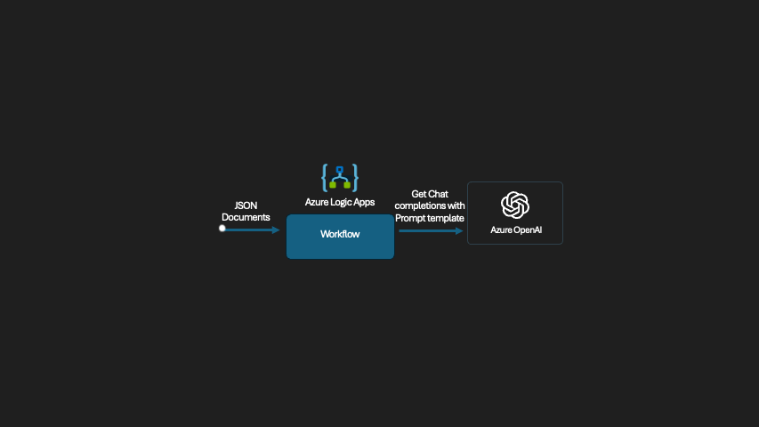

 **Authors:**
[Parth Shah - Microsoft](https://techcommunity.microsoft.com/users/shahparth/1051277)

## High-level architecture


## Introduction

Answering procurement-related questions doesn't have to be a manual process. With the new Chat Completions using Prompt Template action in **Logic Apps (Standard)**, you can build an AI-powered assistant that understands context, reads structured data, and responds like a knowledgeable teammate.

### 🏢 Scenario: AI assistant for IT procurement

Imagine an employee wants to know:

> "When did we last order laptops for new hires in IT?"

Instead of forwarding this to the procurement team, a Logic App can:

*   Accept the question
*   Look up catalog details and past orders
*   Pass all the info to a prompt template
*   Generate a polished, AI-powered response


### 🧠 What Are Prompt Templates?
Prompt Templates are reusable text templates that use **Jinja2** syntax to dynamically inject data at runtime.

In Logic Apps, this means you can:

*   Define a prompt with placeholders like  ```{{ customer.orders }}```
*   Automatically populate it with outputs from earlier actions
*   Generate consistent, structured prompts with minimal effort

#### ✨ Benefits of Using Prompt Templates in Logic Apps

*   **Consistency**: Centralized prompt logic instead of embedding prompt strings in each action.
*   **Reusability**: Easily apply the same prompt across multiple workflows.
*   **Maintainability**: Tweak prompt logic in one place without editing the entire flow.
*   **Dynamic control**: Logic Apps inputs (e.g., values from a form, database, or API) flow right into the template.

This allows you to create powerful, adaptable AI-driven flows without duplicating effort — making it perfect for scalable enterprise automation.

:::info
To learn more, you can ask your favorite AI companion these questions:
- What are Prompt Templates in Azure Logic Apps, and how do they enhance the functionality of AI-powered workflows?
- What are the benefits of using built-in connectors over managed connectors in Azure Logic Apps?
- How can you dynamically inject data into a prompt template using Jinja2 syntax in Azure Logic Apps?
:::

## Prerequisites


- Grab the sample prompt template and sample inputs from our GitHub repo and follow along.
    👉 [Sample logic app](https://github.com/Azure/logicapps/tree/shahparth-lab-patch-2/AI-sample-demo)
- A **Logic App (Standard)** resource in Azure
- An **Azure OpenAI** resource with a deployed GPT model (e.g., GPT-3.5 or GPT-4)

## 🔧 Build the Logic App workflow

Here’s how to build the flow in Logic Apps using the Prompt Template action. This setup assumes you're simulating procurement data with test inputs.

📌 **Step 0:** Start by creating a **Stateful Workflow** in your Logic App (Standard) resource.

*   Choose "Stateful" when prompted during workflow creation.
*   This allows the run history and variables to be preserved for testing.

📸 \_Creating a new Stateful Logic App (Standard) workflow  
\_


📌 **Trigger:** "When an HTTP request is received"

📌 **Step 1:** Add three **Compose** actions to store your test data.

*   **documents:** This stores your internal product catalog entries

```json
[
  {
    "id": "1",
    "title": "Dell Latitude 5540 Laptop",
    "content": "Intel i7, 16GB RAM, 512GB SSD, standard issue for IT new hire onboarding"
  },
  {
    "id": "2",
    "title": "Docking Station",
    "content": "Dell WD19S docking stations for dual monitor setup"
  }
]
```

📸 _Compose action for documents input_


*   **question:** This holds the employee’s natural language question.

```json
[
  {
    "role": "user",
    "content": "When did we last order laptops for new hires in IT?"
  }
]
```

📸 \_Compose action for question input  
\_


*   **customer:** This includes employee profile and past procurement orders

```json
{
  "firstName": "Alex",
  "lastName": "Taylor",
  "department": "IT",
  "employeeId": "E12345",
  "orders": [
    {
      "name": "Dell Latitude 5540 Laptop",
      "description": "Ordered 15 units for Q1 IT onboarding",
      "date": "2024/02/20"
    },
    {
      "name": "Docking Station",
      "description": "Bulk purchase of 20 Dell WD19S docking stations",
      "date": "2024/01/10"
    }
  ]
}
```

📸 _Compose action for customer input_


📌 **Step 2:** Add the **"Chat Completions using Prompt Template"** action  
📸 _OpenAI connector view_


:::info
 Always prefer the_ **in-app connector** (built-in) over the managed version when choosing the Azure OpenAI operation. Built-in connectors allow better control over authentication and reduce latency by running natively inside the Logic App runtime.
:::

📌 **Step 3:** Connect to Azure OpenAI Navigate to your Azure OpenAI resource and click on **Keys and Endpoint** for connecting using key-based authentication 

📸 _Create Azure OpenAI connection_


## 📝 Prompt template: Building the message for chat completions

Once you've added the **Get chat completions using Prompt Template** action, here's how to set it up:

### 1\. **Deployment Identifier**

Enter the name of your deployed Azure OpenAI model here (e.g., gpt-4o).

📌 _This should match exactly with what you configured in your Azure OpenAI resource._

### 2\. **Prompt Template**

This is the structured instruction that the model will use.

Here’s the full template used in the action — note that the variable names exactly match the **Compose action names** in your Logic App: documents, question, and customer.

```json
system: You are an AI assistant for Contoso's internal procurement team. You help employees get quick answers about previous orders and product catalog details. 
Be brief, professional, and use markdownformatting when appropriate. Include the employee’s name in your response for a personal touch. 
# Product Catalog Use this documentation to guide your response. Include specific item names and any relevant 
descriptions.  
Catalog Item ID: {{item.id}} 
Name: {{item.title}} 
Description: {{item.content}}  
# Order History Here is the employee's procurement history to use as context when answering their question. 
 
Order Item: {{item.name}} 
Details: {{item.description}} 
— Ordered on {{item.date}}  
# Employee Info Name: 
{{customer.firstName}} {{customer.lastName}} 
Department: {{customer.department}} 
Employee ID: {{customer.employeeId}} 
# Question The employee has asked the following: 
 {{item.role}}: {{item.content}}  
Based on the product documentation and order history above, please provide a concise and helpful answer to their question. 
Do not fabricate information beyond the provided inputs.
```

📸 \_Prompt template action view  
\_


### 3. **Add your prompt template variables**

Scroll down to **Advanced parameters** → switch the dropdown to **Prompt Template Variable**.

Then:

*   Add a new item for each Compose action and reference it dynamically from previous outputs:
    *   documents
    *   question
    *   customer

📸 _Prompt template variable references_


## 🔍 How the template works

| Template element | What it does |
| --- | --- |
| ```{{ customer.firstName }} {{ customer.lastName }}``` | Displays employee name |
| ```{{ customer.department }}``` | Adds department context |
| ```{{ question\[0\].content }}``` | Injects the user’s question from the Compose action named question |
| `````` | Loops through catalog data from the Compose action named documents |
| `````` | Loops through employee’s order history from customer |

Each of these values is dynamically pulled from your Logic App Compose actions — no code, no external services needed. You can apply the exact same approach to reference data from any connector, like a SharePoint list, SQL row, email body, or even AI Search results. Just map those outputs into the Prompt Template and let Logic Apps do the rest.

## ✅ Final Output

When you run the flow, the model might respond with something like:

> _"The last order for Dell Latitude 5540 laptops was placed on February 20, 2024 — 15 units were procured for IT new hire onboarding."_

This is based entirely on the structured context passed in through your Logic App — no extra fine-tuning required.

📸 \_Output from run history  
\_


:::tip[Congratulations!]

Congratulations on finshing this Lab on building a procurement assistant with Azure Logic Apps and Azure OpenAI! Here are the main conclusions from this Lab:

- The integration of the "Chat Completions using Prompt Template" action in Azure Logic Apps allows for the automation of answering procurement-related questions. This reduces the need for manual intervention and streamlines the process of retrieving and presenting relevant information.

- Prompt Templates in Azure Logic Apps use Jinja2 syntax to dynamically inject data at runtime. This ensures consistency, reusability, and maintainability of the prompts across multiple workflows, making it easier to manage and update the logic in one central place.
  
- By leveraging Azure OpenAI and structured data inputs, the AI-powered assistant can provide personalized and contextually accurate responses to employees' procurement questions. This improves the overall user experience by delivering quick and precise answers based on the company's product catalog and order history.

**Well done on exploring these advanced features and capabilities! This knowledge will undoubtedly enhance your ability to manage and index unstructured data effectively. Keep up the great work!**

:::

---