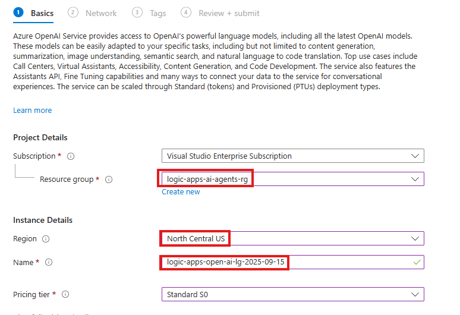
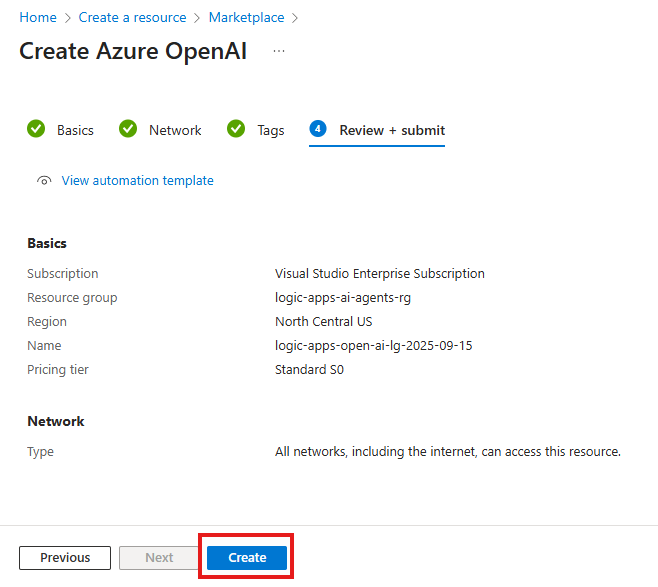
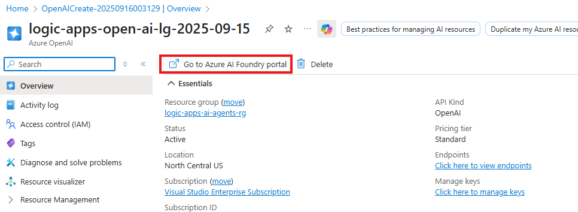

In this module we will provision the Azure OpenAI service and deploy the GPT-4.1 model that will be used by the Logic Apps Agent Loop.

## Provision Azure OpenAI Service
1. Search for and navigate to the OpenAI Service

    - In the serach bar enter: `OpenAI`
        - In the search bar enter: `OpenAI`
    - Select: `Azure OpenAI` -> `Create` -> `Azure OpenAI`
    
    

1. Configure the Azure OpenAI service as follows:

    - **Resource Group**: `logic-apps-ai-agents-rg`
    - **Region**: `North Central US`
    - **Name**: ` logic-apps-open-ai-{your-initials-date}`
    - **Pricing Tier**: `Standard S0`
    

    

1. Click `Next` twice

1. Review the configuration and click `Create`

    

## Deploy the GPT-4.1 Model
1. After your resource successfully deploys, click the `Go to Resource` button

1. To be able to deploy models into our Azure OpenAI instance, we need to launch the **Azure AI Foundry portal**. Click `Go to Azure AI Foundry portal` 

    

1. In the Azure AI Foundry portal, go to the **Chat playground**. Click `Create new deployment -> From base models` to deploy a new model.

    

1. Search for and select `gpt-4.1` from the list of available models; then click `Confirm`

    

1. Accept the default configuration for the gpt-4.1 model deployment. Click `Deploy`

    

1. Test your model's deployment by entering a prompt 

    
