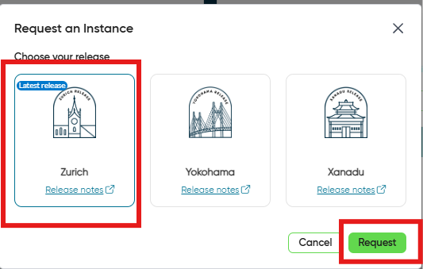
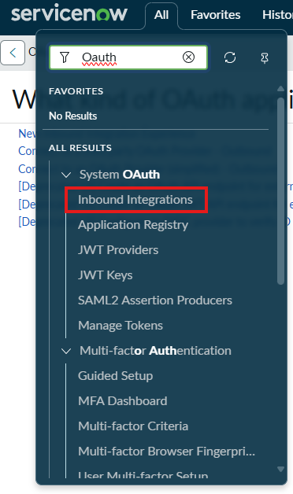
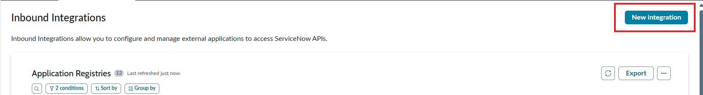
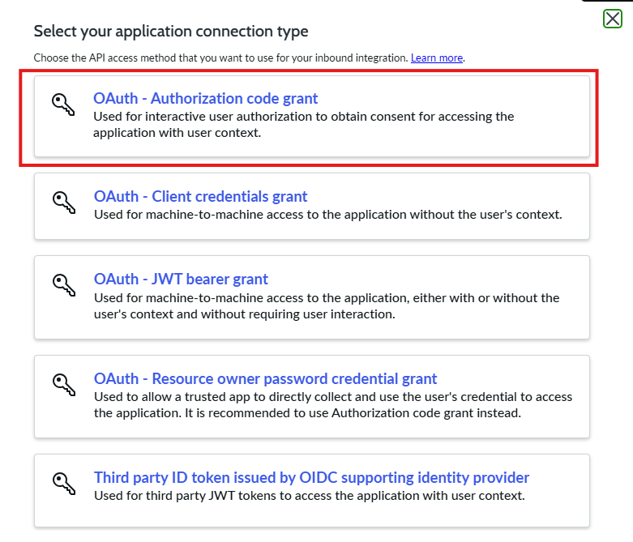
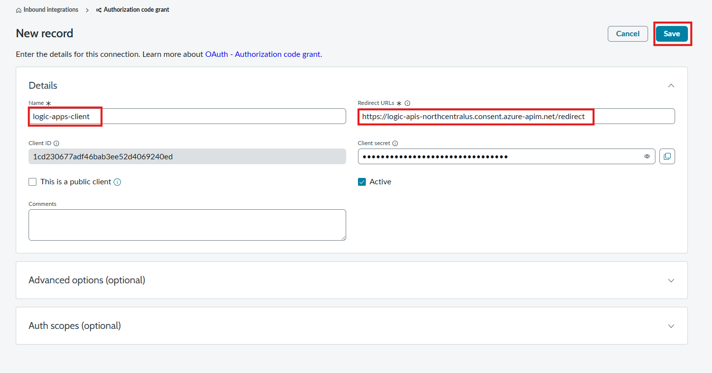

A ServiceNow environment will be required to enable our integration to create and interact with incident tickets.
**Important:** Use your personal email address  when creating your ServiceNow Environment

1. Register a new account with ServiceNow:

    https://signon.service-now.com/x_snc_sso_auth.do?pageId=sign-up

1. Fill out the registration form:

    

1. You will receive an Email Verification Code:

    

1. Navigate to the developer portal: 

     https://developer.servicenow.com/dev.do

    (if prompted, sign in using the account created above)

1. Request a Developer Instance

    

1. Click the Start Building link:

    

## Configure OAuth Authentication 
We will need to configure an OAuth API endpoint to enable our logic apps to authenticate to our ServiceNow instance

1. Navigate to the `OAuth -> Inbound Integrations` section
    - Using the top navigation menu
      - Select `All`
      - Enter `OAuth` in the search box
      - Select `Inbound Integrations`

      

1. Select `New Integration`

    

1. Select `OAuth - Authorization code grant`
  
    

1. Configure the OAuth API endpoint as follows:
    - **Name:** `logic-apps-client`
    - **Redirect URL:** https://logic-apis-northcentralus.consent.azure-apim.net/redirect
     
       (**note:** your redirect URL will depend on the region you are deployment your Azure Logic Apps Instance. If you deployed to a different region, you will need to update your **Redirect URL:  https://logic-apis-{azure-region}.consent.azure-apim.net/redirect**)
     - Click `Submit`

    

1. Save the `Client ID`, `Client Secret` and the `Instance Name` created in this module for later steps when configuring the Logic Apps connection to ServiceNow
