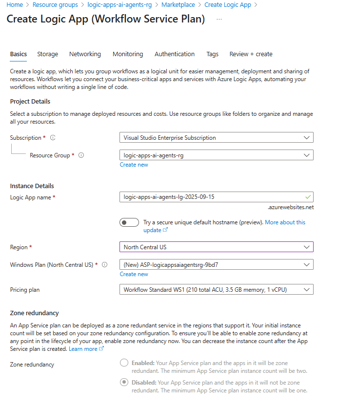
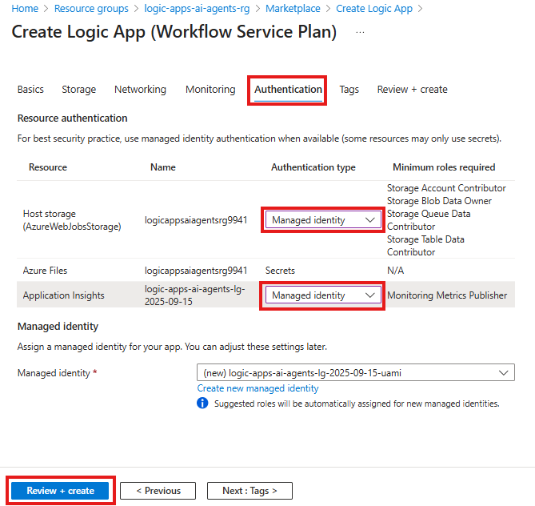
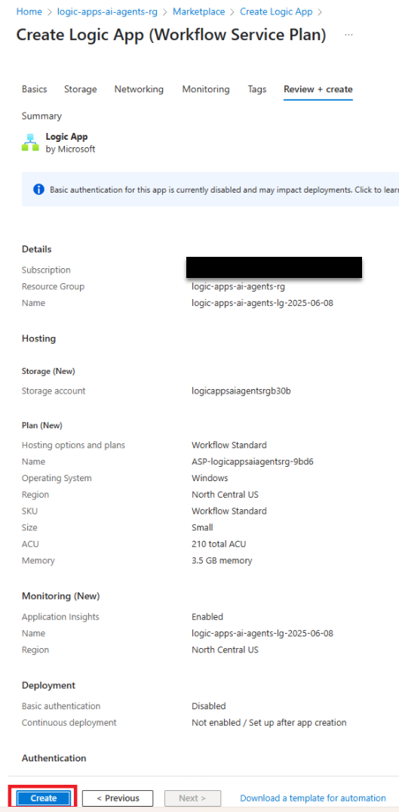
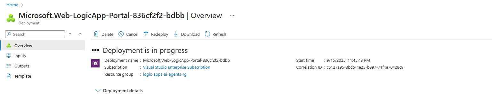
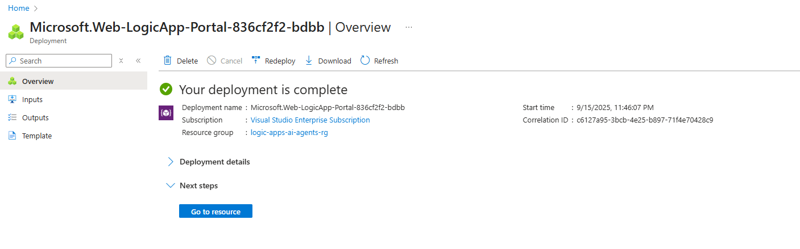

In this module we will provision a Logic Apps Standard instance enabling us to create and test our workflows.

1. Search for and navigate to the `Logic Apps` service

    

1. Click `+ Add`

    

1. Select `Workflow Service Plan` and click `Select`

    

1. Configure the Logic Apps instance as follows:

    - **Resource Group:** `logic-apps-ai-agents-rg`
    - **Logic App Name:** `logic-apps-ai-agents-<some-unique-extension>` **(in the example initials and date were used)**
    - **Region:** `North Central US`
    
    

1. Click `Authentication` and configure the following:
   
   - **Host Storage (AzureWebJobsStorage)** - `Managed identity`
   - **Application Insights** - `Managed identity`
    - **Click:** `Review + Create`

   

   **Note:** enabling managed identities will allow logic apps to securely authenticate and access Azure Blob Storage and Application Insights without needing to manage credentials like passwords or secrets.

1. Review the configuration and click `Create`

        

1. This will start the deployment of your Logic Apps instance 

    

1. Once the deployment is completed, you will see the following screen and the button `Go to resource` that will open the Azure Logic Apps you just deployed

    
