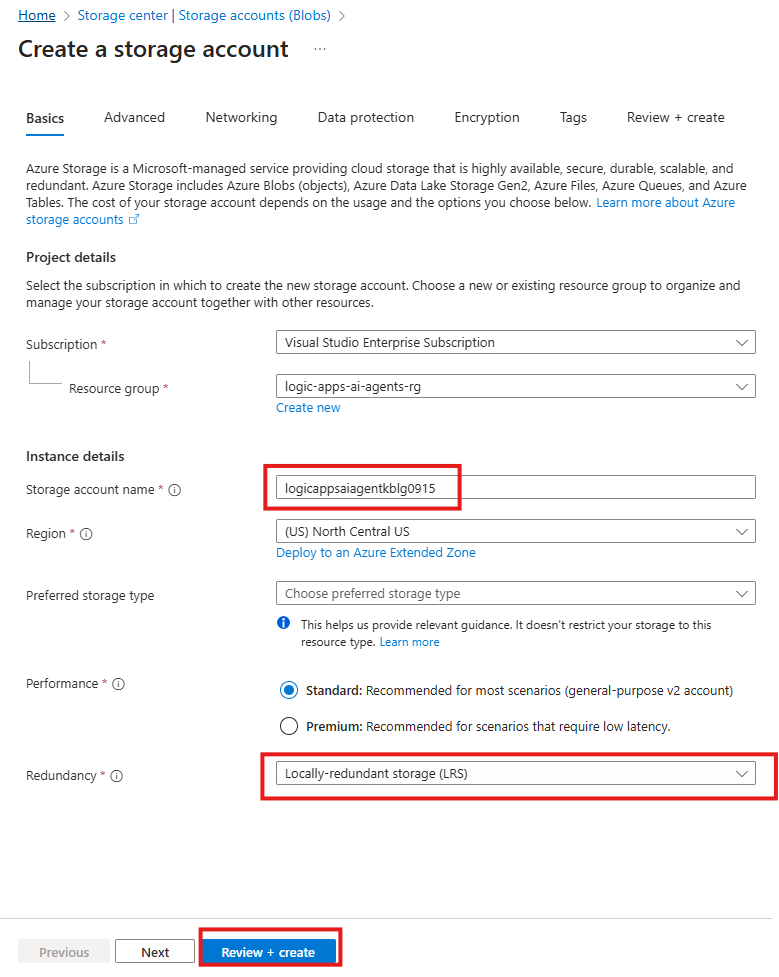
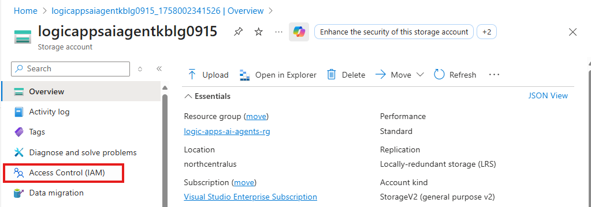
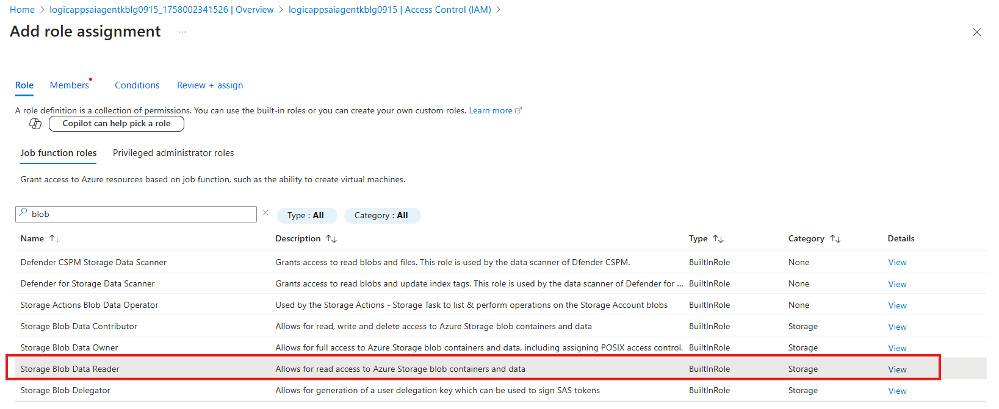
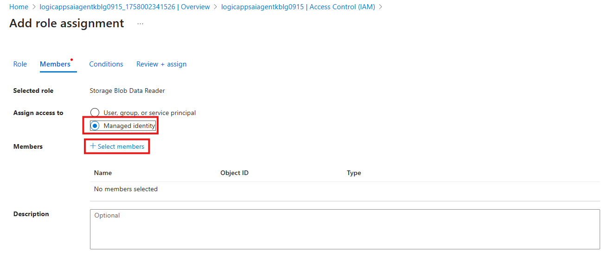
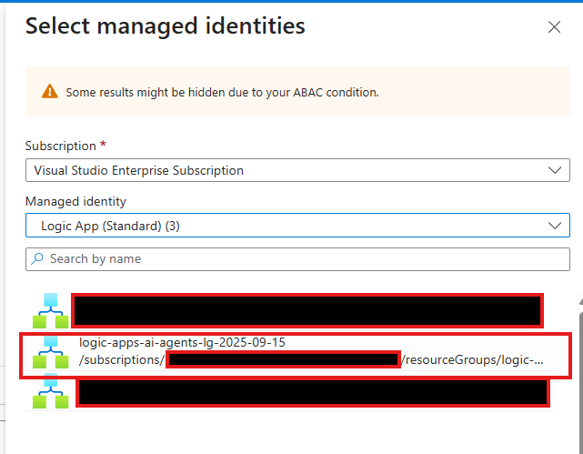
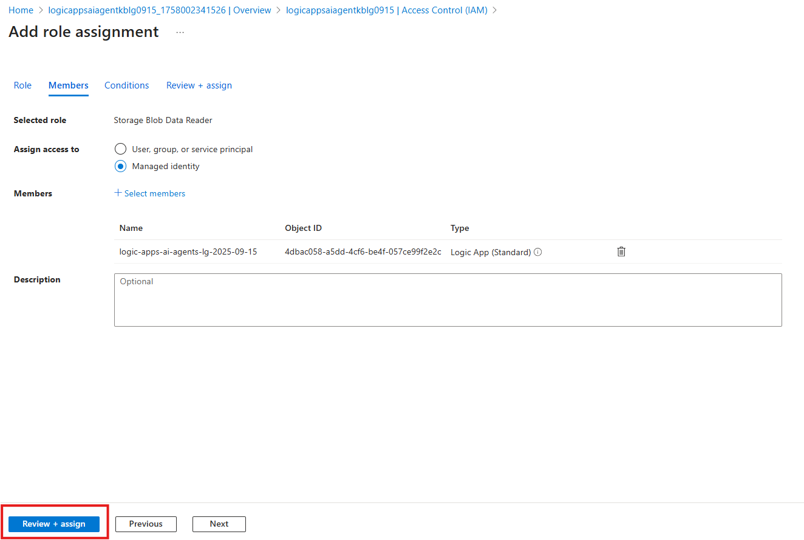

In this module we will provision an Azure Storage account that will hold our operations manual / knowledge base used by the Logic Apps Agent Loop.

1. Search for and Navigate to `Storage Accounts`

    

1. Create a new storage account by clicking `+ Create` 

    

1. Configure the new storage account as follows:

    - **Resource Groups**: `logic-apps-ai-agents-rg`
    - **Storage Account**: `logicappsaiagentkb<your-initials|date>`  (**Storage account name needs to be globally unique**)
    - **Redundancy**: `Locally-redundant storage (LRS)`
    - Click `Review + Create`
    - Click  `Create`

    

1. Expand `Data Storage` and select `Containers` in the left side feature options for your storage account:

    

1. Configure a new container as follows:
    
    - **Name:** `playbooks`
    - Click: `Create`

    

1. Upload the playbook to the container by clicking `Upload`
 
    

1. Download the knowledge base - [Agent in a Day - Operational Runbook.docx](./resources/Agent%20in%20a%20Day%20-%20Operational%20Runbook.docx "download playbook")
   
2. Navigate to the location on your machine where you downloaded the `Agent in a Day - Operational Runbook.docx` file, select it, then click `Upload`

    

    Once successfully uploaded, you will receive the following message:
    
    

    And now be able to see the file displayed for the **playbooks** container:

    

## Configure Access to the Storage Account
We will need to grant the Logic Apps instance access to read the blobs in our storage account. We will use Managed Identity for this purpose as it simplifies assigning access and does not require the use of security keys. To learn more about Managed Identities, please see the following article: <a href="https://learn.microsoft.com/en-us/entra/identity/managed-identities-azure-resources/overview" title="Managed Identities for Azure resources">Managed Identities for Azure resources. </a>

1. Navigate to the **Access Control (IAM)** settings  fo the Storage Account 

    

1. Select the role to add

    - Select `Add -> Add Role Assignment`
    - Search for and select the `Storage Blob Data Reader` role
    - Click `Next`

    

1. Select the Managed Identity to be granted the access

    - Select `Managed Identity`
    - Click `+ Select Members`

    

1. Select the Logic App created in earlier module

    - In the **Managed Identity** dropdown, select `Logic Apps(Standard)`
    - Select the Logic App created in the earlier module

    

    - Click `Select`
    - Click `Close`

1. Click `Review + Assign`

    
