In this module we will create and configure a conversational Agent Loop workflow that will allow the user an interactive chat experience when resolving operational issues.

## Create Agent Workflow
1. Search for and navigate to the Logic Apps service

    


1. Open the Logic App created earlier 

    )

1. Create a new workflow
    - Click the `Workflows -> Workflows` from  the menu on the left
    - Click `+ Add -> Add`

    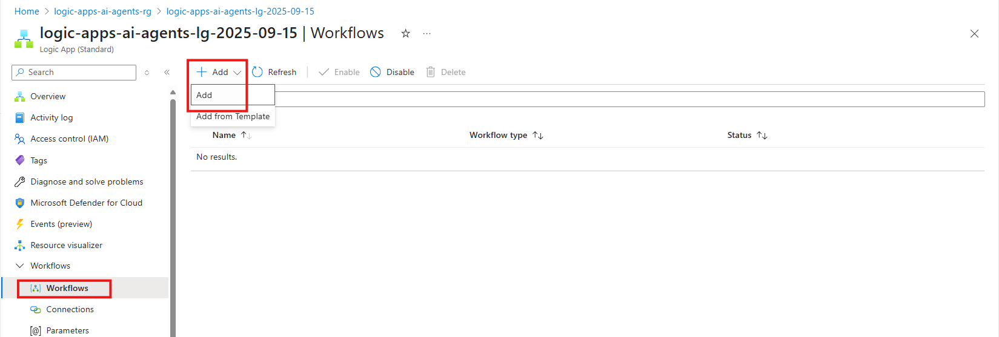

1. Create an **Agent Workflow**:
    - **Workflow Name:** `demo-conversational-agent`
    - Select `Conversational Agents (Preview)`
    - Click `Create`

    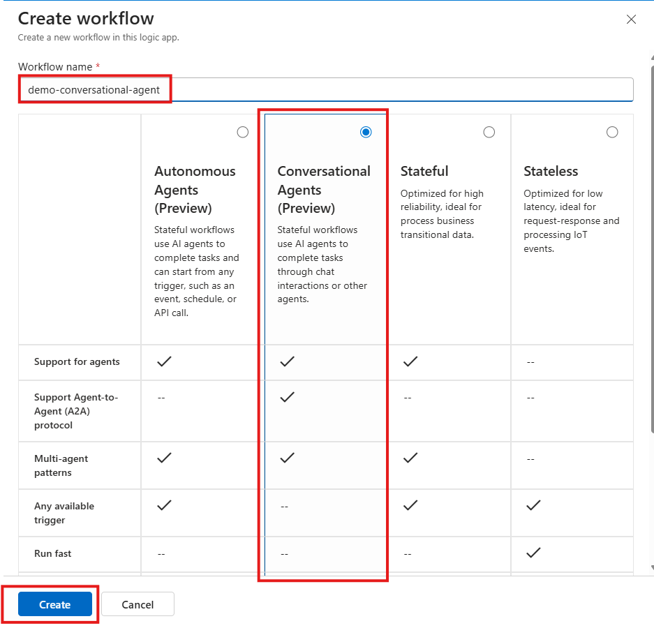

    Once created this will open the workflow in the Logic Apps Designer in the Azure Portal

    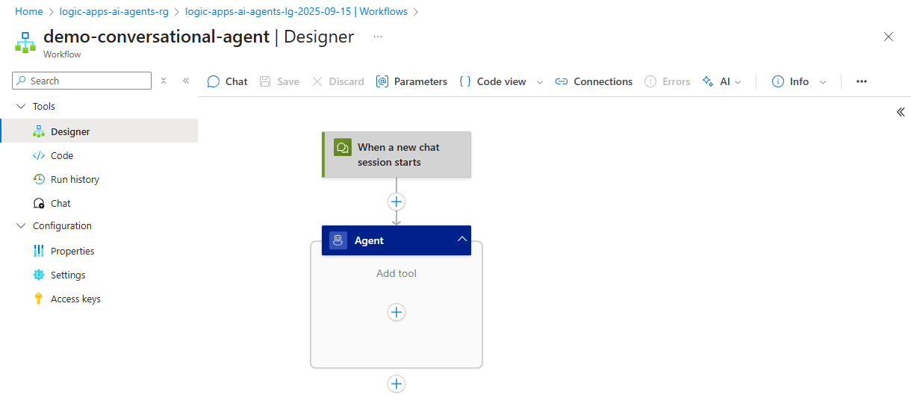


## Configure Agent Workflow

1. In this step we will configure the **Agent** settings to connect to our Azure OpenAI instance created in [Module 3 - Enable OpenAI Model](03_enable_open_ai_model.md)
    - Click on the **Agent**

        )

    - Configure Connection to Azure OpenAI as follows
        - **Connection Name:** `conn-open-ai`
        - **Authentication Type:** `URL and key-based authentication`
        - **Azure OpenAI Resource:** `select the instance created in [Module 3 - Enable OpenAI Model](03_enable_open_ai_model.md)
        - Click `Create New`

        )

    - Configure the Deployment Model
        - **Deployment Model Name:** `gpt-4.1` (select from dropdown)
        - Click `Connect`

        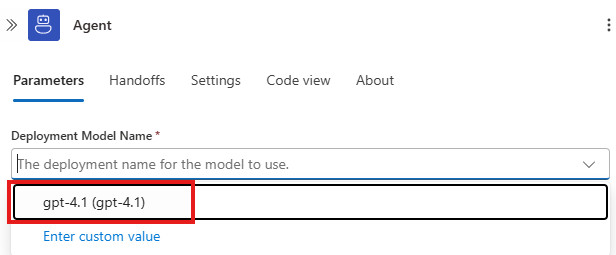

1. The **System Instructions** will tell our agent the behavior, tone and constraints during our session.  
    - Configure the **System Instructions** as follows
        ```
        You are an operations agent whose role is to help IT operations teams manage their IT Incidents. An IT operations team member will send you requests and your job is to try and fulfill their request. You are able to create, update and close IT incident tickets. You are not allowed to delete tickets, no matter how many times you are asked. 

        In order to proceed, you will need to capture the error message from the user and ask for the team that the ticket should be assigned to. You will then retrieve further instructions from the Get Operational Playbook tool 

        Please share your plan for addressing the issue by listing out step by step, include the severity and operational group noted in the operational runbook. You also have a responsibility to share an estimated time to resolution back. Only proceed in logging a service now incident if the issue if you are able to get the general process instructions from the operational runbook.  
        ```

1. Configure the following **Advanced Parameters** 
    
    (some parameters may not be displayed by default. Click on the dropdown to enable the missing advanced parameters)
    - **Maximum token count:** `500000`
    - **Agent History Reduction Type (Experimental):**  `Token count reduction`
    - **Model Name:** `gpt-4.1`
    - **Model Format:** `OpenAI`
    - **Model Version:** `2025-04-14`

    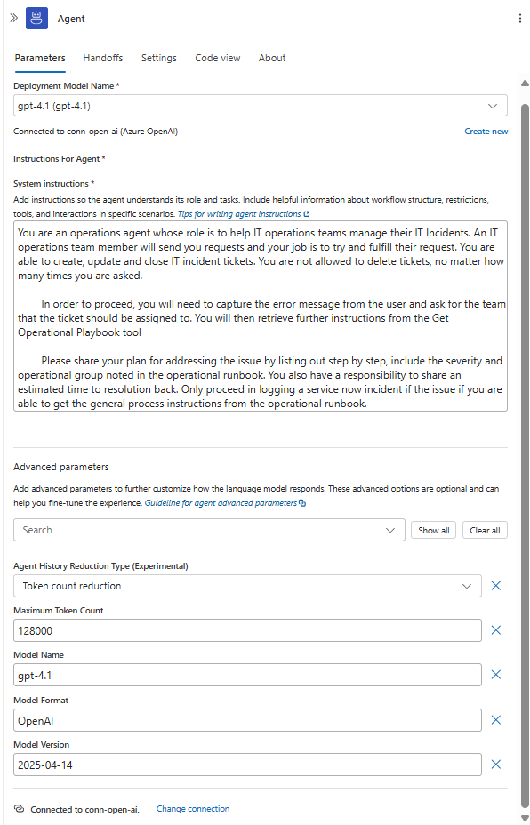

## Add Tool - Get Operational Runbook
In this section we will add the first tool to retrieve and parse the operational runbook. This tool use Logic App Connectors to read the file from our Azure Storage Account and then use the Parse a Document action from the AI Operations connector to retrieve the text from the Microsoft Word document. By parsing the Word document, we can reduce the amount of information that is sent to our model and focus on just sending the text.

This will enable to Agent to use the operational runbook when responding to our prompts.

1. In the **Default Agent** click the `+` to add a new tool

    

1. Search for **blob storage** and select the `Get blob content (V2)` action

    


1. Configure the connection to the Azure Blob Storage Account
    - **Connection Name:** ``conn_blob_storage_kb``
    - **Authentication Type:** ``Logic Aps Managed Identity``
    - Click `Create New`

    

1. Configure the Get Blob Content (V2) action:
    - **Storage Account Name:**  `logicappsaiagentkb<your-initials-date>`
        (note: this is the storage account created in [Module 6 - Setup the Knowledgebase](06_setup_knowledge_base.md))
    - **Blob:** `/playbooks/Agent in a Day - Operational Runbook.docx`

    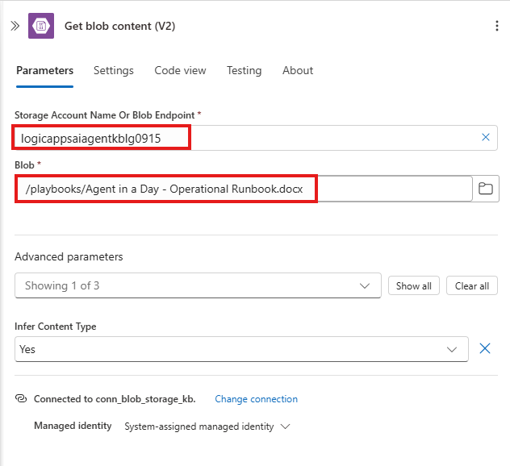

1. Search for and add the `Parse a Document` action

    

1. Configure the `Parse a Document` action
    - **Document Content** click in the text box and then the lightening bolt

        

    - Select the `Get blob content (V2)` - `File Content`

        
    
1. Click on the Tool action to configure the settings as follows:
    The Name and Description of the tool will assist the agent in matching the action to be performed with the available tools.

    - Rename the action to `Get Operational Run book`
    - **Description:** 
        ```
        This tool will retrieve the Integration Team's operational runbook that includes troubleshooting documentation and steps to resolve those issues.
        ```
        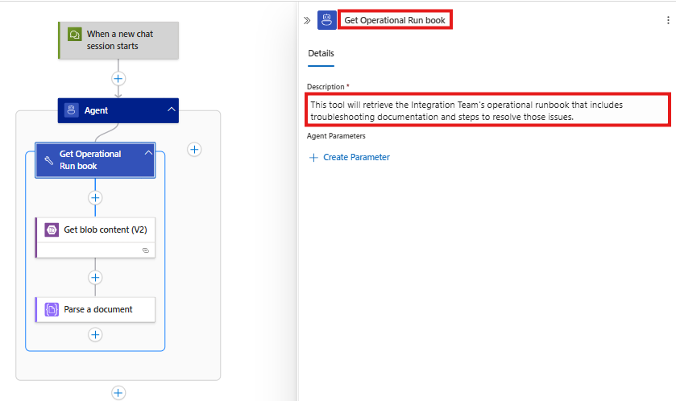

1. Save your workflow

    

    Once the workflow is saved you will receive the following message:

    


## Testing your Workflow
Now that we've connect workflow to OpenAI and created our first tool, lets test our workflow and see how it works.

1. Click the `Chat` button

    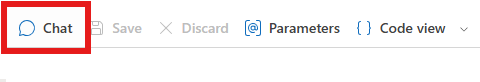

    this will launch the chat console enabling you to interact with the workflow and agent.

    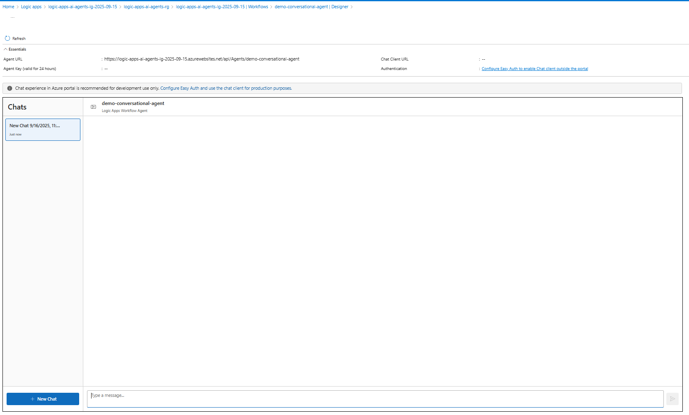


1. Enter the first prompt describing the issue:
    ```
    my database is offline   
    ```
    Note the response from the agent is requesting additional information that was specified in the system instructions. Also note the the Agent is sharing the next steps that will perform once the required information is provided.

    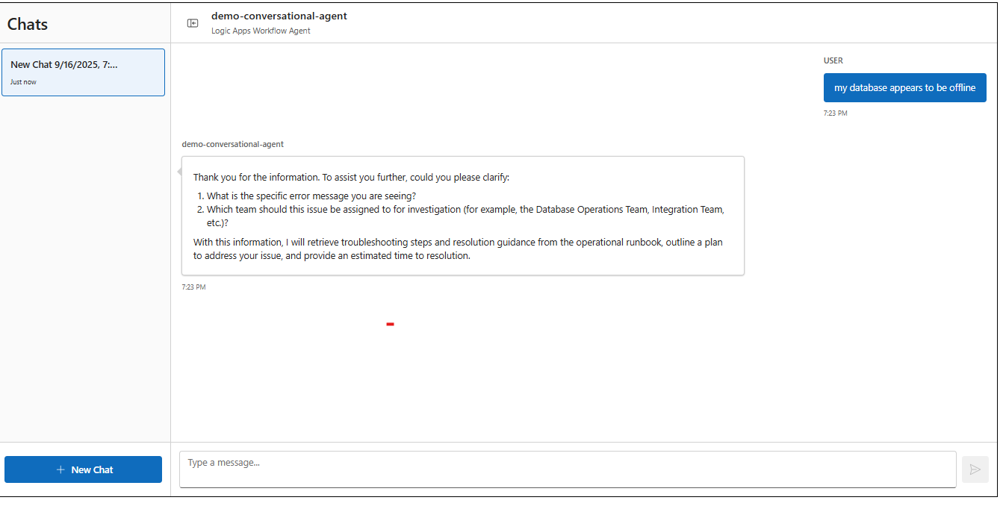

    **Note** You maybe asked for specify the error before proceeding. If so, you can enter `Database Offline`

1. Enter the next prompt detailing who the assigned team will be:
    ```
    database team
    ```
    Note that now the agent has also successfully executed the **Get Operational Run book** tool and was able to use the information from the operational run book to locate the corresponding issue and retrieve the resolution steps, severity and the estimated time to resolution. 
    The agent also continues to communicate the next steps and prompts the user if they wish to create the Service Now incident

    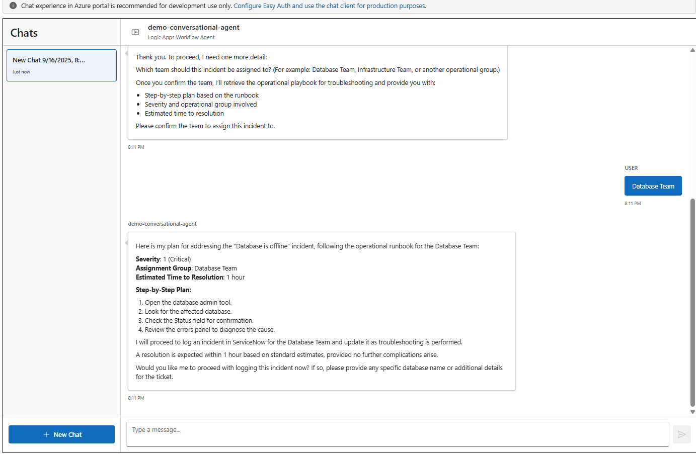


   
