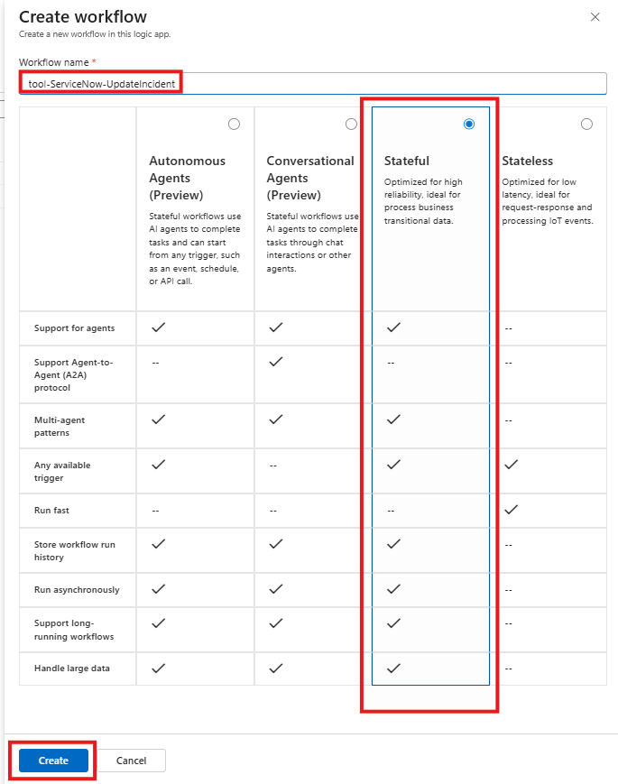

In this module we will create a stateful workflow to update an existing ServiceNow incident and prepare it for agent use.

## Create the Stateful Workflow
1. Search for and navigate to the Logic Apps service

    


1. Open the Logic App created earlier 

    

1. Create a new workflow
    - Click `Workflows -> Workflows` from the menu on the left
    - Click `+ Add -> Add`

      

1. Create a new stateful workflow with:
    
    - **Workflow name:** `tool-ServiceNow-UpdateIncident`
    - Select the radio button for the `Stateful` workflow type
    - Click `Create`

    

1. Open the workflow visual editor by clicking on the `tool-ServiceNow-UpdateIncident` link

    

## Configure Workflow
1. Configure the workflow trigger to accept an HTTP Request
    - Click on `Add Trigger`
    - Select the `Request` action located in the **Built-in tools** group

        
        
    - Select the `When a HTTP request is received`

    

1. Configure the `When a HTTP request is received` action:
    - **Request Body JSON Schema**
        ```JSON
       {
            "type": "object",
            "properties": {
                "TicketNumber": {
                    "type": "string"
                },
                "Notes": {
                    "type": "string"
                }
            }
       }
       ```

1. Look up the internal identifier for the **Incident** in ServiceNow

    - Add a new action. Click `+ Add an action`

        

    - Select the `ServiceNow - List Records` action

        

1. Configure the List Records Activity as follows
    - Rename activity to `List Records - Get Ticket Details`
    - **Record Type:** `Incident`
    - **Advanced Parameters** (click `Show all`)
    - **Query:** `number=@{triggerBody()?['TicketNumber']}`

        (**note:** notice that the ServiceNow connection was automatically selected for the activity)

        

1. Add the **Update Record** action to update the work notes on the incident in ServiceNow
    - Click on the `+` -> `Add an Action`
    - Search for `ServiceNow` Connector and select the `Update Record` Activity

        

1. Configure the **Update Record** action
    - Rename activity to `Update Incident Work Notes`
    - **Record Type:** `Incident`
    - **System ID:** *(using the expression (fx) editor)* `first(body('List_Records_-_Get_Ticket_Details')?['result'])['sys_id']`
    - **State:** *(Advanced Parameter)* `2`
    - **Work Notes:** *(Advanced Parameter)* `@{triggerBody()?['Notes']}`

        

1. Add the **Response** activity to return a status message to the calling process
    - Click on the `+` -> `Add an Action`
    - Search for and select the `Response` activity

    

1. Configure the **Response** activity
    - **Body:** 
        ```
        {
            "status": "Ticket {@{triggerBody()?['TicketNumber']}} has been updated successfully"
        }
        ```
    

1. Save your workflow

    

