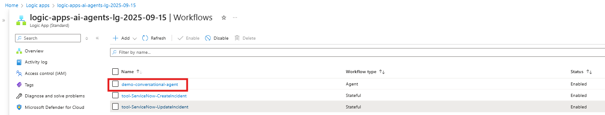
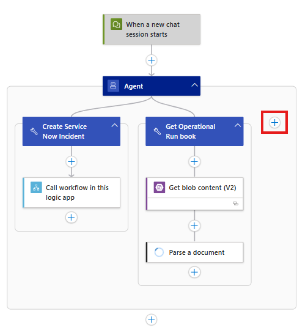
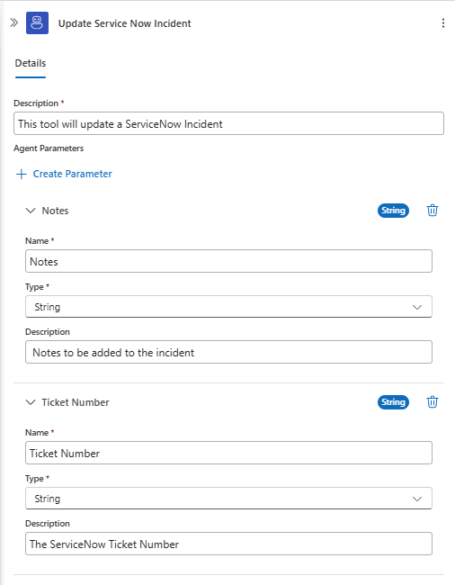
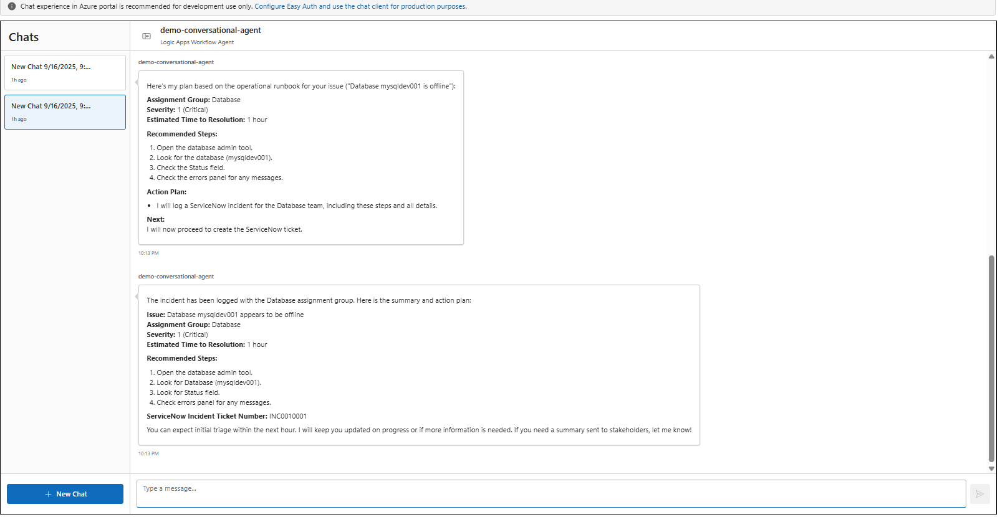
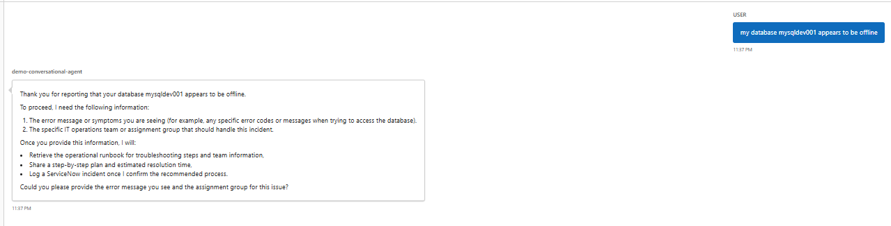
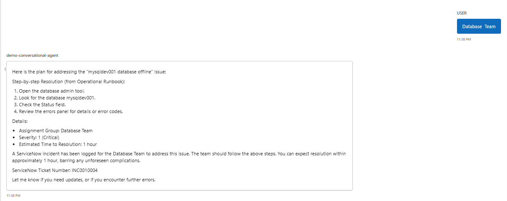
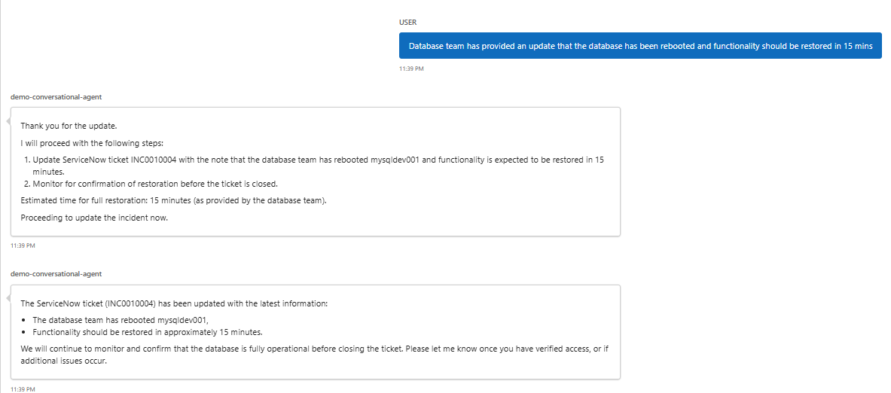
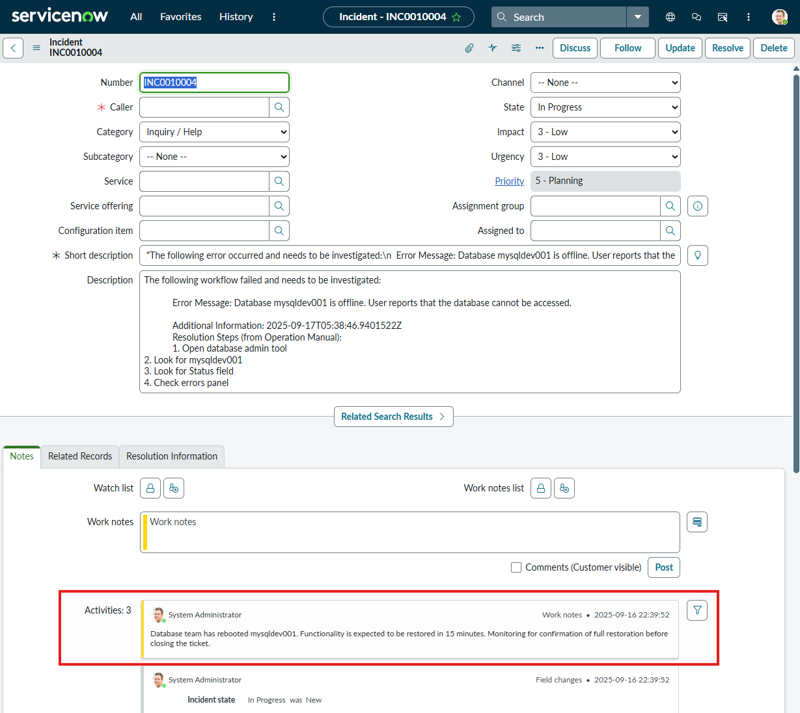

In this module we will take the ServiceNow Update Incident workflow and add it as a tool in our Agent Loop workflow.


1. Return to the list of workflows in the Logic Apps by clicking on the Workflows link at the top of the page

    

1. Open the `demo-conversational-agent` workflow

    

1. Add a new tool.
    - Click on the `+`

        

1. Search and select the `Call workflow in this logic app`

    

1. Configure the **Call workflow in this logic app** action
    - Rename action to `tool-update-servicenow-incident`
    - **Workflow Name** - `tool-ServiceNow-UpdateIncident`
    - click **Show all**

    

1. Configure the Tool action
    - Rename the tool to `Update Service Now Incident`
    - **Description:** `This tool will update a ServiceNow Incident`
    - **Agent Parameters**
        
        for each agent parameter click `+ Create Parameter` 
        - **Name:** `Notes`

          **Type:** `String`

          **Description:** `Notes to be added to the incident`

        - **Name:** `Ticket Number`

          **Type:** `String`

          **Description:** `The ServiceNow Ticket Number`


          

1. Configure the inputs parameters for the call to the logic app.
    - **TicketNumber:** `@{agentParameters('Ticket Number')}`
    - **Notes:** `@{agentParameters('Notes')}`

    

1. Save your workflow

    

## Test your agent

1. Click `Chat` switch back to the Agent chat session.

    


1. This will open the Agent chat component. Note that all the previous chat sessions are present. Start a new chat session by clicking `+ New Chat`

    


1. Enter the your issue for the agent to action:

    In this session we will:
    - Ask the agent to help coordinate the resolution for their issue
    - The agent will 
        - retrieve the Operation Run and find the corresponding entry
        - will log the incident in ServiceNow
    - We provide updates on our progress of the Incident
    - The agent will
        - Update work notes in ServiceNow

    1.  Enter the following prompt to have the agent log the incident
        ```
        my database mysqldev001 appears to be offline  
        ```
      
        

        (**note** the agent may prompt you for the assignment group or the date the incident occurred.)
   
        

    1. Enter the following prompt to have the agent update the ticket with the work notes.
        ```
        Database team has provided an update that the database has been rebooted and functionality should be restored in 15 mins
        ```
        (**note** the agent has leveraged the Update ServiceNow Incident Tool to update our Incident with the work notes)


        

1. Validate your Incident in ServiceNow.
  - Navigate to your ServiceNow developer portal
  - Use the Incident Ticket Number from the Agent's response to search for the incident in ServiceNow
   - Note the update has been captured in the work notes for the incident.
    
