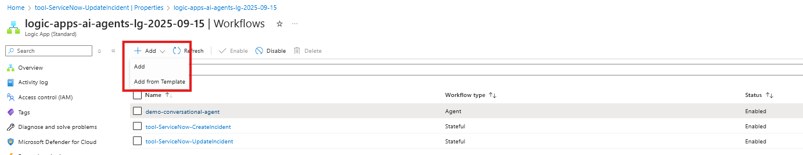
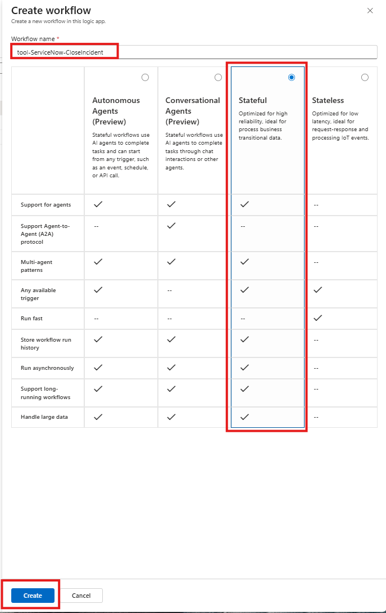
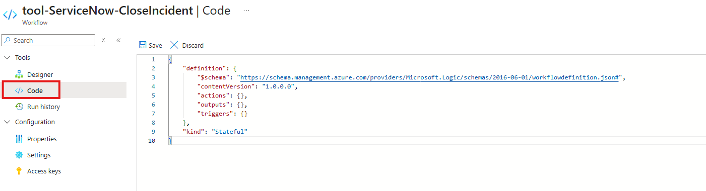
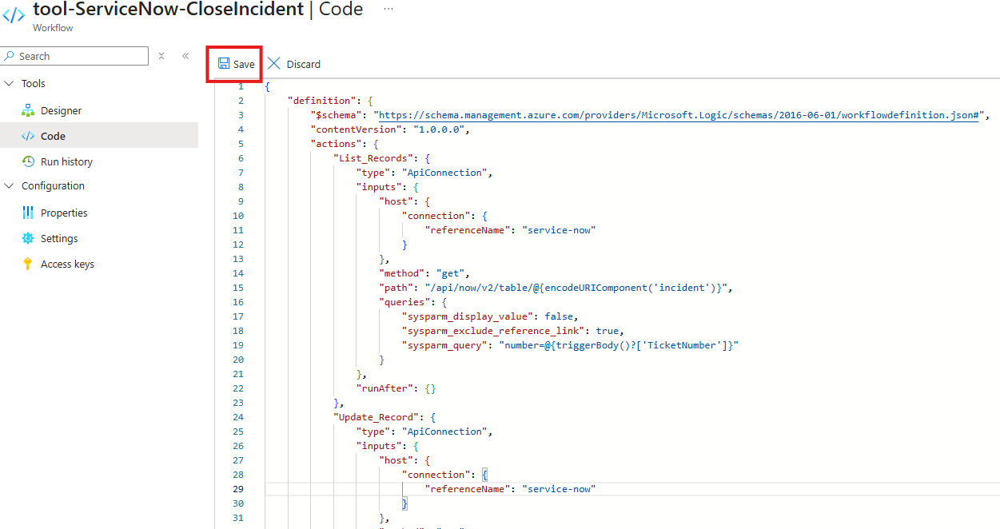
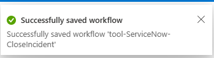
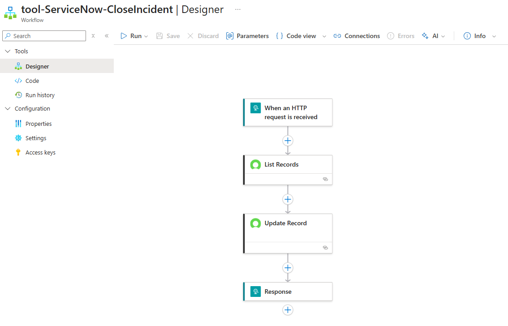
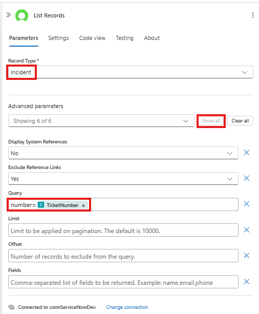
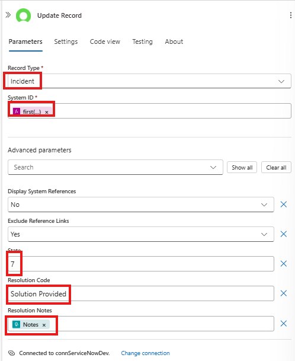

In this module we will create a stateful workflow to close an existing ServiceNow incident and add resolution comments.

## Create the Stateful Workflow
1. Search for and navigate to the Logic Apps service

    


1. Open the Logic App created earlier 

    

1. Create a new workflow
    - Click `Workflows -> Workflows` from the menu on the left
    - Click `+ Add -> Add`

      

1. Create a new stateful workflow with:
    
    - **Workflow name:** `tool-ServiceNow-CloseIncident`
    - Select the radio button for the `Stateful` workflow type
    - Click `Create`

    

1. Open the workflow visual editor by clicking on the `tool-ServiceNow-UpdateIncident` link (if the workflow designer isn't opened automatically)

    

<details>

<summary>
    🚀 <b>Create Workflow using existing workflow.json</b> (expand for details)

- 📄 -  provides a preconfigured workflow definition
- 🕐 - This option saves you time creating the tools allowing more time to explore and interact with the agent.
</summary>

## Configure Worflow using existing workflow.json
1. Select the `Code` Option in the **Tools**

    

1. Paste the contents of the `workflow.json` file into the editor

    ```JSON
    {
        "definition": {
            "$schema": "https://schema.management.azure.com/providers/Microsoft.Logic/schemas/2016-06-01/workflowdefinition.json#",
            "contentVersion": "1.0.0.0",
            "actions": {
                "List_Records": {
                    "type": "ApiConnection",
                    "inputs": {
                        "host": {
                            "connection": {
                                "referenceName": "service-now"
                            }
                        },
                        "method": "get",
                        "path": "/api/now/v2/table/@{encodeURIComponent('incident')}",
                        "queries": {
                            "sysparm_display_value": false,
                            "sysparm_exclude_reference_link": true,
                            "sysparm_query": "number=@{triggerBody()?['TicketNumber']}"
                        }
                    },
                    "runAfter": {}
                },
                "Update_Record": {
                    "type": "ApiConnection",
                    "inputs": {
                        "host": {
                            "connection": {
                                "referenceName": "service-now"
                            }
                        },
                        "method": "put",
                        "body": {
                            "state": "7",
                            "close_code": "Solution Provided",
                            "close_notes": "@triggerBody()?['Notes']"
                        },
                        "path": "/api/now/v2/table/@{encodeURIComponent('incident')}/@{encodeURIComponent(first(body('List_Records')?['result'])['sys_id'])}",
                        "queries": {
                            "sysparm_display_value": false,
                            "sysparm_exclude_reference_link": true
                        }
                    },
                    "runAfter": {
                        "List_Records": [
                            "SUCCEEDED"
                        ]
                    }
                },
                "Response": {
                    "type": "Response",
                    "kind": "Http",
                    "inputs": {
                        "statusCode": 200,
                        "body": {
                            "status": "Ticket {@{triggerBody()?['TicketNumber']}} has been updated successfully"
                        }
                    },
                    "runAfter": {
                        "Update_Record": [
                            "SUCCEEDED"
                        ]
                    }
                }
            },
            "outputs": {},
            "triggers": {
                "When_an_HTTP_request_is_received": {
                    "type": "Request",
                    "kind": "Http",
                    "inputs": {
                        "schema": {
                            "type": "object",
                            "properties": {
                                "TicketNumber": {
                                    "type": "string"
                                },
                                "Notes": {
                                    "type": "string"
                                }
                            }
                        }
                    }
                }
            }
        },
        "kind": "Stateful"
    }    
    ```


1. Click the `Save` button to save the changes to the workflow

    

    The follwoing message will appear once the changes have been successfully saved:
    
    

1. Click on the `Designer` option in the **Tools** menu to review the workflow using the designer.

    
</details>

<details>
<summary>
    📋 <b>Create Workflow using the Logic Apps Workflow Designer</b>  (expand for details)
    
- ✅ - provides step by step instructions for configuring the workflow using the designer. 
- ✏️ - Use this option if you want more practice using the Logic Apps Designer 
</summary>

## Configure Workflow using designer

1. Configure the workflow trigger to accept an HTTP Request
    - Click on `Add Trigger`
    - Select the `Request` action located in the **Built-in tools** group

        
        
    - Select the `When a HTTP request is received`

        

1. Configure the `When a HTTP request is received` action:
    - **Request Body JSON Schema**
        ```JSON
       {
            "type": "object",
            "properties": {
                "TicketNumber": {
                    "type": "string"
                },
                "Notes": {
                    "type": "string"
                }
            }
       }
       ```

1. Look up the internal identifier for the **Incident** in ServiceNow

    - Add a new action. Click `+ Add an action`

        

    - Select the `ServiceNow - List Records` action

        

1. Configure the List Records Action as follows
    - **Record Type:** `Incident`
    - **Advanced Parameters** (click `Show all`)
    - **Query:** `number=@{triggerBody()?['TicketNumber']}`

        (**note:** notice that the connection for the ServiceNow connection was automatically selected for the action)

        

1. Add the **Update Record** action to update the work notes on the incident in ServiceNow
    - Click on the `+` -> `Add an Action`
    - Search for `ServiceNow` Connector and select the `Update Record` Action

        

1. Configure the **Update Record** action
    - Rename action to `Update Incident Work Notes`
    - **Record Type:** `Incident`
    - **System ID:** *(using the expression (fx) editor)* `first(body('List_Records')?['result'])['sys_id']`
    - **State:** *(Advanced Parameter)* `7`
    - **Resolution Code:** *(Advanced Parameter)* `Solution Provided`
    - **Resolution Notes:** *(Advanced Parameter)* `@{triggerBody()?['Notes']}`

        

1. Add the **Response** action to return a status message to the calling process
    - Click on the `+` -> `Add an Action`
    - Search for and select the `Response` action

        

1. Configure the **Response** action
    - **Body:** 
        ```
        {
            "status": "Ticket {@{triggerBody()?['TicketNumber']}} has been updated successfully"
        }
        ```
        

1. Save your workflow

    

</details>