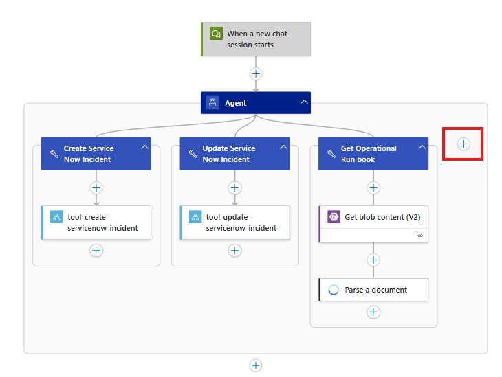
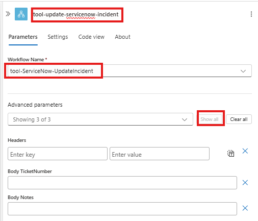
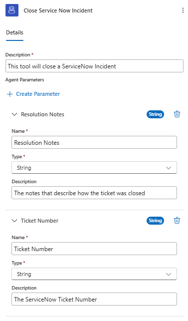

In this module we will take the ServiceNow Close Incident workflow and add it as a tool in our Agent Loop workflow.

1. Return to the list of workflows in the Logic Apps by clicking on the Workflows link at the top of the page

    

1. Open the `demo-conversational-agent` workflow

    

1. Add a new tool.
    - Click on the `+`

        

1. Search and select the `Call workflow in this logic app`

    

1. Configure the **Call workflow in this logic app** action
    - Rename activity to `tool-close-servicenow-incident`
    - **Workflow Name** - `tool-ServiceNow-CloseIncident`

    

1. Configure the Tool activity
    - Rename the tool to `Close Service Now Incident`
    - **Description:** `This tool will close a ServiceNow Incident`
    - **Agent Parameters**
        
        for each agent parameter click `+ Create Parameter` 
        - **Name:** `Resolution Notes`

          **Type:** `String`

          **Description:** `The notes that describe how the ticket was closed`

        - **Name:** `Ticket Number`

          **Type:** `String`

          **Description:** `The ServiceNow TIcket Number`


          

1. Configure the inputs paremeters for the call to the logic app.
    - Rename the activity to `tool-ServiceNow-CloseIncident`
    - **TicketNumber:** `@{agentParameters('Ticket Number')}`
    - **Notes:** `@{agentParameters('Resolution Notes')}`

    

1. Save you workflow

    

## Test your agent

1. Click `Run` to start your workflow and initiate the agent session.

    

    You will receive a notification when the workflow as successfully started  
    

1. Navigate to you **Run History** and located you **Running** instance. Click on the identifier to view the executed steps and agent chat session.

    

1. Enter the your issue for the agent to action:

    In this session we will:
    - Ask the agent to help coordinate the resolution for their issue
    - The agent will 
        - retireve the Operation Run and find the corresponding entry
        - will log the incident in ServiceNow
    - We provide updates on our progress of the Incident
    - The agent will
        - Update work notes in ServiceNow
    - Finally we will ask the agent to close the ticket noting that access to the database was restored
    - The agent will
        - Close the Incident in ServiceNow and provide our update in the Incident Ticket
    
    1.  Enter the following prompt to have the agent log the incident
        ```
        my database mysqldev001 appears to be offline  
        ```
      
        

        (**note** the agent may prompt you for the assignment group or the date the incident occured.)
   
    1. Enter the following prompt to have the agent update the ticket with the work notes.
        ```
        the database team is looking into the issue and will reboot the service. It will be ready in 15 mins
        ```
        (**note** the agent has leveraged the Update ServiceNow Incident Tool to update our Incident with the work notes) 
        

    1. Enter the following prompt to have the agent close the ticket with the resolution notes.

        ```
        please close the issue, the access to the database has been restored and tested
        ```
        (**note** the agent has leveraged the Close ServiceNow Incident Tool to update our Incident with the resolution notes) 
        


1. Vaidate your Incident in ServiceNow.
  - Navigate to your ServiceNow developer portal
  - Use the Incident Ticket Number from the Agent's response to search for the incident in ServiceNow
   - Note the update has been captured in the work notes for the incident.

        


   
