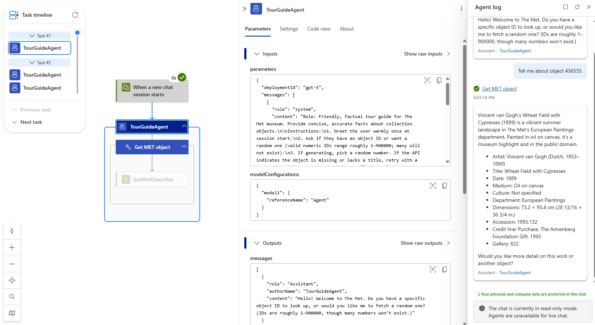
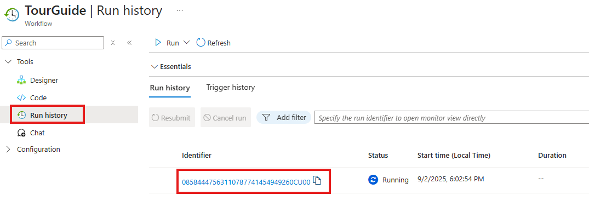
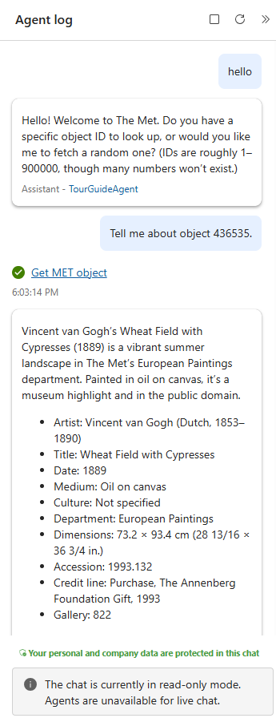
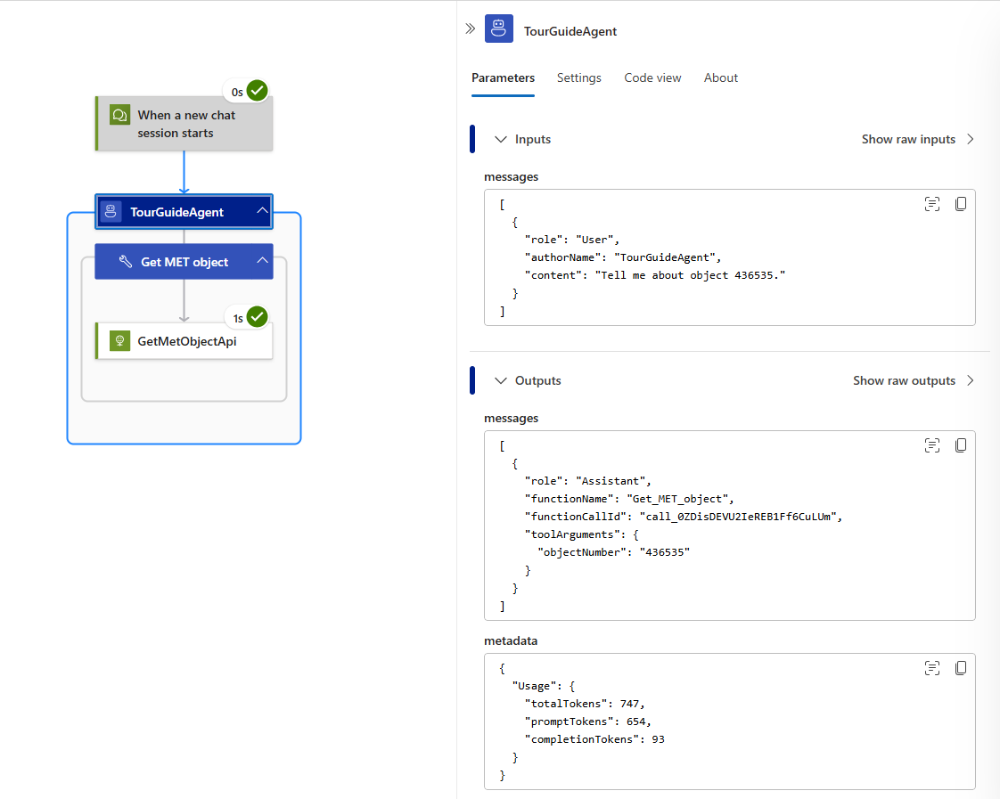
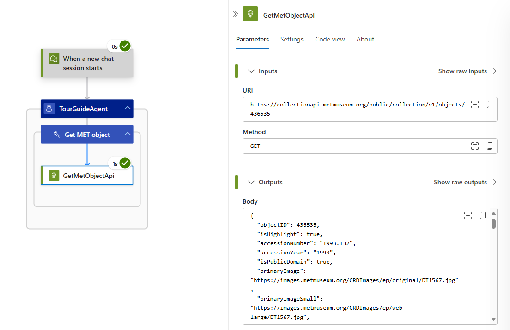

--- 
title: 02 - Debug your conversational agent in Azure Logic Apps
description: Learn how to monitor and debug a Logic Apps conversational agent using run history, chat transcripts, tool calls, and model inputs/outputs.
ms.service: logic-apps
ms.topic: tutorial
ms.date: 08/19/2025
author: absaafan
ms.author: absaafan
---

In this module you learn how to observe, inspect, and debug the TourGuide conversational agent you built in Module 01. You distinguish model (reasoning) issues from workflow or integration issues, view the chat transcript, inspect tool executions, and capture deeper telemetry for ongoing monitoring.

By the end, you will:
- View run history for agent chat sessions.
- Read chat transcripts and intermediate messages.
- Inspect agent reasoning steps and tool invocation details.
- Locate and review model inputs and outputs safely.
- Differentiate model misalignment vs connector/action failure.

You continue using the same TourGuide workflow created earlier.

---

## Prerequisites
- Completed Module 01 (TourGuide agent created and working).

---

## Debugging overview
An agent run (chat session) consists of: chat transcript (user ↔ agent messages); agent loop reasoning (decide, tool, respond); tool executions (workflow actions); model interactions (system + context + user prompt and model replies); workflow runtime (triggers, actions, retries, latency, failures). You drill from run status down to specific reasoning or action artifacts to isolate the cause.

The run history or monitoring view for a conversational agent run consists of the following parts.

#### Task timeline
The task timeline lets you navigate between different tasks in that chat session and into the steps in each of those tasks. Clicking on the agent execution in a task will load that task and execution into the workflow canvas.

#### Workflow canvas
The workflow canvas is the same workflow canvas you might know from your other Azure Logic App workflows. The canvas will show and highlight any tools that have ran in that agent task and action(s) inside that tool.

#### Action panel
The action panel loads the inputs and outputs of the action you are inspecting. If you are inspecting the agent action, the input will show the most recent input into the agent and the output will show the result of the agent chat completion. There is also a metadata section for agent actions that shows things like token usage for that agent execution.

#### Agent log
The agent log shows the conversation chat history for that session so far. The agent messages are shown as "Assistant - `{agent name}`" messages and clicking on the hyperlinked agent name will navigate to the task where that output was given by the agent.
It also shows when tools were executed by the agent. The tool names are hyperlinked and clicking on them will navigate you to the task where that tool was executed so you can inspect the inputs and outputs of the action.

---

### Step 1 - Open run history
1. In the Logic Apps resource, select Workflows.
1. Select the TourGuide workflow.
1. Open the run history.

    

### Step 2 - Review the agent log
1. Once the run history loads, you will see the agent log on the right side for review.

    

1. Use the task timeline to go through each step in the different tasks. The amount of steps and tasks will depend on your workflow and chat session.

    

### Step 3 - Inspect agent reasoning and tool calls
1. Click on the tool execution in the agent log.
1. This will load the task and step where the agent decided it should make the tool call.
1. Click on the agent action to inspect it
    - The input will be the message from the user. In our case that will be a message asking the agent to tell us about an art object.
    - The output will be the agent making the tool call. You can inspect the "toolArguments" property to see what the agent set the agent parameters to in this execution.
    - The metadata field will let you see the token usage for this request. The prompt tokens are the ones used in the input, this includes the system prompt and the entire chat history passed into the agent, including tool calls and tool results. The completion tokens are the ones used by the model in the response to this call.
    - Inspecting the agent allows you to confirm that the reasoning and execution is working as expected.

    

1. Click on the action inside the tool to inspect it
    - The action panel will show the inputs and outputs of the action and lets you inspect them. This allows you to confirm the action works as expected.

    

The monitoring view in Azure Logic Apps lets you debug your agent workflow and inspect every part of its execution. This helps you adjust your workflow as needed, whether it be updating system prompts or clarifying tool names and descriptions.

---

## Summary & next steps
You inspected run history, transcripts, reasoning steps, tool calls, and model interactions. Next, introduce additional tools, user context, and other patterns.
