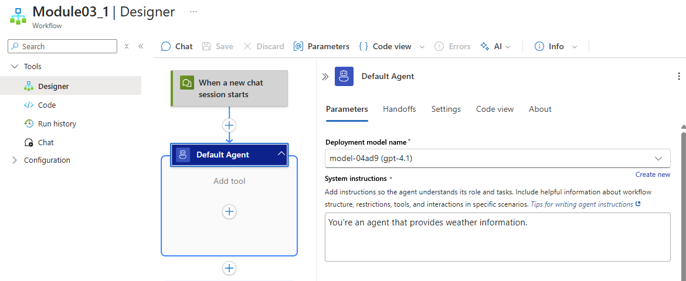
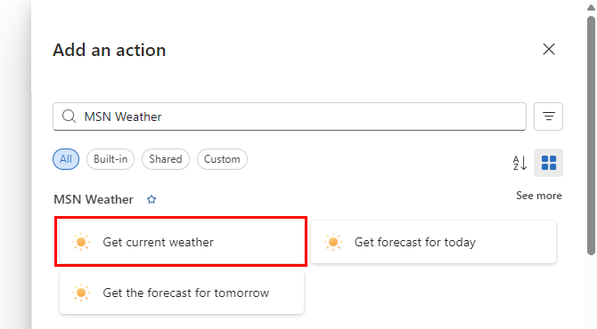
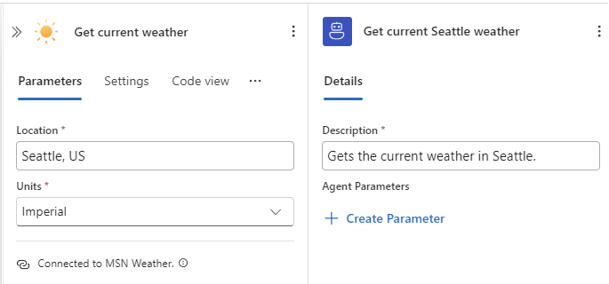
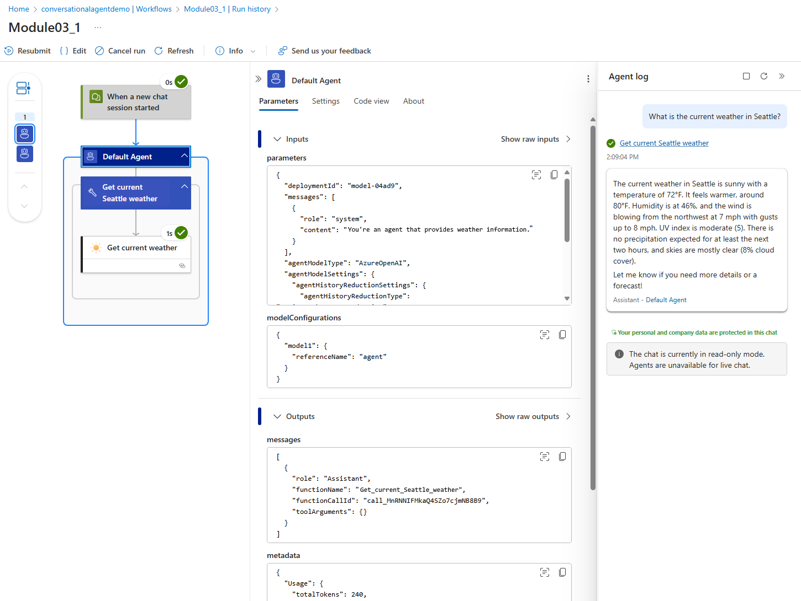

In this module, you learn how to connect a conversational agent workflow in Azure Logic Apps to external systems by using connectors and how to expose connector actions as tools that the agent can call during a chat conversation.

When you finish this module, you'll achieve the goals and complete the tasks in the following list:

- Understand key connector concepts such as actions, connections, authentication, and limits.
- Add one read-only connector action as a tool that your agent can autonomously and directly call without needing authentication.
- Optionally add an authenticated connector action as a tool that handles inputs and errors.
- Apply best practices for safe, reliable tool use in conversational scenarios.

This module keeps the primary flow simple without using [agent parameters](https://learn.microsoft.com/azure/logic-apps/agent-workflows-concepts#key-concepts) or [on-behalf-of (OBO) authorization](https://learn.microsoft.com/entra/identity-platform/v2-oauth2-on-behalf-of-flow). In Module 04, you learn how to parameterize inputs. In Module 05, you learn how to add OBO authorization.

For more information, see [Connectors overview for Azure Logic Apps connectors](https://learn.microsoft.com/azure/connectors/introduction).

## Connectors and their relationship to tools

In Azure Logic Apps, *connectors* offer prebuilt operations that provide a fast, secure, and reliable way for an agent to take an action in the real world without needing you to write integration code. The following table describes other benefits that connectors offer when you build integration workflows:

| Benefit | Description |
|---------|-------------|
| Breadth of integrations | Choose operations offered by more than 1,400 connectors across Microsoft 365, Azure services, SaaS apps, developer tools, and data platforms. |
| Faster time to value | Use declarative actions so you don't have to build and maintain custom API clients. Reduce boilerplate, errors, and maintenance overhead. |
| Secure connections | Standardize authentication with connections that can use Open Authorization (OAuth 2.0), API keys, or managed identity. Store secrets securely and reuse connections across tools. |
| Reliability | Take advantage of built-in retries, pagination, and robust error surfaces exposed in run history and monitoring. |
| Consistent patterns | Simplify how an agent calls operations and how you compose workflows around them by using a unified model. |
| Observability | Trace tool calls, diagnose failures, and tune prompts by using workflow run history, monitoring, and telemetry. |
| Enterprise readiness | Combine connectors with network isolation and other platform controls to meet organizational requirements. |

In conversational agent scenarios, connectors turn operations that work with external services and systems into tools that agents can use. When you provide a clear tool name and description, the agent can better decide when to call connector operations as tools and how to summarize results back to the user. To benefit from built-in authentication, throttling guidance, schemas, and monitoring, use connectors when available, rather than raw HTTP.

> :::note
>
> Conversational agent workflows always start with the default trigger named **When a new chat session starts**,
> and not any other trigger. Conversational agents start running when a chat session starts from the integrated
> chat client in Azure Logic Apps. No separate workflow trigger exists in the agent because the agent directly
> calls tool actions during the conversation.

The following table helps map the relationship between connector operations and the tools that conversational agents use:

| Component | Description |
|-----------|-------------|
| Connectors | - Provide operations that you use to create reusable integrations where Azure Logic Apps can call external services, such as Microsoft 365, GitHub, Azure services, SaaS apps, and more.   - Expose connector operations as triggers, which are events that start the workflow, and actions, which are tasks that the agent can call.   - Create a connection that specifies authentication and environment-specific settings.   - Managed connectors versus built-in operations: Managed connector operations run in global, multitenant Azure and usually require connections. Built-in operations, such as Request, Recurrence, HTTP, Compose, Until, and so on, directly run with the Azure Logic Apps runtime. |
| Tools | - Provides a single action or an action sequence that an agent can call to satisfy a user's request, such as "Get weather" or "Look up a ticket".   - For agents in Azure Logic Apps, a tool can use a connector action, a built-in action, or even another workflow.   - Provide a tool name and description so that the agent can better determine when to call the tool. Good descriptions drive better tool selection. |

## Prerequisites

- An Azure account and subscription. If you don't have a subscription, [sign up for a free Azure account](https://azure.microsoft.com/free/?WT.mc_id=A261C142F).

- A Standard logic app resource and a conversational agent workflow with the model that you set up in previous modules.

  If you don't have this workflow, see [Module 01 - Create your first conversational agent](01-create-first-conversational-agent.md).

  For the examples, this workflow can use the following options:

  - Primary example: MSN Weather connector, which doesn't need authentication.
  - Optional example with authentication: A GitHub account with either OAuth 2.0 or a personal access token (PAT) with minimal read scopes.

> :::note
>
> This module focuses on connector-backed tools. Later modules cover agent parameters and on-behalf-of (OBO) authorization patterns.

## Connector concepts for this module

| Concept | Description |
|---------|-------------|
| Triggers versus actions | Conversational agent workflows must use the default trigger named **when a new session starts**. Autonomous agent workflows can use any available trigger. Agents in both workflows use actions as tools. |
| Connections and authentication | OAuth 2.0, API key, managed identity, or none, based on the connector. |
| Inputs and outputs | Actions define parameters and return JSON. The agent summarizes outputs for the end user. |
| Limits and reliability | Expect throttling errors (HTTP 429), timeouts, retries, and pagination. Design your prompts and tools to gracefully handle errors and exceptions. |
| Connection references | Your workflow binds to a specific connection at runtime. |

## Part 1 - Expose a basic read-only connector as a tool (MSN Weather)

To more easily demonstrate the conversational agent pattern from end to end, this example doesn't use authentication or agent parameters.

### Step 1 - Set up your agent

1. In the [Azure portal](https://portal.azure.com), open your Standard logic app resource.

1. Find and open your conversational agent workflow in the designer.

   

1. On the designer, select the agent action. On the agent information pane, for the system instructions, enter **You're an agent that provides weather information.**

   

### Step 2 - Add a tool for your agent

1. On the designer, inside the agent and under **Add tool**, select the plus sign (+) to open the pane where you can browse available actions.

1. On the **Add an action** pane, follow these [general steps](https://learn.microsoft.com/azure/logic-apps/create-workflow-with-trigger-or-action?tabs=standard#add-action) to add the **MSN Weather** action named **Get current weather** as a tool, for example:

   

1. Provide a clear and brief name and desription for the tool, for example:

   - Name: **Get current Seattle weather**
   - Description: **Gets the current weather in Seattle.**

     The large language model (LLM) for your agent uses the tool description to help the agent decide when to call the tool. Keep the description short, specific, and outcome-focused.

   The tool now looks like the following example:

   

### Step 3 - Set up the connector action

1. In the **Get current weather** action, provide the following information:

   | Parameters | Value |
   |------------|-------|
   | **Location** | **Seattle, US** |
   | **Units** | **Imperial** |

   The action now looks like the following example:

   

1. Save your workflow.

### Step 4 - Test your weather tool in chat

1. On the designer toolbar, select **Chat**.

1. In the chat client interface, ask the following question: **What is the current weather in Seattle?**

1. Check that the response is what you expect, for example:

   

### Step 5 - Check tool in monitoring view

1. On the workflow sidebar, under **Tools**, select **Run history**.

1. Select the most recent workflow run. 

1. Confirm that the agent succesfully called the tool and ran the action.

   

For more information, see [Module 02 - Debug your agent](02-debug-agent.md).

## Part 2 (optional): Expose an authenticated connector as a tool (GitHub)

Now, you'll learn to add a tool that requires authentication. This module uses static or hardcoded inputs, but a later module shows how to parameterize inputs.

### Step 1 - Add the GitHub connector action

1. On the designer, inside the agent and next to your existing tool, select the plus sign (+) for **Add an action** to open the pane where you can browse available actions.

1. On the **Add an action** pane, follow these [general steps](https://learn.microsoft.com/azure/logic-apps/create-workflow-with-trigger-or-action?tabs=standard#add-action) to add a read-only **GitHub** action, for example, **List all repositories for the authenticated user** as a tool.

### Step 2 - Connect to GitHub

1. On the designer, select the **GitHub** action that you added to your tool.

1. On the **Create connection** pane that opens, sign in to GitHub, and provide consent to authenticate the connection your GitHub account.

> :::caution
>
> For private repositories, make sure that the connection identity has access.

### Step 3 — Configure the tool (static inputs for this module)

1. Provide a clear and brief name and desription for the tool, for example:

   - Name: **Get GitHub repositories**
   - Description: **Gets my public and private GitHub respositories.**

   

1. Save your workflow.

### Step 4 - Test your GitHub tool in chat

1. On the designer toolbar, select **Chat**.

1. In the chat user interface, ask the following question: **Show me the details of the demo GitHub issue.**

1. Check that the response is what you expect.

1. Go to monitoring view. Confirm that the agent succesfully called the tool and ran the action.

## Troubleshoot problems

| Error or problem | Action to try |
|------------------|---------------|
| Connection shows "Not authorized". | Reauthenticate with the required scopes and confirm target resource permissions. |
| Agent doesn't call the tool. | Improve the tool description and reduce overlap with other tools. Verify input mappings. |
| Wrong or missing parameters | Provide stronger hints and examples. Make key inputs required as shown in extension modules - [Module 04 - Add parameters to tools](../04_agent_functionality/01-add-parameters-to-tools.md). |
| 429 "Too many requests" error or throttling | Limit the frequency or cache. Ask the user to narrow the query. |
| 404 "Not found" error | Confirm the GitHub owner, repo, number, or location format. Suggest alternatives. |

## Best practices for agent tools and connectors

- Start with tools that are read-only. Then try tools that make write operations but require confirmations, for example, for create, update, or delete operations. Require explicit user confirmation.
- Apply least privilege principles. Use managed identity authentication or scoped tokens. Store secrets securely, for example, using Azure Key Vault.
- Provide clear and specific tool descriptions that specify when to use or not use a tool.
- Provide examples and hints. Improve parameter extraction by using formats, for example, GitHub owner or repo, and sample responses.
- Validate inputs. Set default values and constrain enum values. Let the agent ask clarifying questions when necessary or appropriate.
- Respect limits. Avoid fetching huge pages. Summarize, rather than retrieve everything.
- Plan for and gracefully handle errors such as 401, 403, 404, 429, and timeouts. Keep responses concise and helpful.
- For observability, confirm tool calls and tune prompts by using the run history or telemetry.

## Adapt this scenario to other connectors

| Connector | Example tools |
|-----------|---------------|
| ServiceNow | List groups or create incidents. For screenshots and patterns, see [Agent-in-a-Day samples](../../logic-apps-agent-in-a-day/01_introduction.md). |
| Microsoft 365 | Get profile or list recent mail. Requires OAuth and tenant permissions. |
| Any REST API | Use **HTTP** built-in action or managed connector if available. |

Here's a recap for the pattern to use:

1. Add an action to the tool.

1. Create or select an existing connection, if prompted.

1. Set up the action with the necessary parameter inputs.

1. Test your tool in chat. Check monitoring view to confirm successful tool calls.

## Clean up resources

- When you're done with this module, make sure to delete any resources you no longer need or want to keep. That way, you don't continue to get charged for their usage.
- If you created any new connections, make sure to remove connections or rotate your credentials, based on your organization's policy.

## Related content

- [Add parameters to your tools](../04_agent_functionality/01-add-parameters-to-tools.md)
- [Add user context to tools](./04-add-user-context-to-tools.md)
