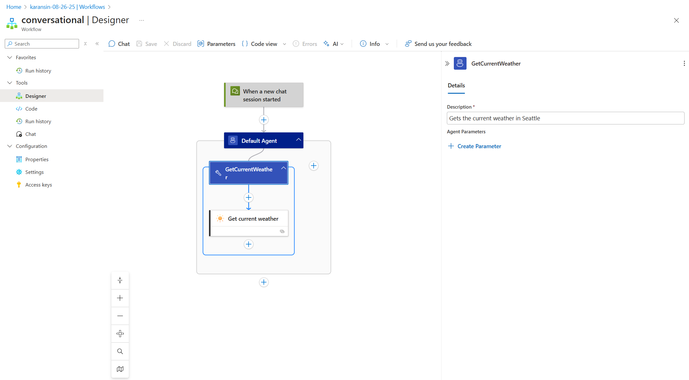
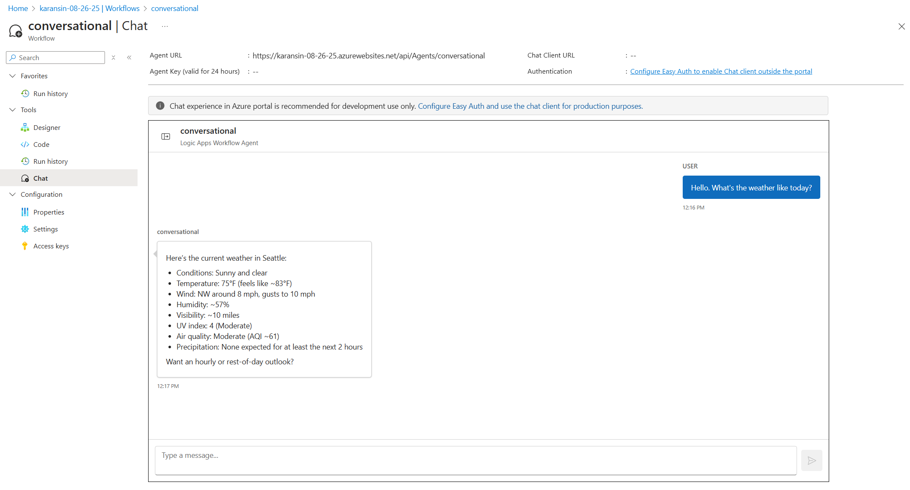
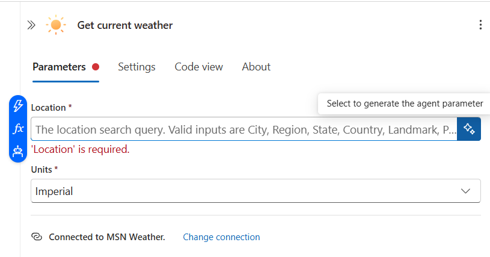
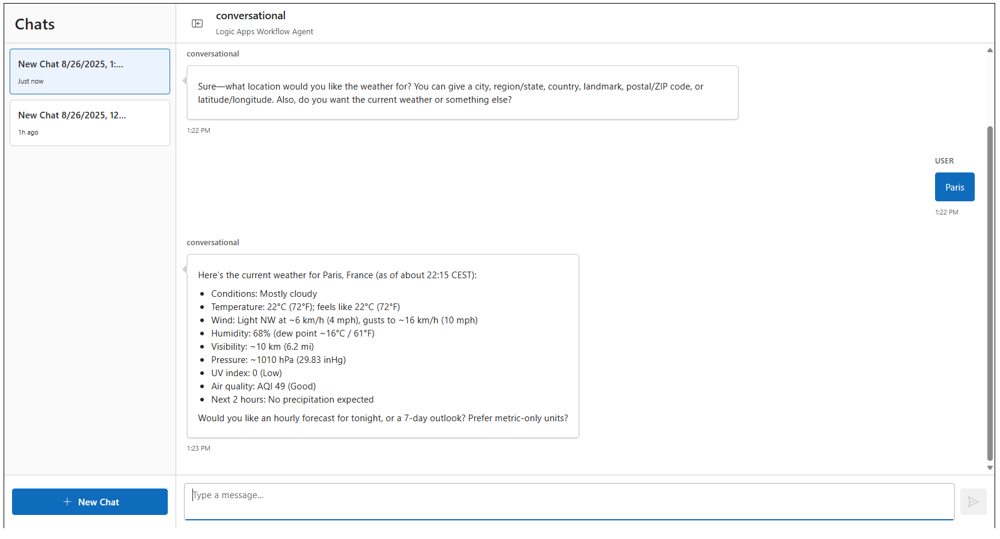
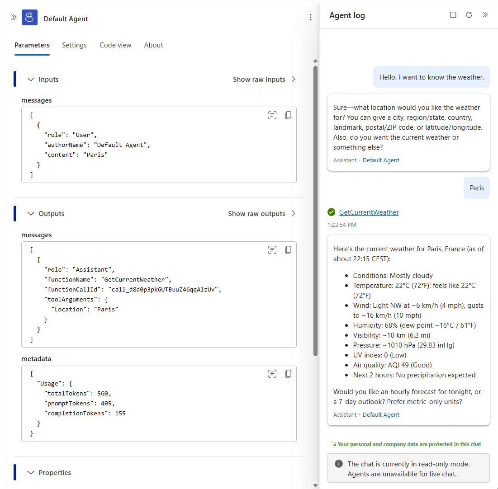
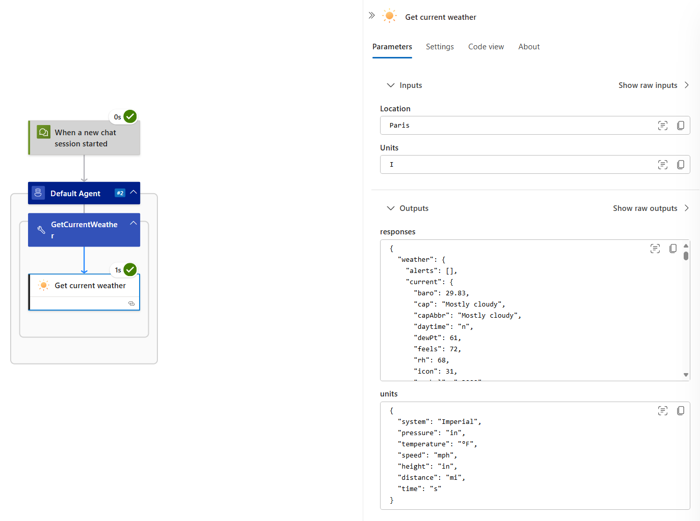

# Module 04 - Add parameters to your tools

In previous modules, we discussed how to add tools to your agent. Sometimes a tool should vary its behavior depending on the interaction and context - we accomplish this using parameters. For example, a GetWeather tool can be configured to always look up the weather in Seattle. But if the location should be dynamic and depends on conversation context, then we need to add a location parameter to the tool.

In this module, we explore different ways you can parameterize your tool calls. We discuss how to:
- add parameters & annotate them for the LLM
- use the monitoring view to trace how parameters are generated & flow through tool actions
- configure whether a parameter should be static (like the Seattle example above), dynamically generated by an LLM, or a mix of both

Together, these capabilities offer granular control & clear observability into how your agent uses parameters.

## Adding parameters to a tool

Let's begin with an agent without any parameters. Here is the structure for a weather agent scoped to Seattle:

| Field | Value |
|---------|-----|
| System prompt | You help answer questions about the weather in Seattle. |
| Tool name | GetCurrentWeather |
| Tool description | Gets the current weather in Seattle |
| Action inside tool | "Get current weather" MSN weather connector with fields "Seattle" and "Imperial"

This agent can only determine weather in Seattle because the "Location" field in "Get current weather" action is static. Even if the user requests data about a different city, the platform will not allow this tool to be called differently.

Static parameters have their place, but we want to allow requests like "What is the weather in Paris?". To accomplish this, we need the "Location" field to be fully replaced with an "agent parameter" so that its value can be provided dynamically by the LLM.

When focusing on the Location field, there is a button to the right labelled "Select to generate the agent parameter". When selecting this, a "Create agent parameter" pane appears with preconfigured metadata like "Name", "Type", and "Description".

Logic Apps prefills this metadata for you based on the action schema. For example, Location is a string and has a default description. You can click "Create" to accept the default values.

When you've created the agent parameter on the action, it gets uplifted to the tool header alongside other tool metadata:

Recall that the tool header pane describes all the metadata actually being passed to the LLM. In this case:
- Tool name: `GetCurrentWeather`
- Tool description: `Gets the current weather in provided Location`
- List of agent parameters

These values, in addition to the system prompt, comprise the full information provided to the LLM. Descriptive prompts and values will improve agent quality. Make sure the **tool** metadata is fully configured - the logic app action name inside a tool ("Get current weather" with spaces) is informational and not passed to the LLM; only the enclosing tool name ("GetCurrentWeather"), tool description, and associated agent parameters are passed to the LLM provider.

Remove "Seattle" from the system prompt and begin a new chat with the agent. We can provide a string like "Paris" and the weather is fetched:

## Monitoring agent parameters

The prior screenshot shows a conversation where weather was fetched for Paris. But how can we verify the parameter was actually used? How do we know the agent did not hallucinate the response? The agent monitoring view provides clear visibility into exactly which tools were called and with which parameters.

Navigate to the monitoring view for the latest run via "Run history" on the left pane. You should see the same Paris conversation in a read-only view on the right side of the screen. Notice the read-only chat pane has a tool call listed for GetCurrentWeather. Click on this tool call.

In the screenshot above, the middle pane now shows the LLM chat completion containing this tool call directive:
- The inputs show the latest user message with the content "Paris"
- The outputs show the assistant message from the LLM with the tool call directive. Notice the `toolArguments` field contains `"Location": "Paris"`. This confirms that the chat completion request to the LLM resulted in a tool call directive with the dynamic argument "Paris".

To fulfill the tool call directive, the platform executed the configured Logic App action in this tool. Click on the "Get current weather" logic app action inside the GetCurrentWeather tool:

Because `Location` references the agent parameter, we see Location is set to `Paris` as provided by the LLM. The outputs of this action are listed as well.

The above flow proves that the LLM truly generated `Paris` as a dynamic agent parameter, and that the platform plumbed this through to the relevant Logic App action inside the tool branch.

## Mixing dynamic and static values in parameter generation

So far we have covered static parameters (constant value like "Seattle") and LLM-generated dynamic parameters (like "Paris"). You can also construct parameters that mix static and dynamic content. For example, imagine a SendEmail action whose body is mostly static, but a single sentence at the end should be LLM-generated. Rather than risk hallucinations for the static portion, you can ensure the LLM content is limited to that single sentence.

To explore this further, imagine the following agent who is provided a simple "EchoTool" implemented with the logic apps "Compose" action. We configure this action to just return what was passed to it:

| Field | Value |
|---------|-----|
| System prompt | You are given one tool that echos back the parameter you provide. You help the user understand how agent parameters work by calling the tool with the given parameter when asked. |
| Tool name | EchoTool |
| Tool description | This tool echoes back the given parameter. |
| Action inside tool | "Compose" action with its Inputs field fully replaced by an agent parameter

screenshots

This is no different than the GetWeather scenario before. Now, we will add a new "EchoTool2" tool. Here, we want the agent parameter to be a **portion** of the "Inputs" field, not a full replacement. Instead of clicking the earlier button on the action input, click "+ Create Parameter" at the tool level. Manually set up a generic string parameter called "Input".

Then on the "Inputs" field, select the fx button on the left. Here you see several expressions available in Logic Apps - and in dynamic content, you will see the agent parameter we constructed. You can mix functions and dynamic content to construct an "Inputs" value that mixes static, expression-generated, and LLM-generated agent parameters. For example, we concatenate a dynamic guid() with the agent parameter. The concat() and guid() functions are part of the Logic Apps expression library and generated without LLM-involvement. Click "Add".

We update the system prompt and start a new chat session:

..

Notice the result of the tool - we asked the agent to call EchoTool2 with the parameter "Hello World". Unlike the first echo tool, this time the tool result was `8a069182-4a95-4c19-903c-cabb3dac3612Hello World`. This is because the Compose action input expression was `concat(guid(), agentParameters('Input'))`. In this manner you have fine-grained control over the parameters passed to your logic app connectors and built-in actions. The values can be static, fully replaced by LLM-generated parameters, dynamically generated via functions like guid(), or a combination of all three.

You can trace the same flow in monitoring view again. See how the LLM-provided tool parameter is "Hello world", but the interpolated input for the Compose action is `8a069182-4a95-4c19-903c-cabb3dac3612Hello World` which gets echoed back.
