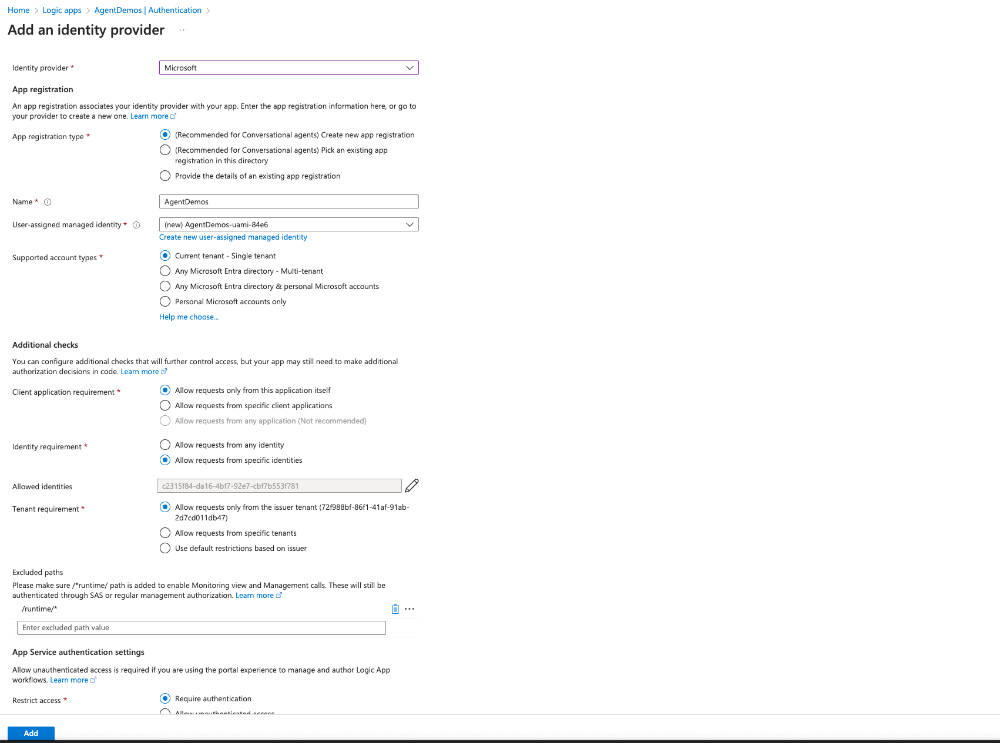
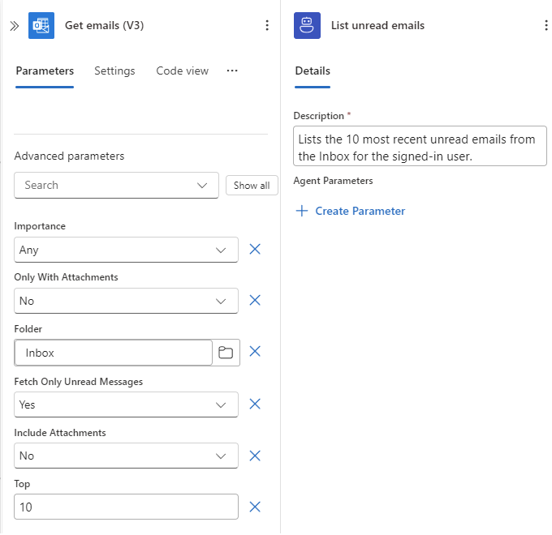

In this module, you learn how to set up an agent that acts *on behalf of* (OBO) the signed-in user, meaning that the agent can run connector actions by using that user's identity. This module describes scenarios for where to add OBO authorization, known also as *user context*, how to configure the appropriate connections, test with different users, and learn the limitations.

When you finish this module, you'll achieve the goals and complete the tasks in the following list:

- Understand user-delegated versus app-only identities for tools.
- Configure a connector-backed tool to run with user context.
- Test behavior changes across users with different permissions.
- Apply best practices for consent, scopes, and error handling.

For more information, see [Microsoft identity platform and OAuth 2.0 On-Behalf-Of flow](https://learn.microsoft.com/entra/identity-platform/v2-oauth2-on-behalf-of-flow).

## Identities for tools

The following table describes different identities that a tool can use to run actions:

| Identity | Description |
|----------|-------------|
| Per-user (OBO) | A connector action runs by using a delegated token for the signed-in user. The result depends on the user's permissions and licenses. |
| App-only (application identity) | A connector action runs by using a managed identity or an app or service principal. The result depends on app permissions and configuration.   **Important**: Use an app-only identity when the tool performs shared operations that aren't tied to a user like posting to a shared channel, running a back office job, or using a service account. |
| Connection reference | Your workflow binds each connector action to a specific connection that determines how to perform authentication. |

## Scenarios for on-behalf-of (OBO) authorization

When you need a tool to respect the signed-in user's permissions, licenses, or personal data boundaries, set up OBO authorization when available. The following list provides a few common example scenarios:

- Microsoft 365: Read a person's mail, calendar, files, or profile.
- ServiceDesk or ITSM: Attribute actions to the requester.
- Enterprise APIs with per-user authorization or auditing requirements.

Many solutions use mixed authorization methods. For example, a solution might read user data with OBO for personalization, and then perform a write operation by using an app-only identity after explicit confirmation.

## Limitations

In conversational agent workflows, support for OBO authorization currently applies only to managed connectors that connect to Microsoft-owned services. Support for 3rd party connectors and custom connectors is coming soon. Please reach out with your scenario if there are particular connectors you would like us to prioritize.

> :::note
>
> For debugging purposes, administrators can view user chat history in monitoring view. 
> To improve this experience in the future, share your feedback with our team.
> 
> Outside monitoring view, each person's chat history is private. You can't read or 
> continue another person's conversation in the chat client or by using the A2A protocol.

## Prerequisites

- An Azure account and subscription. If you don't have a subscription, [sign up for a free Azure account](https://azure.microsoft.com/free/?WT.mc_id=A261C142F).

- A Standard logic app resource and conversational agent workflow from previous modules.

  - The conversational agent workflow requires a connector operation that works with a Microsoft service or system. The connection must also support delegated, per-user connections, for example, Microsoft 365, SharePoint, or Microsoft Graph. If required, the connection might also need tenant administrator consent.

    > :::tip
    > 
    > Make sure to keep tool descriptions concise and include guidance about the data that they access,
    > for example, such a description might say "Gets the signed-in user's next five calendar events."

- The chat client interface integrated with conversational agent workflows.

  > :::note
  >
  > If you are building a custom client that can't pass a user token yet, complete the concepts with the app-only connections.
  > In a later module, you integrate a custom client that supplies the user's access token to the agent.

- Two test users or user accounts for conversing through chat with different permissions using the specified connection for this module.
  For example, one user account might have access to a mailbox or website, while the other user account doesn't have access.

## Authentication and authorization

### Recommended: Set up Easy Auth on your logic app

For production scenarios, including chat clients outside the Azure portal, set up Easy Auth (App Service Authentication) as the recommended way to securely handle authentication and authorization.

1. In the [Azure portal](https://portal.azure.com), open your Standard logic app resource.

1. On the resource sidebar, under **Settings**, select **Authentication**.

1. On the **Authentication** page, select **Add identity provider**. From the **Identity provider** list, select **Microsoft** for Microsoft Entra ID.

1. Create a new app registration (highly recommended) or select an existing app registration (additional set-up required) by using the options for conversational agents. If you choose to select an existing app registration, please follow [Authentication and authorization in Azure Logic Apps for Conversational Agents](https://learn.microsoft.com/azure/logic-apps/overview-agent-authentication-authorization) to configure the existing app registration to work with conversational agents.

1. Set up additional checks for the sign-in process, based on your scenario.

1. Require authentication for requests as appropriate for your environment.

1. When you're done, select **Add** to save your selections.

The following example shows a sample Easy Auth setup:

For more information, see the following articles:

- [Authentication and authorization in Azure App Service and Azure Functions](https://learn.microsoft.com/azure/app-service/overview-authentication-authorization)
- [Configure your App Service or Azure Functions app to use Microsoft Entra sign-in](https://learn.microsoft.com/azure/app-service/configure-authentication-provider-aad)

### Alternative: Default authentication and authorization through developer key

For testing and other non-production scenarios, the portal provides a developer key that can be used instead of Easy Auth. The developer key is linked to a particular user and tenant based solely on the ARM bearer token. The usage of the developer key is automatically handled in the portal to execute actions on the user's behalf.

## Part 1 - Choose the identity model for each tool action

Determine the authorization to use for each tool action:

 - For "my data" or user-personalized operations, such as "Get my upcoming meetings", use OBO.

 - For shared resources or automations, such as "Post today's health status to the operations channel", use app-only authorization.

> :::tip
> 
> Make sure to keep tool descriptions concise and include guidance about the data that they access,
> for example, such a description might say "Gets the signed-in user's next five calendar events."

## Part 2 - Create a per-user, delegated connection

To support delegated user access, create the connection as a per-user connection:

1. In the [Azure portal](https://portal.azure.com), open the conversational agent workflow in the designer.

1. In the designer, add or select the connector action that you want your workflow to run with OBO, for example, a Microsoft 365 action.

1. On the **Create connection** pane, select **Create as per-user connection?**, which is required and available only for Microsoft service or system connectors, and then select **Sign in**, for example:

   

   > :::caution
   >
   > You must create per-user connections with the **Create as per-user connection?** option. 
   > You can't convert an existing app-only connection to a per-user connection, so you must
   > create a new per-user connection. If you don't see the per-user connection option,
   > you might be editing an app-only connection. In this case, create a new connection.

1. Complete the sign-in and consent flow, which authorizes the workflow to use your credentials.

   At this point, any sign-in exists only for connection creation validation. At runtime, this identity isn't available for other users.

  > :::note
  >
  > Currently, there are no indicators in the workflow designer on which connections are per-user connections. This will be addressed in an upcoming release. For now, please check the cross-check the connection with the connections tab in the logic app which has the per-user (dynamic) connection indicators.

### Expectations for chat first use and reuse

When a tool first uses a connector action with per-user authorization in the chat client, an authentication prompt appears for the user to sign in. After the user signs in, subsequent calls made with same per-user connection don't require reauthentication.

> :::note
>
> The connection uses credentials that belong to the user in the chat session, not the connection creator.
> This behavior makes sure that the tool runs with the signed-in user's permissions.

## Example: List unread Outlook emails for a signed-in user

The following example shows how to add a tool that lists the unread emails for a signed-in user by using an Outlook connector action with OBO.

### Part 1 - Add the Outlook connector action

1. In the [Azure portal](https://portal.azure.com), open your Standard logic app resource.

1. Find and open your conversational agent workflow in the designer.

1. On the designer, inside the agent and next to any existing tool, select the plus sign (+) for **Add an action** to open the pane where you can browse available actions.

1. On the **Add an action** pane, follow these [general steps](https://learn.microsoft.com/azure/logic-apps/create-workflow-with-trigger-or-action?tabs=standard#add-action) to add an **Office 365 Outlook** action, for example, **Get emails (V3)**, as a tool.

### Part 2 - Set up the per-user, delegated connection

1. On the designer, select the Outlook action that you added as a tool.

1. On the **Create connection** pane, select **Create as per-user connection?**, and then select **Sign in**.

1. Complete the sign-in and consent flow, which authorizes the workflow to use your credentials.

### Part 3 - Set up the action

1. On the designer, select the Outlook action to open the information pane for the action.

1. On the **Parameters** tab, provide the following information:

   | Parameter | Value |
   |-----------|-------|
   | **Folder** | **Inbox** |
   | **Fetch only unread messages** | **Yes** |
   | **Top** | **10** |

### Part 4 - Name and describe the tool

1. On the designer, select the tool action to open the information pane for the tool.

1. On the **Details** tab, provide the following information:

   - Name: **List unread emails**
   - Description: **Lists the 10 most recent unread emails from the Inbox for the signed-in user.**

   The following example shows how the tool appears at this point:

   

1. Save your workflow.

### Part 5 - Test in chat

1. On the designer toolbar, select **Chat** to open the chat client in the Azure portal.

1. For Easy Auth only, select the chat client URL, which opens the chat client integrated with your logic app.

   

1. In the chat client interface, ask the following question: **What unread emails do I have?**

   If you're using the tool for the first time, the agent prompts you to sign in for authentication, for example:

   

   After you authenticate, the chat client interface that authentication successfully completed, for example:

   

   The chat client interface now returns a summary with unread emails, specifically the subject, sender, and received time.

You can follow a similar pattern when you use other Microsoft 365 connectors, such as OneDrive with **List my recent files** or Teams with with **List my joined teams or recent messages**.

> :::caution
> 
> For OBO scenarios, make sure to select the per-user connection option.

### Part 6 - Test with users who have different access

1. In the chat client outside the Azure portal, start a session as User A.

1. Ask the agent to perform an operation that requires OBO authorization, for example, **Show my upcoming events today**.

1. Confirm that the tool successfully runs and that the results reflect the data and permissions for User A.

1. Repeat these steps as User B. Confirm that the tool successfully runs and that the results reflect the data and permissions for User B.

   Based on access, results for User B might differ from User A.

## Part 3 - Plan for client integration (token pass-through)

If your production experience uses a custom chat client that's web-based, mobile, or another service, plan to provide the user's access token to the agent and implement the OBO flow, based on the following process:

1. Capture the user's sign-in through your app. Get an access token for the target resource, for example, Microsoft Graph, with the required scopes.

1. Pass the token to your agent call, based on your integration model (Module 09).

1. Set up your tool to use the delegated token or a connection that recognizes the user's context.

For more information and sample client code, see the module [Module 05 - Connect your agents using A2A protocol](./05-connect-agents-a2a-protocol.md).

## Review best practices

The following table describes best practices to consider for OBO authorization scenarios:

| Concept | Description |
|---------|-------------|
| Mixed identity patterns | Set up OBO authorization for read operations and use app-only authorization for write operations after explicit confirmation. |
| Clear feedback | Instruct the agent to briefly summarize permission errors and suggest remediation, for example, "You might not have access to this mailbox". |
| Auditing and logging | Track and analyze the tools that run and the identity (user or app) they use by reviewing the workflow run history and telemetry. |

## Troubleshoot problems

The following table describes some common problems and troubleshooting suggestions:

| Problem | Suggestion |
|---------|------------|
| 401/403 Unauthorized | Confirm that the connection uses delegated permissions and the user has access to the resource. Check conditional access policies. |
| Consent or scope mismatch | Confirm that the requested scopes match the operation. Recreate the connection if scopes changed. |
| Token audience (aud) errors | Confirm that the access token is issued for the correct resource when using a custom client. |
| Rate limits (429 errors) | Apply backoff or ask the user to narrow the request. |
| Mixed identity confusion | Check the connection that a tool uses. Make sure to clearly label app-only and user-delegated connections. |

## Additional content

- [Extend tool functionality with patterns](../04_agent_functionality/02-extend-tools-with-patterns.md)
- [Connect your agents using A2A protocol](./05-connect-agents-a2a-protocol.md)
- [Deploy agent clients](./06-deploy-agents-clients.md)
