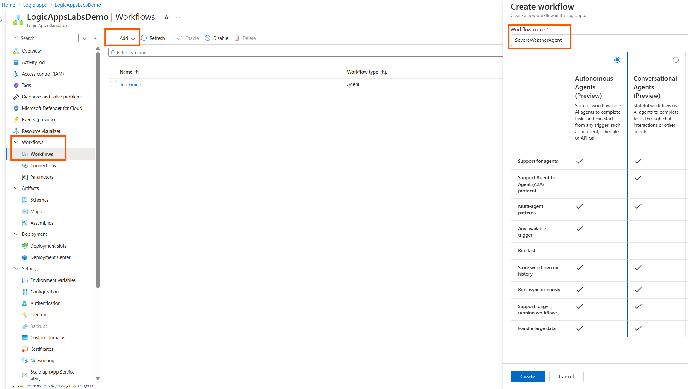
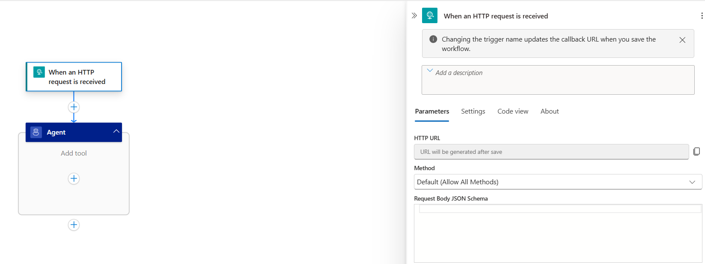
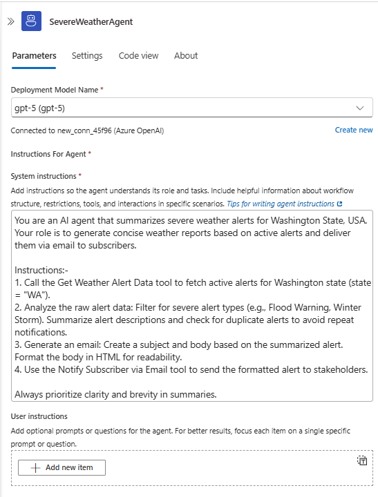
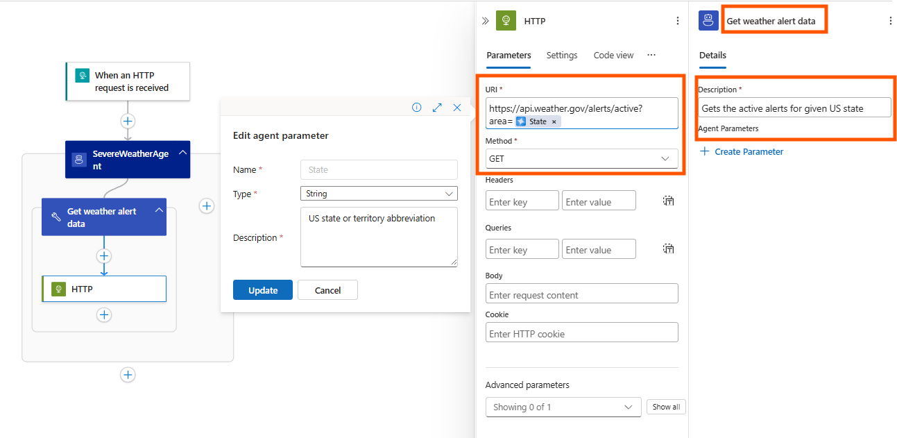
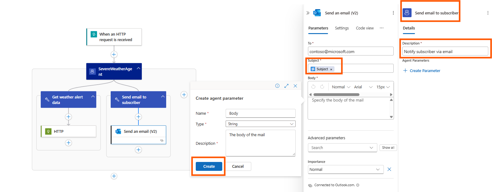

In this module, you'll learn how to create your first autonomous agent using Azure Logic Apps (Standard). You'll build a simple agent workflow, connect it to an Azure OpenAI model or Azure Foundry, and integrate a tool the agent can invoke. The example agent is a Severe Weather Advisory Agent for Washington State, designed to monitor public alerts and generate actionable summaries for subscribers on demand.

By the end of this module, you will:
- Build and deploy a working autonomous agent.
- Understand key concepts behind agent workflows in Logic Apps.
- See how agents reason and execute tools.

This module keeps the agent and tool simple to focus on core principles. Future modules will expand with more tools, control logic, and model resource types.

---
## Prerequisites 

- An Azure account and subscription. If you don't have a subscription, [sign up for a free Azure account](https://azure.microsoft.com/free/?WT.mc_id=A261C142F).
- Existing Logic Apps Standard workflow app (or create one): [Create a single-tenant workflow app](https://learn.microsoft.com/azure/logic-apps/create-single-tenant-workflows-azure-portal).
- Deployed Azure OpenAI model (for example a GPT family chat/completions model): [Azure OpenAI models](https://learn.microsoft.com/azure/ai-services/openai/concepts/models).

---
## Create an autonomous agent
1. Open your Logic Apps Standard resource and select Workflows.
1. Select + Add.
1. In the Create workflow pane, enter a name (example: `SevereWeatherAgent`).
1. Select workflow kind: Autonomous Agents.
1. Select Create.

   

You are redirected to the new workflow designer.

## Configure trigger for the agent
Your agent needs a trigger to determine when it should start running. You can choose any trigger that suits your scenario. See [triggers for autonomous agents](https://learn.microsoft.com/en-us/azure/logic-apps/create-agent-workflows#add-a-trigger) for more options. For this module, we’ll use the **Request** trigger.
To add a trigger, follow these steps:
1. On the designer, select Add trigger.
1. On the Add a trigger pane, select **Request** trigger named When a HTTP request is received.


## Configure the agent loop connection
1. Select the Agent (agent loop) action.
1. Pick your subscription.
1. Select the Azure OpenAI resource that hosts your deployed model (e.g., GPT‑5).
1. Create the connection.

   

The agent connection is now ready; configure its inputs next.

## Configure agent loop inputs
1. Rename the agent loop action to `SevereWeatherAgent`.
1. Select the deployment model name (or create a new deployment if needed).
1. Provider the instructions for agent. Use a concise, structured prompt that guides tool use and resilience:

Recommended prompt for Severe Weather Agent
````text
You are an AI agent that summarizes severe weather alerts for Washington State, USA. Your role is to generate concise weather reports based on active alerts and deliver them via email to subscribers.

Instructions:- 
1. Call the Get Weather Alert Data tool to fetch active alerts for Washington state (state = "WA").
2. Analyze the raw alert data: Filter for severe alert types (e.g., Flood Warning, Winter Storm). Summarize alert descriptions and check for duplicate alerts to avoid repeat notifications.
3. Generate an email: Create a subject and body based on the summarized alert. Format the body in HTML for readability.
4. Use the Send email to subscriber tool to send the formatted alert to stakeholders.

Always prioritize clarity and brevity in summaries.
````


## Add tools in the agent loop action
Tools empower agent loop to interact with external systems using 1400+ logic app connectors, enabling them to retrieve data, perform actions, and make decisions beyond static responses. They are essential for grounding agent reasoning in real-world context and executing tasks dynamically within workflows.

**NOTE**: Providing a clear **tool name** and a well-written **tool description** helps the agent understand when and how to use the tool effectively. Good descriptions lead to smarter tool selection and more accurate task execution. Learn more about using [connector actions](../02_build_conversational_agents/03-connect-tools-external-services.md) and [agent parameters](../02_build_conversational_agents/04-add-parameters-to-tools.md) in tools.

In this module, we will add 2 tools:- **Get weather alert data** and **Send email to subscriber**.

### Steps to configure Get weather alert data tool
1. Click “Add an action” inside the agent loop (opens the action panel).
1. Select the HTTP connector > HTTP action (this creates a new tool along side the action).
1. In HTTP action panel, configure URI as ````https://api.weather.gov/alerts/active?area=(Configure state code as agent parameter at the end of URI)```` and set method as ```GET```
1. In tool panel, rename tool name as ````Get weather alert data```` and description as ````Gets the active alerts for given US state.````



### Steps to configure Send email to subscriber tool
1. Click “Add an action” inside the agent loop (opens the action panel).
1. Select the Outlook.com connector > Send an email(V2) action (this creates a new tool along side the action).
1. Create outlook managed connection as directed.
1. In Send an email(V2) action panel, set subject and body of the email as agent parameters
1. In tool panel, rename tool name as ````Send email to subscriber```` and description as ````Notify subscriber via email.````



## Save and trigger the agent
The last step is to save your workflow — the autonomous agent is now ready to use. To initiate a run, simply invoke the trigger URL.


### Summary & next steps
In this module, we built our first autonomous agent using Azure Logic Apps. We defined a system prompt to guide the AI model’s reasoning and added a tool the agent can invoke to fetch relevant data. These elements form the foundation of agent design and can be combined with the full range of Azure Logic Apps features to create robust, scalable, and intelligent workflows.