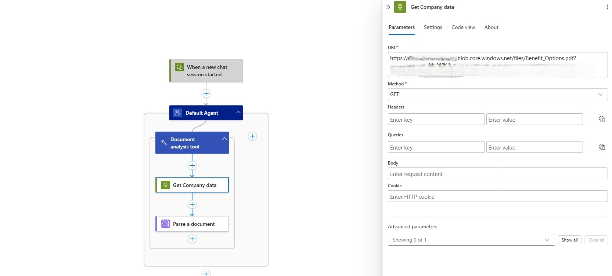
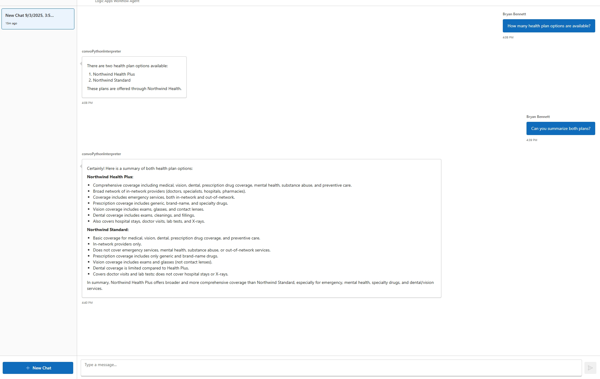

This module explains how to add basic custom knowledge to your Azure Logic Apps agents.

When finished with this module, you'll have gain the following knowledge:

- **Knowledge Agent Creation**: How to transform unstructured documents into knowledge agents for answer domain specific questions

## Adding Domain specific knowledge to an Agent

Adding domain-specific knowledge to an AI agent significantly enhances its ability to deliver accurate, relevant, and context-aware responses. By incorporating specialized information, the agent can better understand industry terminology, workflows, and unique challenges, resulting in more effective problem-solving and decision-making. This targeted expertise enables the agent to provide tailored recommendations, automate complex tasks, and improve user trust by demonstrating a deeper understanding of the domain. Ultimately, domain-specific knowledge transforms a generic AI agent into a valuable resource that drives greater efficiency and business value within its intended environment.

Azure Logic Apps provides a comprehensive suite of document processing and transformation actions that enable seamless data ingestion from diverse sources and document formats.


## Ingest a document from Blob storage for Agent use

### Step 1 - Setup your agent
> :::note
> Prerequisites for this module are the following
> - You have access to an Azure Storage Account resource. For steps on setting this resource up, follow the guide here [Create an Azure storage account](https://learn.microsoft.com/en-us/azure/storage/common/storage-account-create?tabs=azure-portal).
> - You have uploaded a pdf document to your storage resource. The link to this resource will be used in the next steps. The pdf used in this module can be download here [Benefit_Options.pdf](media/03-add-knowledge-to-agent/Benefit_Options.pdf)  
> - You have access to an Azure Search service. For more on creating this resource visit here [Create an Azure AI Search service](https://learn.microsoft.com/en-us/azure/search/tutorial-optimize-indexing-push-api#create-an-azure-ai-search-service). This module assume your search index is created using this index schema 


1. In the [Azure portal](https://portal.azure.com), open your Standard logic app resource.

1. Find and open your conversational agent workflow in the designer.

   

On the designer, select the agent action. Rename the agent: **Document knowledge agent**. Next enter the System Instructions  

```
You are a helpful document analysis agent. When a question is asked, follow these steps in order: 

Using the "Document Analysis tool" to download the document, the output from this tool is the document text. Use only this text to answer the user's question. No other data or information should be used to answer the question.

```

### Step 2 - Add the Document Analysis tool to your agent
1. On the designer, inside the agent, select the plus sign (+) under **Add tool**.
1. Click on the Tool, and rename it to **Document analysis tool**. Then add the follow Description **Answers questions about a specific document.** 

   

1. Add the **HTTP** action and rename if to **Get company data** Select **GET** as the Method type. Set the **URI** property to the http address of your PDF document in Blob storage.
1. Add the **Parse document** action, setting the **Document Content** property to the **Body** output of the **HTTP** action using the value "@body('Get_Company_data')".  
   

### Step 3 - Test your workflow in Chat experience

1. On the designer toolbar, select **Chat**.
1. In the chat client interface, ask the following questions: **How many health plan options are available?**, then ask **Can you summarize both plans?**
   
   
