This module explains how to use advanced techniques to add custom knowledge to your Azure Logic Apps agents using RAG ingestion and retrieval. This module builds from module 4's agent implementation to create a simpler retrieval workflow using a search index with an integrated vectorizer.

When finished with this module, you'll have gained the following knowledge:

- **Azure AI Search integrated vectorization**: How to use Azure AI Search's integrated vectorization for RAG retrieval workflows, simplifying the workflow design.

## Part 1 - Data ingestion and Indexing
> :::note
> Prerequisites for this module are the following
> - You have access to an Azure Storage Account resource. For steps on setting this resource up, follow the guide here [Create an Azure storage account](https://learn.microsoft.com/en-us/azure/storage/common/storage-account-create?tabs=azure-portal).
>- You have a upload a pdf document to your storage resource. The link to this resource will be used in the next steps. The pdf used in this module can be download here [Benefit_Options.pdf](media/03-add-knowledge-to-agent/Benefit_Options.pdf) 
> - You have access to an Open AI Service and this service has a deployed model for generating text embeddings. For more on creating this service visit [Explore Azure OpenAI in Azure AI Foundry](https://learn.microsoft.com/en-us/azure/ai-foundry/openai/tutorials/embeddings?source=recommendations&tabs=command-line%2Cpython-new&pivots=programming-language-python).
> - You have access to an Azure AI Search service. For more on creating this resource visit here [Create an Azure AI Search service](https://learn.microsoft.com/en-us/azure/search/tutorial-optimize-indexing-push-api#create-an-azure-ai-search-service).

### Part 1 - Create your AI Search resources
Using the supplied index JSON file we will create your index in Azure AI Search. More on integrated vectorization [here](https://learn.microsoft.com/en-us/azure/search/vector-search-integrated-vectorization#using-integrated-vectorization-during-indexing). This index will have integrated vectorization enable so that sending embeddings to your index will not be necessary. Next, we will build a data ingestion pipeline in Azure AI Search to ingest your document directly into your index.

#### Step 1 - Create your index
1. In the [Azure portal](https://portal.azure.com), create or open your Azure AI Search resource.
1. On the top menu select **(+ Add index)**, then select **Add index (JSON)**
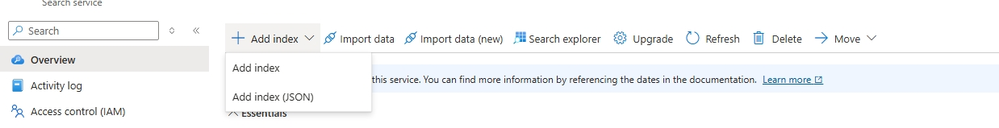
1. Copy the context of the file: [index_schema](media/05-extend-knowledge-to-agent-using-ai-search-integrated-vectorization/integrated_vectorizer_schema.JSON) and paste it into the dialog box. The JSON contects contains placeholders for your OpenAI resource values for the following: \{OpenAI resource URI\}, \{deployment ID\}, \{API key\}, and \{model name\}. Follow below steps to find these values in your OpenAI resource.
   1. In a new browser tab on the [Azure portal](https://portal.azure.com), create or open your Azure OpenAI resource.
   1. On the **Overview** tab, click the **Click here to view endpoints** link.
   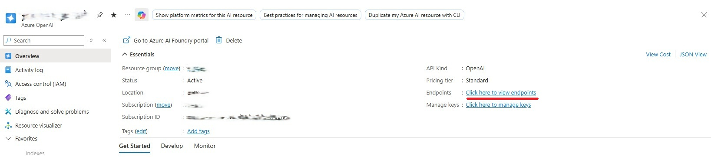
   1. Replace **\{OpenAI resource URI\}** in the JSON with the value from the **Endpoint**.
   1. Replace **\{API key\}** in the JSON with the value from **KEY 1**.
   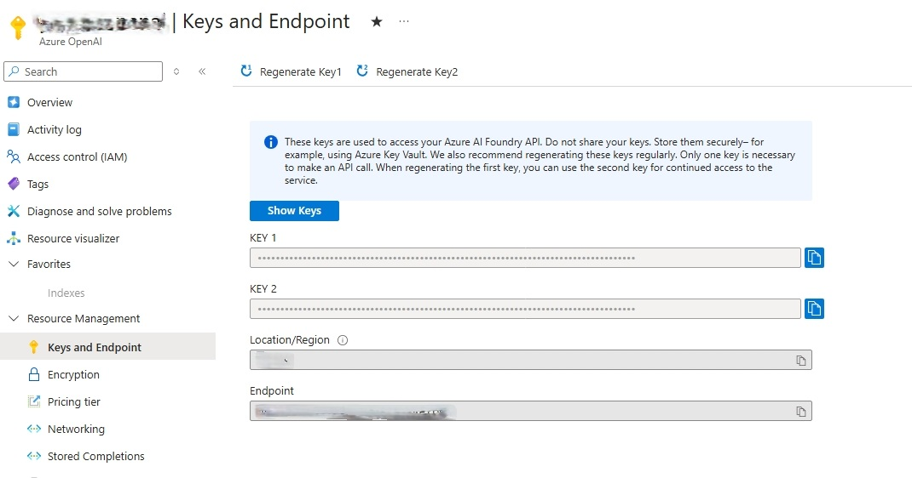
   1. Go back to the **Overview** tab.
   1. Click the **Explore Azure AI Foundry portal** button.
   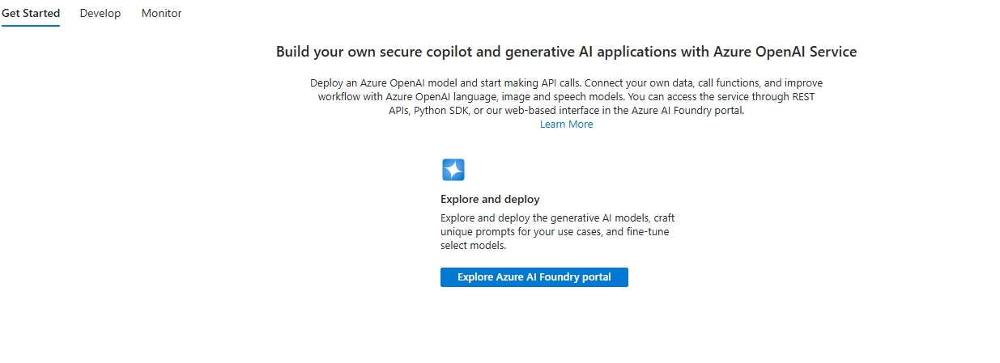
   1. Click **Continue** on the next page.
   1. From the Azure Foundry page, click **Deployments** on the left side menu.
   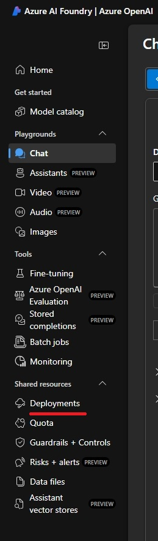  
   1. From the **Model deployments** screen find your text embedding deployments.
   1. Replace **\{model name\}** in the JSON with the Model name of your deployment. ***text-embedding-ada-002** from our example.
   1. Replace **\{deployment ID\}** with the name of your deployment. **text-embedding** from our example.
   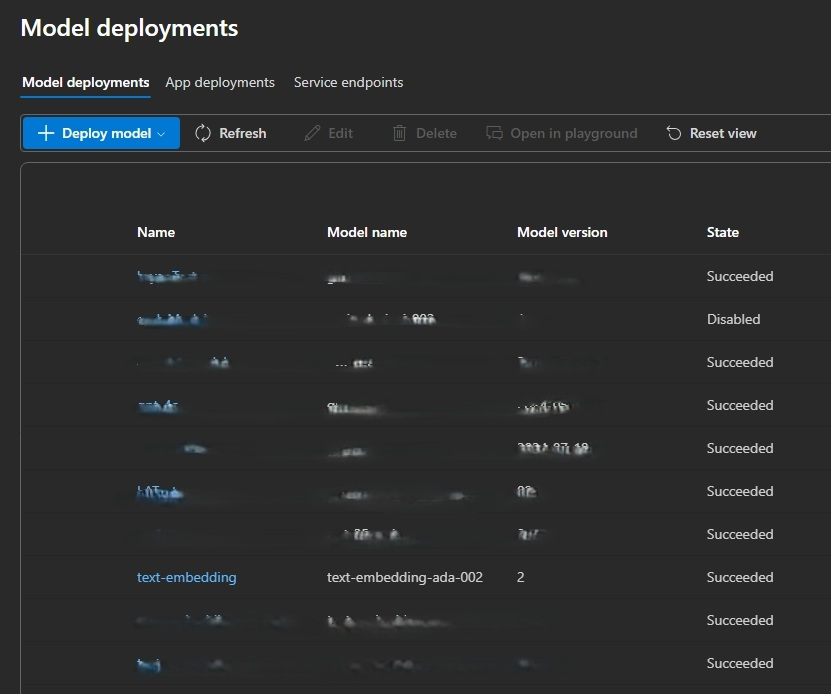
   1. If you do not have an embedding model deploy, follow the steps [here](https://learn.microsoft.com/en-us/azure/ai-foundry/openai/how-to/create-resource?pivots=web-portal#deploy-a-model) to deploy a model.


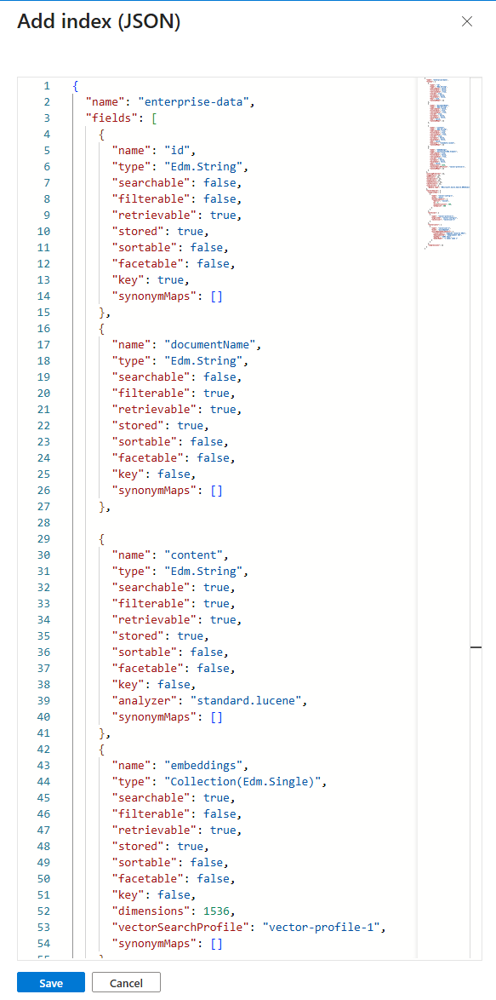
1.With the values replaced for your OpenAI resource, click Save.
1. After successfully saving the index, click on the **Indexes** left side menu item.
1. Verify the index you created is listed.

#### Step 2 - Create your data ingestion pipeline
##### Part A - Create your data source
1. From your AI Search index resource, click the **Data sources** left side menu item.
1. Click the **(+ Add data source) button from the top menu, then click **Add data source**.
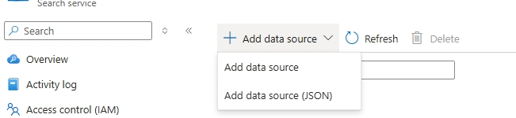
1. On the **Add data source** page. Fill the form to point to your Azure Blob Storage where your document is located.
1. Set **Data Source** to **Azure Blob Storage**.
1. Set **Name** to a name you can remember to reference this data source.
1. Set **Subscription**, **Storage account**, **Blob container**, and **Blob folder** (if necessary) to point to your Blob storage account where your file to ge ingested is stored.
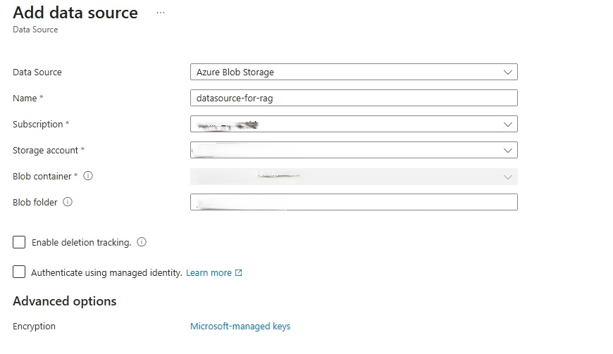

##### Part B - Create your Skillset
1. From your AI Search index resource, click the **Skillsets** left side menu item.
1. Click the **+ Add skillset** button.
1. This will take you to a default skillset JSON page.
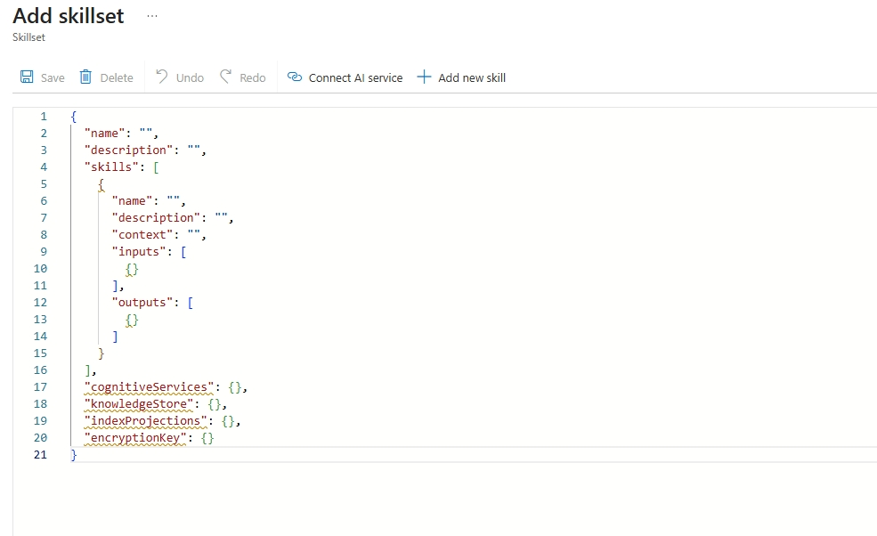
1. Copy the cotents of the skillset JSON [here](media/05-extend-knowledge-to-agent-using-ai-search-integrated-vectorization/skillset.JSON). This file defines two "skills" that will execute when your document is ingested.
    1. The **split-documents** skill will chunk your document into section that are small enough to be sent to OpenAI for generating embeddings,
    1. The **create-embeddings** skill will send your text chunks to your OpenAI text embeddings deployment and return their embeddings.
    1. Replace the value **resourceUri** with your OpenAI resource endpoint.
    1. Replace the value **apiKey** with your OpenAI resource's api key.
1. Click **Save**.

##### Part C - Create your indexer
1. From your AI Search index resource, click the **Indexers** left side menu item.
1. Click **(+ Add indexer)** at the top menu, then click **Add indexer**.
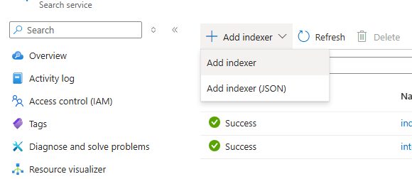
1. Set the **Name** property.
1. Select the integrated vectorizer index you created on the **Index** selector.
1. Set the **Datasource** to the data source created in **Part A** above.
1. Set the **Skillset** to the skillset created in **Part B** above.
1. Set the **Schedule** to the value that makes sense you you. For our example we will set the value to **Once** meaning the indexer will run once after saving.
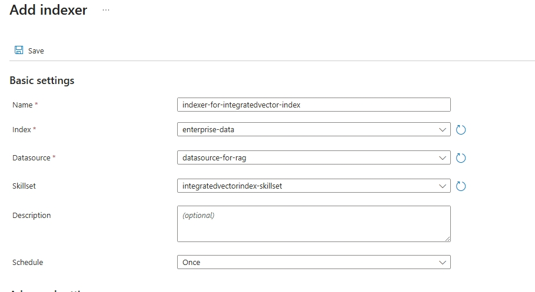
1. Click **Save**.
1. Verify the indexer has run successfully
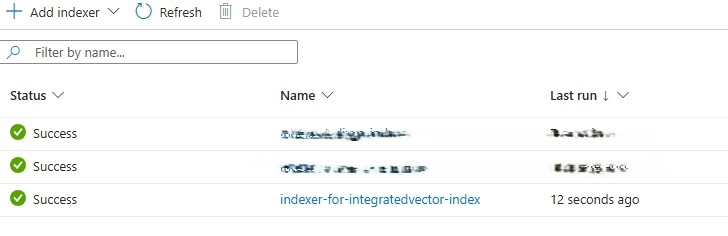

### Part 2 - Create your knowledge agent
To simplify the retrieval workflow compared to module 4, you will use the **Azure AI Search natural language** action in your workflow. This action will automatically engage the integrated vectorizer for generating embeddings. Because the search service creates embeddings for the incoming user queries, your Logic App will not need a separate action to generate embeddings.

#### Benefits
- Fewer actions in your Logic App (simpler workflows)
- Reduced API calls and maintenance
- Consistent vectorization when the same model is used for indexing and querying

#### Step 1 - Create your retrieval workflow
1. In the [Azure portal](https://portal.azure.com), open your Standard logic app resource.

1. Find and open your conversational agent workflow in the designer.


On the designer, select the agent action. Rename the agent: **Document knowledge agent**. Next enter the System Instructions  
```
You are a helpful assistant, answering questions about specific documents. When a question is asked, follow these steps in order: 

Use this tool to do a vector search of the user's question, the output of the vector search tool will have the related information to answer the question. Use the "content" field to generate an answer. Use only information to answer the user's question. No other data or information should be used to answer the question.
```
1. On the designer, inside the agent, select the plus sign (+) under **Add tool**.
1. Click on the Tool, and rename it to **Document search tool**. Then add the follow Description **Searches an azure search index for content related to the input question.**
1. Click the plus **(+)** sign to add a new action.
1. Search for **Azure AI Search (built-in)**.
1. Select the **Search vectors with natural language** action.
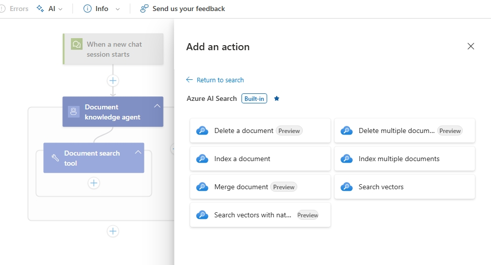
   - Set **Index Name** to the name of your index.
   - Set **Search Text** to the agent parameter previous created named **userQuery**.
   - Click **Save** on the Designer's top menu.
   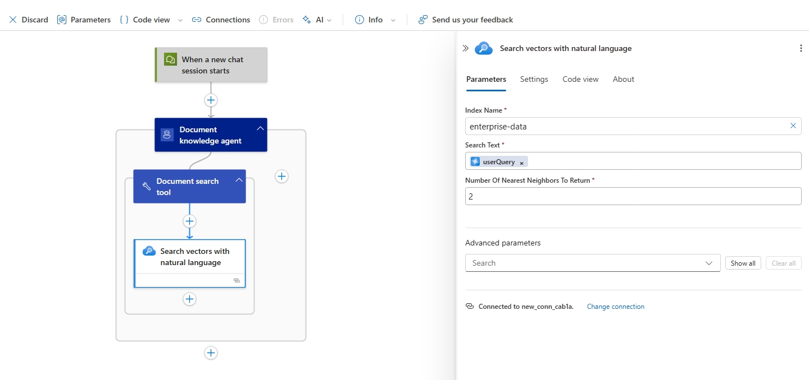
1. Test your workflow
   - Click on **Chat** from the left side menu.
   - Submit the question **What health plans are available?**.
   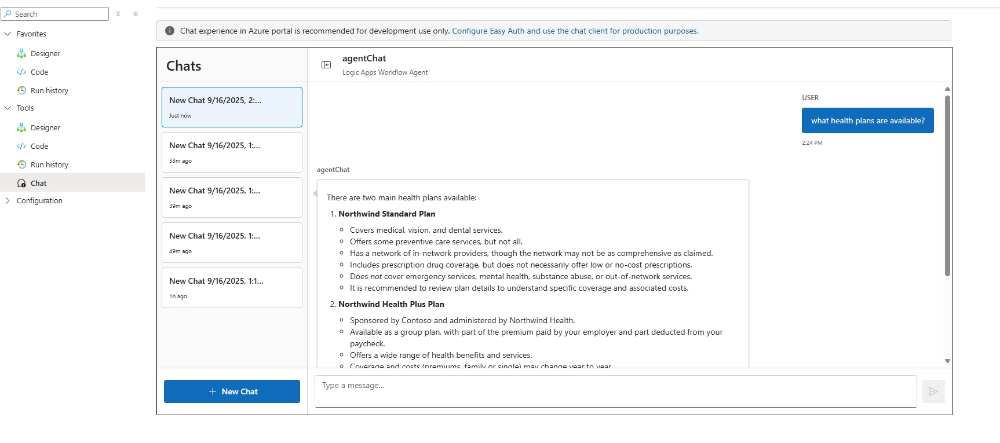
1. Verify workflow execution
   - Click on **Run history** from the left side menu.
   - Click on the latest run and verify the agents execution.
   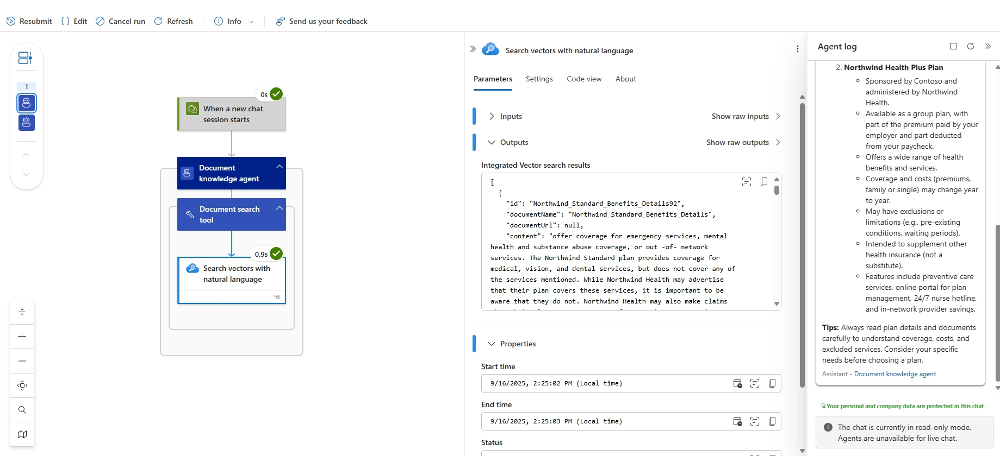


#### Notes and considerations
- Use the same embedding model/deployment for both indexing and query vectorization to ensure compatible vectors.
- Verify quota, permissions, and cost implications for the configured embedding deployment.
- Keep monitoring and adjust the number of nearest neighbors and scoring parameters to tune relevance.
