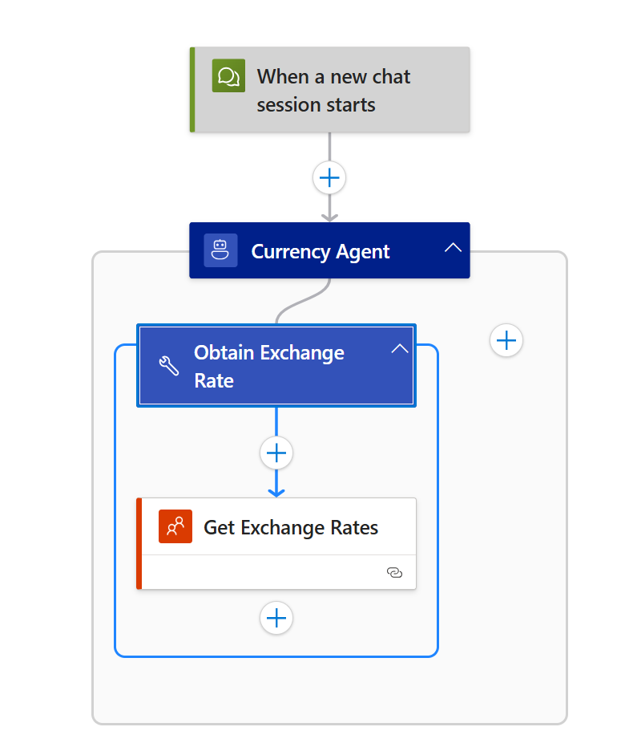
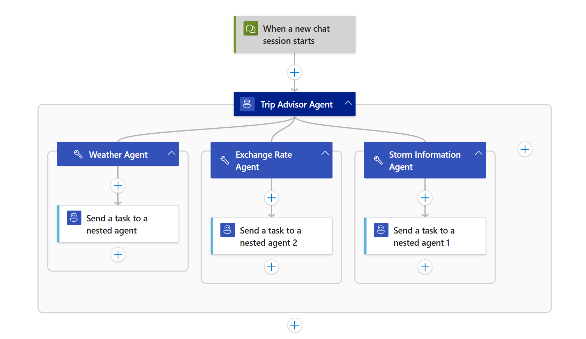
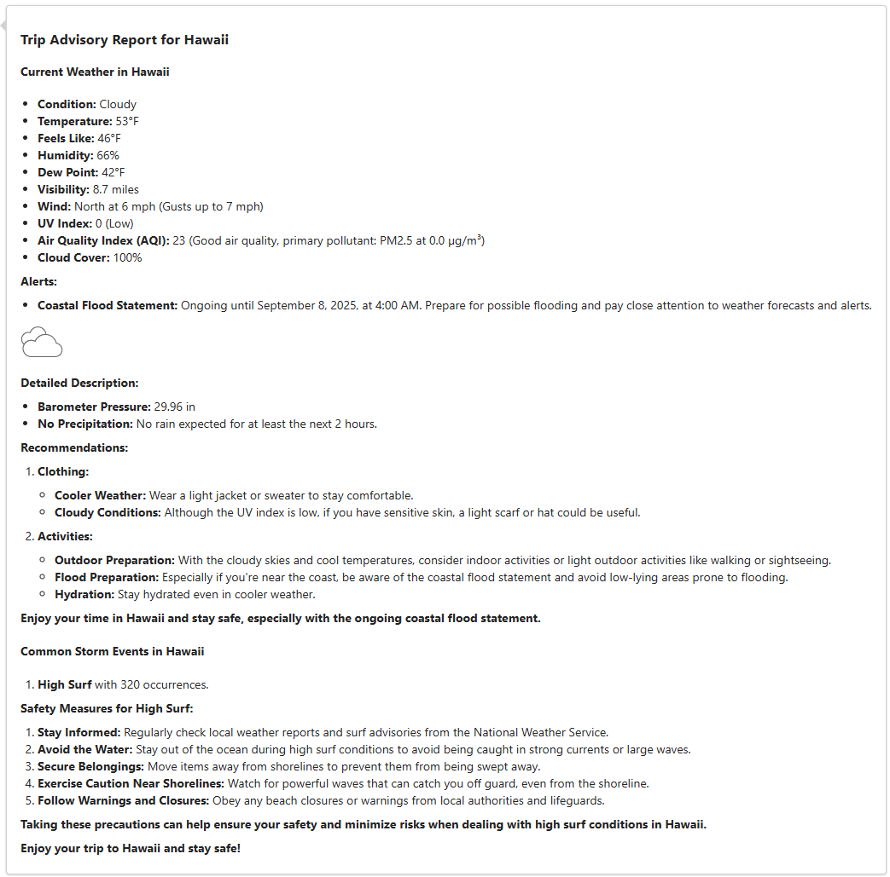

# Orchestrator-Workers Pattern (Module 06)

In this module, you will explore how the orchestrator-workers pattern which enables a central agent to break down complex tasks into smaller, manageable subtasks, delegate them to specialized worker agents, and combine their results to solve problems more efficiently.

When you finish this module, you'll achieve the goals and complete the tasks in the following list:

- Understand when and why to use the orchestrator-workers pattern
- Build nested agent workflows in Logic Apps using autonomous agents
- Design dynamic task decomposition and delegation strategies
- Aggregate and synthesize results from multiple worker agents

## What is the Orchestrator-Workers Pattern?

The orchestrator-workers pattern is a workflow where a central orchestrator agent receives a complex task, dynamically decomposes it into subtasks, delegates these to specialized worker agents, and then aggregates or synthesizes their results. This pattern is ideal when subtasks cannot be predicted in advance and must be determined dynamically based on the input or context.

### Key Benefits

- **Dynamic Task Decomposition**: The orchestrator can break down complex or ambiguous tasks into manageable subtasks at runtime.
- **Parallelization**: Multiple worker agents can process subtasks simultaneously, improving efficiency.
- **Specialization**: Worker agents can be tailored for specific types of subtasks, increasing quality and reliability.
- **Result Synthesis**: The orchestrator can intelligently combine or summarize results from multiple workers.

### When to Use This Pattern

Use the orchestrator-workers pattern when:
- The overall task is complex or unstructured and needs to be broken down dynamically.
- Subtasks are not known in advance and depend on the input.
- Specialized processing is required for different subtasks.
- You want to parallelize work for efficiency.
- Aggregating or synthesizing results from multiple agents is needed.

## Example Scenario

We'll build a **Trip Advisor Agent** for U.S. residents that generates a concise, informative report for any chosen destination. The report always includes the current weather with recommended activities and clothing. For destinations within the U.S., it also includes the most common storm events and important safety measures, as storm data is available exclusively for U.S. locations. For international destinations, it includes the currency exchange rate and preferred payment methods.

This orchestrator agent coordinates three specialized worker agents:

- **Weather Agent**: Provides current weather conditions for the specified region along with suitable activities and clothing
- **Storm Information Agent**: Provides information on the most common types of storm events in a U.S. state as well as pertinent safety measures.
- **Currency Agent**: Provides information on the currency exchange rate for regions outside the U.S and guidance on payment methods.

**Input**: The user's chosen destination (U.S. state or international location)

**Pattern Steps**:
1. **Decompose**: The Trip Advisor Agent receives the region name and determines which information is needed based on whether the region is in the U.S. or not.
2. **Delegate**: The Trip Advisor Agent always calls the Weather Agent to obtain current weather conditions for the region and suggestions for suitable activities and clothing.
3. **Conditional Delegation**:
   - If the region is in the U.S., the Trip Advisor Agent also calls the Storm Information Agent to retrieve the most common storm types for that state as well as safety measures.
   - If the region is outside the U.S., the Trip Advisor Agent calls the Currency Agent to retrieve the currency exchange rate and guidance on payment methods.
4. **Aggregate**: The Trip Advisor Agent synthesizes the gathered information into a concise travel advisory report, including:
   - The current weather of the region, along with suitable activities and clothing
   - For U.S. states: the most common types of storm events and safety measures
   - For non-U.S. regions: the currency exchange rate and preferred payment methods

**Output**: A comprehensive trip advisory report for the selected region

## Prerequisites

- An Azure account and subscription. If you don't have a subscription, [sign up for a free Azure account](https://azure.microsoft.com/free/?WT.mc_id=A261C142F).
- A Standard logic app resource with agent capabilities enabled.
- Completion of previous modules in the conversational agents series.

If you don't have this setup, see [Module 1 - Create your first conversational agent](../02_build_conversational_agents/01-create-first-conversational-agent.md).

## Build a Basic Orchestrator-Workers Workflow

In this section, you'll create a workflow where the orchestrator agent dynamically decomposes a task, delegates subtasks to worker agents, and aggregates their results.

### Step 1 - Create workflows

1. Set up an orchestrator agent and three worker agents.
In the Azure portal, open your Standard logic app resource.

Add a new conversational agent workflow in the designer for each of the four agents: `trip-advisor-agent`, `weather-agent`, `storm-information-agent`, `currency-agent`

### Step 2 - Add the first worker agent (Weather Agent)


1. Configure the agent with the following settings:

- **Name**: Weather Agent
- **System Instructions**:  
   ```
    You are a Weather Agent that provides real-time weather information for any specified region.

    You have access to the "Get Weather" tool, which returns current weather conditions for any location.
    Use this tool to answer questions, offer insights, or assist with tasks related to the weather in the requested location. In addition to reporting the weather, recommend suitable activities and appropriate clothing based on the region and current conditions.
    Ensure your responses are accurate, clear, and tailored to the user’s needs.
   ```
    1. Click “Add an action” inside the agent loop.
    1. Select the MSN Weather > Get current weather action.
    1. Rename the tool: `Get Weather`
    1. Tool description: `Obtain weather for a given region`
    1. Create an agent parameter:
        - Name: `region`
        - Type: String
    1. Add a new connections for the `Get current weather` action.
    1. Set the following:
        - Location: `@{agentParameters('region')}`
        - Units: Imperial

    Note: For this agent and subsequent agents, when you see something like `agentParameters('parameter_name')`, please insert the agent parameter.

   

   

### Step 3 - Add the second worker agent (Storm Information Agent)


1. Configure the agent with the following settings:

- **Name**: Storm Information Agent
- **System Instructions**:  
   ```
    You are an agent specializing in storm-related knowledge.

    You have access to the "Most Common Storm Events" tool, which provides information about the most common storm events for any U.S. state.
    Use this tool to answer questions, offer insights, or assist with tasks related to storm events in the specified state. In addition to reporting storm types, suggest appropriate safety measures to help users prepare for or respond to these events.
    Ensure your responses are accurate, clear, and tailored to the user’s needs.
   ```
    1. Click “Add an action” inside the agent loop.
    1. Select the Azure Data Explorer > Run KQL query.
    1. Rename the tool: `Most Common Storm Events`
    1. Tool description: `Identify the most common storm events for a given state`
    1. Create an agent parameter:
        - Name: `state`
        - Type: String
        - Description: `The U.S. state`
    1. Use the default method of authentication for the `Run KQL query` action.
    1. Set the following:
        - Cluster URL: `https://help.kusto.windows.net/`
        - Database Name: `Samples`
        - Query:
        ```
            StormEvents
            | where State == toupper("@{agentParameters('state')}")
            | summarize Occurrences = count() by EventType
            | order by Occurrences 
            | where Occurrences > 100
        ```

### Step 4 - Add the third worker agent (Currency Agent)


1. Configure the agent with the following settings:

- **Name**: Currency Agent
- **System Instructions**:  
   ```
    You are an Currency Agent that provides exchange rate information for a specified region.

    First, determine the official currency code for the given region.
    Next, use the "Obtain Exchange Rates" tool to find the current exchange rate from USD to the region’s currency.
    Return the exchange rate in a clear and concise format. In addition, offer helpful tips for currency exchange or payment methods commonly used in the destination, such as whether cash, credit cards, or mobile payments are preferred.
   ```
    1. Click “Add an action” inside the agent loop.
    1. Select the Coinbase > Get Exchange Rates.
    1. Rename the tool: `Obtain Exchange Rate`
    1. Tool description: `Obtain exchange rate from USD to the currency of user destination.`
    1. Create an agent parameter:
        - Name: `currency_code`
        - Type: String
        - Description: `The currency code for the region of interest`
    1. Add a new connections for the `Get Exchange Rates` action.
    1. Set the following:
        - Currency: `@{agentParameters('currency_code')}`

### Step 5 - Add the orchestrator agent (Trip Advisor Agent)


1. Configure the agent with the following settings:

- **Name**: Trip Advisor Agent
- **System Instructions**:  
   ```
    You are a Trip Advisor Agent for U.S. residents.
    
    You have access to the following tools:
    - Weather Agent: Provides current weather conditions for a specified U.S. state or international region, along with recommended activities and clothing.
    - Storm Information Agent: Provides information on the most common types of storm events in a U.S. state and suggested safety measures
    - Currency Agent: Provides the current exchange rate for international regions and tips for currency exchange or payment methods in the destination
    
    Your task is to generate a concise and informative trip advisory report for the region the user wishes to visit. 
    
    Your report must include:
    - The current weather for the specified region, including recommended activities and clothing
    - If the region is within the United States, also include the most common types of storm events for that state and suggested safety measures
    - If the region is outside the United States, also include the current currency exchange rate and tips for currency exchange or payment methods.
    
    Use the available tools as needed to gather accurate and relevant information before composing your report. Ensure your report is clear, actionable, and tailored to the user’s selected destination.
   ```
    1. Click “Add an action” inside the agent loop.
    1. Select the Workflow Operations > Send task to a nested agent.
    1. Rename the tool: `Weather Agent`
    1. Tool description: `Obtain weather and suitable clothes and activities for a given region.`
    1. Create an agent parameter:
        - Name: `region`
        - Type: String
    1. Set the following in the nested agent action:
        - Workflow Name: `weather-agent`
        - Task Message: `@{agentParameters('region')}`
    1. Again, click “Add an action” inside the agent loop.
    1. Select the Workflow Operations > Send task to a nested agent.
    1. Rename the tool: `Storm Information Agent`
    1. Tool description: `Obtain storm information and safety precautions for a given U.S. state.`
    1. Create an agent parameter:
        - Name: `state`
        - Type: String
        - Description: `The U.S. state`
    1. Set the following in the nested agent action:
        - Workflow Name: `storm-information-agent`
        - Task Message: `@{agentParameters('state')}`
    1. Again, click “Add an action” inside the agent loop.
    1. Select the Workflow Operations > Send task to a nested agent.
    1. Rename the tool: `Currency Agent`
    1. Tool description: `Obtain exchange rate and preferred payment methods for a given region.`
    1. Create an agent parameter:
        - Name: `region`
        - Type: String
    1. Set the following in the nested agent action:
        - Workflow Name: `currency-agent`
        - Task Message: `@{agentParameters('region')}`

### Step 6 - Test the Orchestrator-Workers Workflow
On the designer toolbar, select **Chat** to open the chat client in the Azure portal. For Easy Auth only, select the chat client URL, which opens the chat client integrated with your logic app.

In the chat client interface, ask the following question: **I would like to travel to Egypt. Can you please advise?**


Then, ask another question: **I would like to travel to Hawaii. Can you please advise?**



When we click the Run history and view the Agent log, we can see the relevant nested agents are being invoked.


## Best Practices for Orchestrator-Workers Workflows

- **Design clear subtask boundaries**: Ensure each worker agent receives a well-defined, independent subtask.
- **Enable dynamic decomposition**: Allow the orchestrator to determine subtasks at runtime based on input.
- **Parallelize where possible**: Design your orchestrator prompt such that worker agents can operate in parallel, improving overall efficiency.
- **Aggregate results effectively**: The orchestrator should synthesize outputs into a cohesive final result.