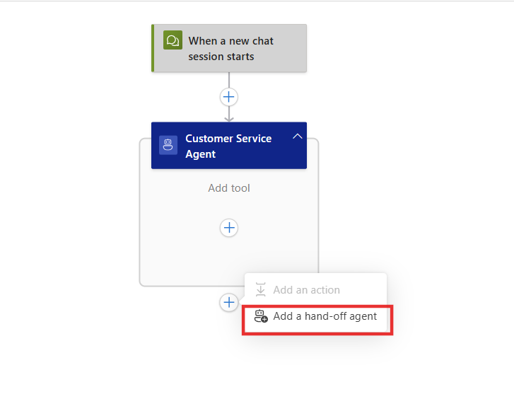
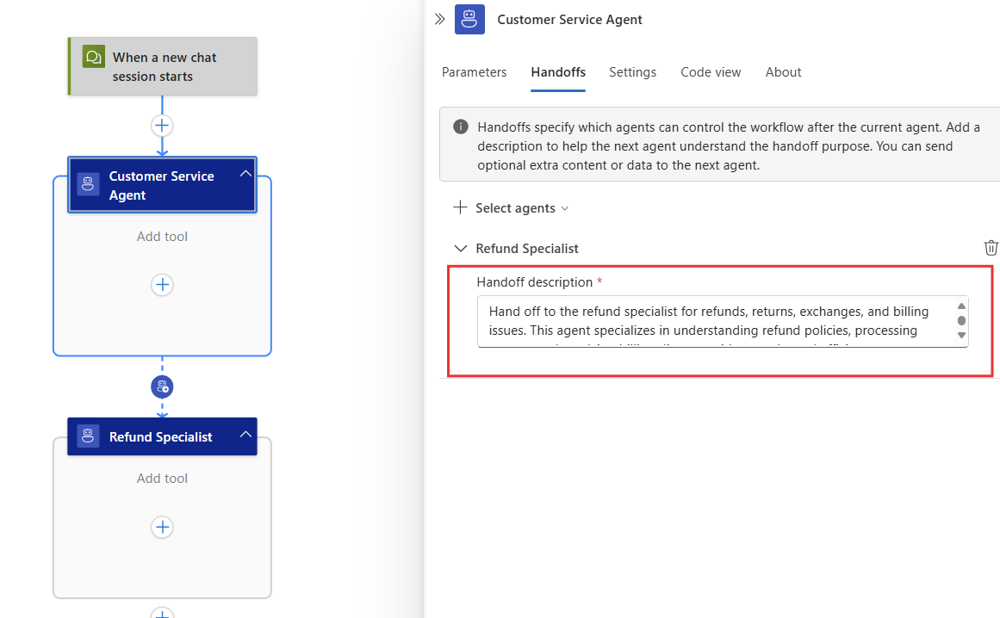
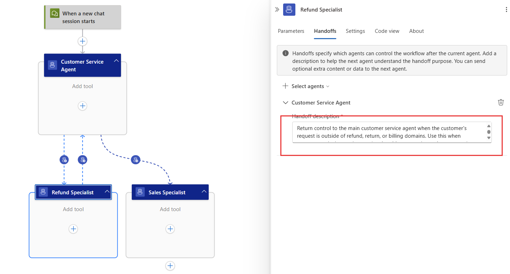
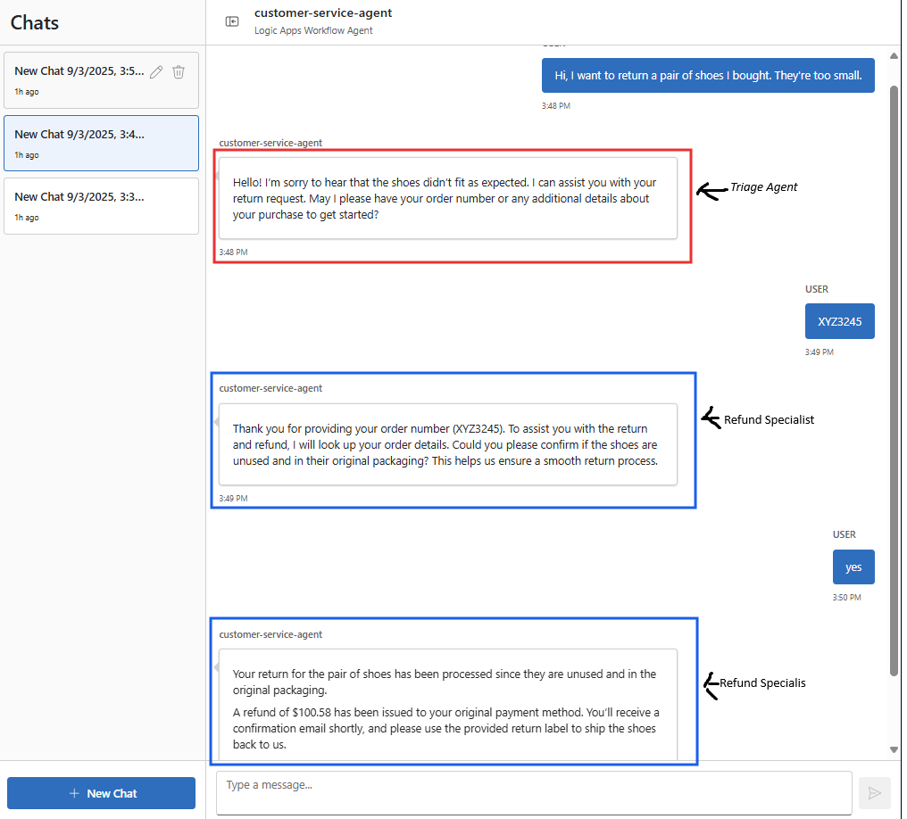
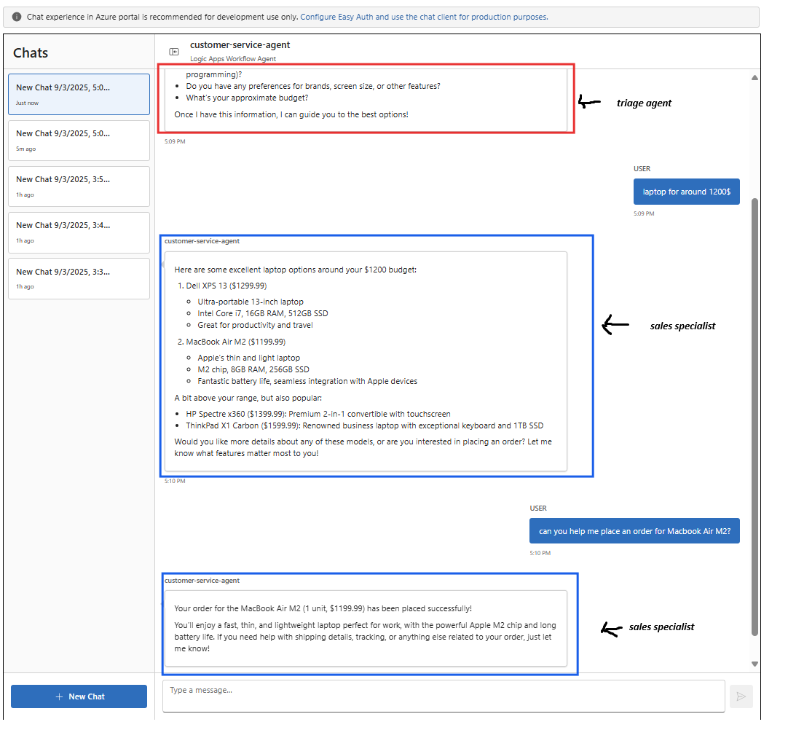
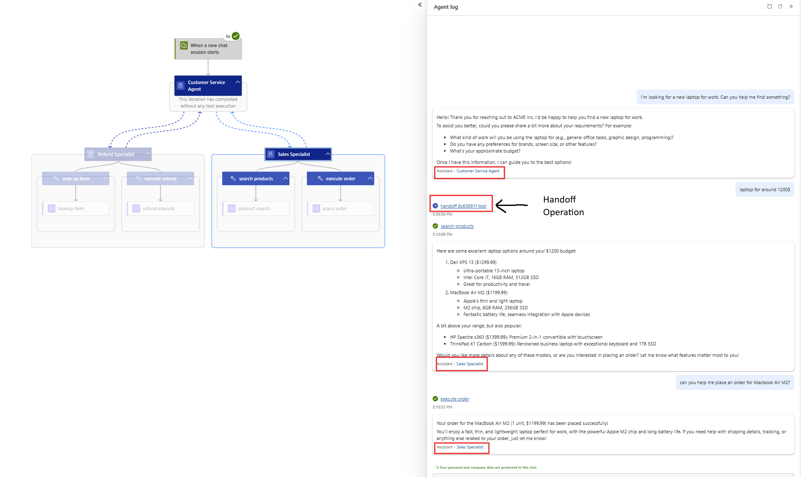
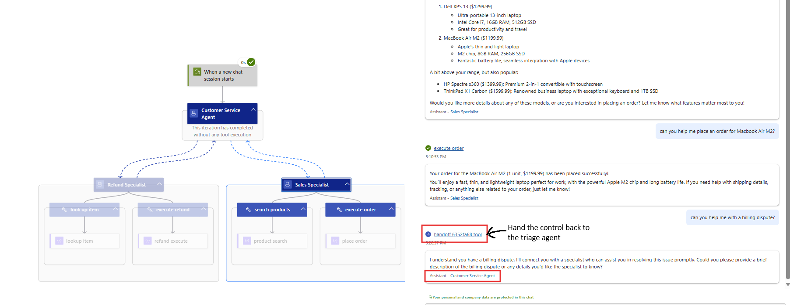

# Handoff Pattern (Module 07)

In this module, you learn how to implement the handoff pattern in Azure Logic Apps. This pattern enables seamless transitions between agents with different specializations while maintaining conversation continuity and context, allowing for expert routing between domains.

When you finish this module, you'll achieve the goals and complete the tasks in the following list:

• Understand when and why to use handoffs
• Build agent workflows with handoff capabilities
• Implement context preservation across agent transitions
• Create bidirectional handoff patterns between specialist agents
• Handle handoff failures and recovery mechanisms
• Monitor multi-agent handoff workflows

## What is the Handoff Pattern?

The handoff pattern enables seamless transitions between agents with different specializations while maintaining conversation continuity and context. As described by Microsoft AutoGen, this pattern allows agents to "delegate tasks to other agents using special tool calls" while preserving the entire conversation context.

### Key Benefits

- **Specialization**: Each agent focuses on its area of expertise
- **Context Preservation**: Complete conversation history is maintained across handoffs
- **Natural Escalation**: Mimics human customer service escalation patterns
- **Fault Isolation**: Issues in one agent don't affect others
- **Dynamic Routing**: Agents can decide when and where to transfer based on conversation flow

### When to Use This Pattern

Use handoff when:
- You need to transfer control between specialized agents during a conversation
- Context and conversation state must be preserved across transitions
- Different stages of a process require different expertise
- Human-like escalation patterns are beneficial
- Agents need to make dynamic decisions about transferring tasks

## Example Scenario

We'll build a **customer service handoff system** that manages the complete customer journey from initial triage through specialized support. This example is based on the Microsoft AutoGen handoff pattern but adapted for Logic Apps.

**Input**: Customer service request
**Handoff Flow**:
1. **Triage Agent**: Initial classification and routing decisions
2. **Refund Agent**: Handles refund requests and processing
3. **Sales Agent**: Manages sales inquiries and product recommendations

**Output**: Specialized response with complete conversation context maintained

## Prerequisites

• An Azure account and subscription. If you don't have a subscription, [sign up for a free Azure account](https://azure.microsoft.com/free/?WT.mc_id=A261C142F).
• A Standard logic app resource with agent capabilities enabled.
• Completion of previous modules in the conversational agents series.

If you don't have this setup, see [Module 1 - Create your first conversational agent](../02_build_conversational_agents/01-create-first-conversational-agent.md).

## Part 1 - Build Customer Service Workflow with Handoff Agents

In this section, you'll create four agent workflows that can seamlessly hand off conversations to each other while preserving complete context.

### Step 1 - Create the Customer Service Workflow with Handoff Agents

1. Create a new workflow in your Logic Apps resource:
   - **Workflow Name**: `customer-service-agent`
   - **Workflow Type**: Conversational Agent

2. Configure the Main Triage Agent:
   - **Name**: Customer Service Agent
   - **System Instructions**: 
     ```
     You are a customer service agent for ACME Inc. Start by introducing yourself and understanding the customer's request. Based on their needs, you can hand off to specialized agents within this conversation.
     
     Your role is to:
     1. Greet customers professionally
     2. Understand their request or issue
     3. Hand off to appropriate specialists when needed
     4. Always maintain friendly, professional tone
     
     You can hand off to specialized agents for complex issues that require focused expertise.
     
     You are part of a multi-agent system designed to make agent coordination and execution easy. Agents uses two primary abstraction: **Agents** and **Handoffs**. An agent encompasses instructions and tools and can hand off a conversation to another agent when appropriate. Handoffs are achieved by calling a handoff function, generally named `handoff_`. Transfers between agents are handled seamlessly in the background; do not mention or draw attention to these transfers in your conversation with the user.
     ```

### Step 2 - Add Specialized Agent Actions with Handoff Descriptions

1. **Add Refund Specialist Agent Action**:
   - In your workflow, add a new **Add a hand-off agent** action to **Customer Service Agent**
     

   - **Agent Name**: Refund Specialist
   - **Handoff Description**: 
     ```
     Hand off to the refund specialist for refunds, returns, exchanges, and billing issues. This agent specializes in understanding refund policies, processing returns, and resolving billing disputes with empathy and efficiency.
     ```
    

   - **System Instructions**: 
     ```
     You are a refund specialist for ACME Inc. Handle refund requests, returns, and billing issues with empathy and efficiency.
     
     Your process:
     1. Understand the customer's refund reason
     2. Propose appropriate solutions (exchanges, fixes, refunds)
     3. If refund is needed, look up item details and execute refund
     4. Always be understanding and helpful with refund requests
     
     You can hand back to the main agent if the request is outside your refund expertise.

     You are part of a multi-agent system designed to make agent coordination and execution easy. Agents uses two primary abstraction: **Agents** and **Handoffs**. An agent encompasses instructions and tools and can hand off a conversation to another agent when appropriate. Handoffs are achieved by calling a handoff function, generally named `handoff_`. Transfers between agents are handled seamlessly in the background; do not mention or draw attention to these transfers in your conversation with the user.
     ```

2. **Add Sales Specialist Agent Action**:
   - Add another **Agent** action to your workflow from **Customer Service Agent** agent
     

   - **Agent Name**: Sales Specialist  
   - **Handoff Description**:
     ```
     Hand off to the sales specialist for product inquiries, purchase assistance, and sales consultations. This agent excels at understanding customer needs, recommending products, and facilitating purchases.
     ```
     
   - **System Instructions**: 
     ```
     You are a sales specialist for ACME Inc. Help customers with product inquiries and sales.
     
     Your sales process:
     1. Understand customer needs and problems
     2. Recommend appropriate ACME products
     3. Discuss features and benefits
     4. Handle pricing and facilitate orders when ready
     5. Hand back to main agent for non-sales issues
     
     Be enthusiastic but not pushy. Focus on solving customer problems.

     You are part of a multi-agent system designed to make agent coordination and execution easy. Agents uses two primary abstraction: **Agents** and **Handoffs**. An agent encompasses instructions and tools and can hand off a conversation to another agent when appropriate. Handoffs are achieved by calling a handoff function, generally named `handoff_`. Transfers between agents are handled seamlessly in the background; do not mention or draw attention to these transfers in your conversation with the user.
     ```

### Step 3 - Configure Return Handoffs to Main Agent

Each specialist agent needs the ability to hand control back to the main Customer Service Agent when they encounter requests outside their domain of expertise.

1. **Add Return Handoff from Refund Specialist Agent to Customer Service Agent**:
   - In the Refund Specialist agent action, add a handoff to the main agent
      
   - **Handoff Agent Name**: Customer Service Agent
   - **Handoff Description**:
     ```
     Return control to the main customer service agent when the customer's request is outside of refund, return, or billing domains. Use this when customers ask about sales, product inquiries, general questions, or need services that are not refund-related.
     ```
      
2. **Add Return Handoff to Sales Specialist Agent**:
   - In the Sales Specialist agent action, add a handoff to the main agent
   - **Handoff Agent Name**: Customer Service Agent
   - **Handoff Description**:
     ```
     Return control to the main customer service agent when the customer's request is outside of sales, product recommendations, or purchase assistance. Use this when customers ask about refunds, technical support, billing issues, or other non-sales topics.
     ```
     
### Step 4 - Configure Agent-Specific Tools

Based on the [Microsoft AutoGen handoff pattern](https://microsoft.github.io/autogen/dev/user-guide/core-user-guide/design-patterns/handoffs.html), each agent should have its own specialized tools. In Logic Apps, you add tools to specific agent actions, not to the main workflow. To keep the example simple, we are going to mock tool invocations by using **Compose** actions.

1. **Add Tools to Refund Specialist Agent**:
   - In the Refund Specialist agent action, add the following tools:
   
   **Tool Name**: `look_up_item`
   - **Tool Description**: `Use to find item ID. Search query can be a description or keywords.`
   - **Tool Parameters**:
     - **Name**: id
     - **Type**: string
     - **Description**: "The item id"
   - **Action**: Add a **Compose** action that returns a mock item ID
   - **Configuration**: 
     ```json
     {
       "item_id": "@agentParameters('id')",
       "status": "found"
     }
     ```

   **Tool Name**: `execute_refund`
   - **Tool Description**: `Execute refund for validated items after confirming eligibility`
   - **Tool Parameters**:
     - **Name**: order_id
     - **Type**: string
     - **Description**: "The order id"
   - **Action**: Add a **Compose** action that processes the refund
   - **Configuration**:
     ```json
     {
       "refund_status": "success",
       "refund_amount": 100.58,
       "confirmation": "Refund processed successfully"
     }
     ```

2. **Add Tools to Sales Specialist Agent**:
   - In the Sales Specialist agent action, add the following tools:

   **Tool Name**: `search_products`
   - **Tool Description**: `Search product catalog based on customer needs and preferences`
   - **Tool Parameters**:
     - **Name**: search_string
     - **Type**: string
     - **Description**: "The search string"
   - **Action**: Add a **Compose** action that returns product search results
   - **Configuration**:
     ```json
     {
       "products": [
         {
           "id": "laptop_001",
           "name": "Dell XPS 13",
           "price": 1299.99,
           "description": "Ultra-portable 13-inch laptop with Intel Core i7, 16GB RAM, 512GB SSD"
         },
         {
           "id": "laptop_002", 
           "name": "MacBook Air M2",
           "price": 1199.99,
           "description": "Apple's thin and light laptop with M2 chip, 8GB RAM, 256GB SSD"
         },
         {
           "id": "laptop_003",
           "name": "ThinkPad X1 Carbon",
           "price": 1599.99,
           "description": "Business laptop with Intel Core i7, 16GB RAM, 1TB SSD, excellent keyboard"
         },
         {
           "id": "laptop_004",
           "name": "HP Spectre x360",
           "price": 1399.99,
           "description": "2-in-1 convertible laptop with touchscreen, Intel Core i7, 16GB RAM, 512GB SSD"
         }
       ]
     }
     ```

   **Tool Name**: `execute_order`
   - **Tool Description**: `Execute customer orders with product details, pricing, and shipping. Price should be in USD.`
   - **Tool Parameters**:
     - **Name**: id
     - **Type**: string
     - **Description**: "The product id"
     - **Name**: quantity
     - **Type**: string
     - **Description**: "The quantity"
   - **Action**: Add a **Compose** action that processes orders
   - **Configuration**:
     ```json
     {
       "order_status": "success",
       "order_id": "@{guid()}",
       "quantity": "@agentParameters('quantity')",
       "productid": "@agentParameters('id')"
     }
     ```

3. **Important Notes on Tool Assignment**:
   - **Agent-Specific Tools**: Each agent only has access to tools assigned to their specific agent action
   - **No Tool Sharing**: The Refund Specialist cannot use sales tools, and the Sales Specialist cannot use refund tools
   - **Focused Functionality**: This separation ensures each agent focuses on their specialized domain
   - **Tool Descriptions**: Clear descriptions help the agent understand when to use each tool


### Step 5 - Test the Handoff System
1. **Test with a refund scenario**:
   - Start a conversation with your `customer-service-handoff` workflow
   - User: "Hi, I want to return a pair of shoes I bought. They're too small."

   

   - Expected behavior:
     - Main agent greets customer and understands the refund request
     - System automatically hands off to Refund Specialist agent
     - Refund Specialist processes the return using available tools
     - Complete conversation context is maintained throughout

   

2. **Test with a sales scenario**:
   - User: "I'm looking for a new laptop for work. Can you help me find something?"

   

   - Expected behavior:
     - Main agent identifies this as a sales inquiry
     - System hands off to Sales Specialist agent
     - Sales Specialist uses product search tools and helps with purchase
     - Conversation flows seamlessly within the same workflow

  

3. **Verify Agent-Specific Tool Usage**:
   - During testing, observe that each agent only uses their assigned tools:
   - **Refund Specialist**: Only uses `look_up_item` and `execute_refund`
   - **Sales Specialist**: Only uses `search_products` and `execute_order`
   - This tool isolation is similar to the AutoGen pattern where each agent has distinct capabilities

4. **Test Return Handoff Scenarios**:
   - **Mixed Request Test**: Start with a refund request, then ask about sales
     - Input to Refund Specialist: "Actually, after this refund, I want to buy something new. What do you recommend?"

     

     - Expected: Refund Specialist hands back to Customer Service Agent, who then routes to Sales Specialist

     
   - **Out-of-Domain Request Test**: Ask specialist agent about unrelated topic
     - Input to Sales Specialist: "Can you help me with a billing dispute?"

     

     - Expected: Sales Specialist hands back to Customer Service Agent, who routes to Refund Specialist

     
## Part 2 - Understanding the Handoff Pattern

### Key Concepts

The [Microsoft AutoGen handoff pattern](https://microsoft.github.io/autogen/dev/user-guide/core-user-guide/design-patterns/handoffs.html) demonstrates important concepts that we adapt for Logic Apps:

1. **Agent Specialization**: Each agent has specific tools and capabilities
   - **Triage Agent**: Has only delegate tools (handoff tools) - no regular tools
   - **Sales Agent**: Has `execute_order` tool + `handoff_back_to_triage` delegate tool
   - **Issues/Repairs Agent**: Has `execute_refund` and `look_up_item` tools + `handoff_back_to_triage`

2. **Tool Separation**: AutoGen distinguishes between:
   - **Regular Tools**: Execute business logic (search, refund, order)
   - **Delegate Tools**: Transfer control to other agents (handoff functions)

3. **Logic Apps Adaptation**: In our Logic Apps implementation:
   - **Agent Actions**: Replace separate AutoGen agents
   - **Handoff Descriptions**: Replace AutoGen delegate tools
   - **Agent Tools**: Replace AutoGen regular tools
   - **Single Workflow**: Replaces AutoGen's distributed agent runtime

### Tool Assignment Best Practices

Based on the AutoGen pattern, follow these principles when assigning tools to agents:

1. **Domain-Specific Tools**: Each agent should only have tools relevant to their domain
   - Refund agents: Item lookup, refund processing, return validation
   - Sales agents: Product search, order processing, pricing tools

2. **No Cross-Domain Tools**: Agents shouldn't have access to tools outside their expertise
   - Sales agents can't process refunds
   - Refund agents can't execute sales orders
   - This prevents confusion and maintains clear boundaries

3. **Tool Description Clarity**: Write precise tool descriptions
   - Include what the tool does
   - Specify input parameters required
   - Add usage guidelines (like "Price should be in USD")

## Best Practices for Handoff Patterns

- **Clear Handoff Descriptions**: Write detailed handoff descriptions that specify exactly when and why to hand off
 to each specialist agent

 >:::important
 Handoffs are implemented as tools and it is important to add special instructions on invoking handoffs to each agent's **system instructions**. For example, we have been adding the following in each of the agents above for better handoff results:

    ```
      You are part of a multi-agent system designed to make agent coordination and execution easy. Agents uses two primary abstraction: **Agents** and **Handoffs**. An agent encompasses instructions and tools and can hand off a conversation to another agent when appropriate. Handoffs are achieved by calling a handoff function, generally named `handoff_`. Transfers between agents are handled seamlessly in the background; do not mention or draw attention to these transfers in your conversation with the user.
     ```

- **Seamless Context Flow**: Conversation context is automatically maintained within the single workflow - no manual context passing required
- **Appropriate Specialization**: Design agent roles with clear boundaries and specific expertise areas
- **Natural Handoff Triggers**: Use natural language cues and customer intent to trigger appropriate handoffs
- **Bidirectional Handoffs**: Ensure agents can both receive handoffs and return control when needed
- **Avoid Handoff Loops**: Ensure agents have clear exit strategies and don't repeatedly hand off the same conversation
- **Monitor Performance**: Track handoff success rates and customer satisfaction across different agent handoffs
## Troubleshooting Common Issues

| Problem | Solution |
|---------|----------|
| Agents don't hand off appropriately | Refine handoff descriptions with more specific triggers and conditions. Append handoff instructions as noted above |
| Handoff loops between agents | Add clear exit strategies and prevent agents from repeatedly handing off same requests |
| Customers confused by agent switches | Ensure smooth transitions with agents introducing their specialization |
| Tools not available to specialist agents | Verify each agent action has access to appropriate tools for their specialty |
| Poor handoff decisions | Monitor and analyze handoff patterns, update agent instructions based on performance |


**Pattern Complexity**: Medium  
**Prerequisites**: Conversational agent basics, Logic Apps fundamentals, Routing pattern
