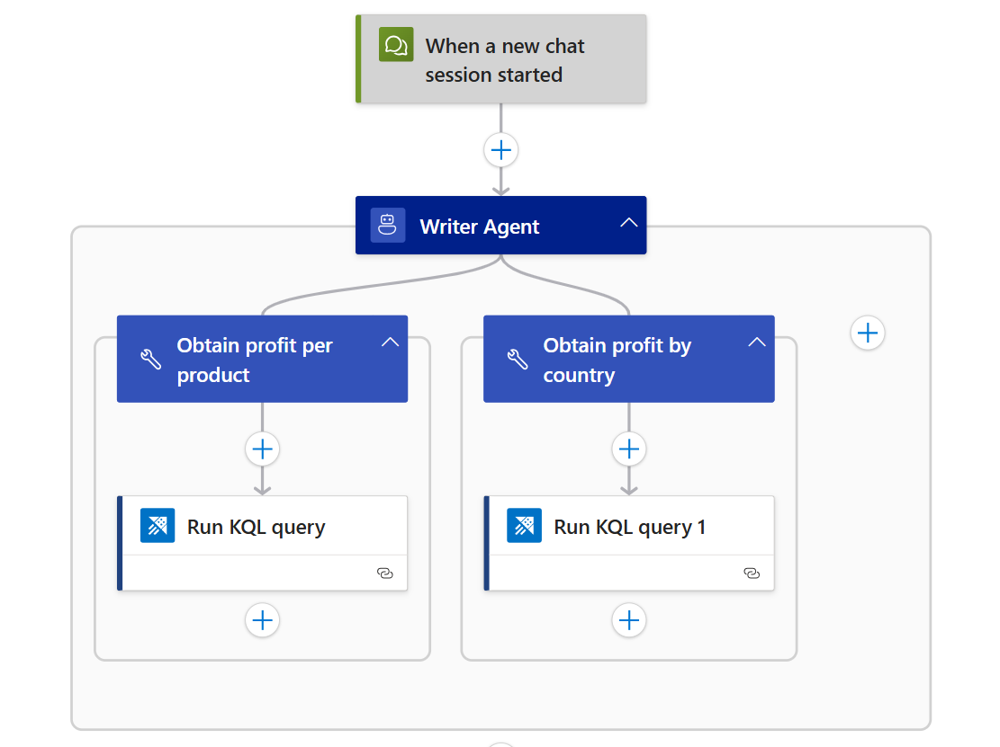
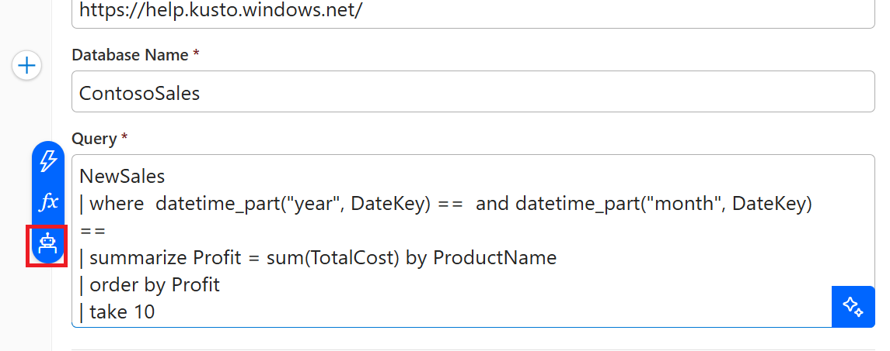
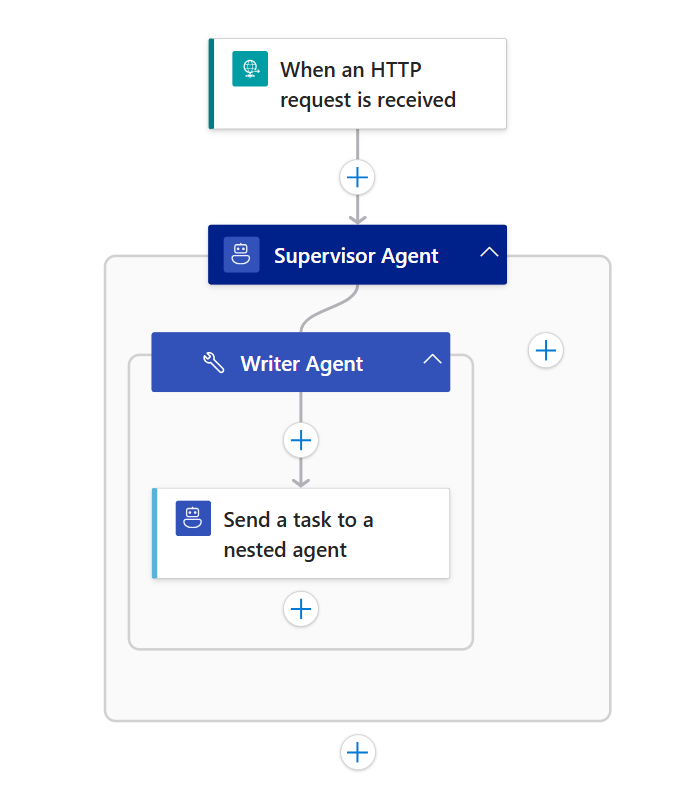
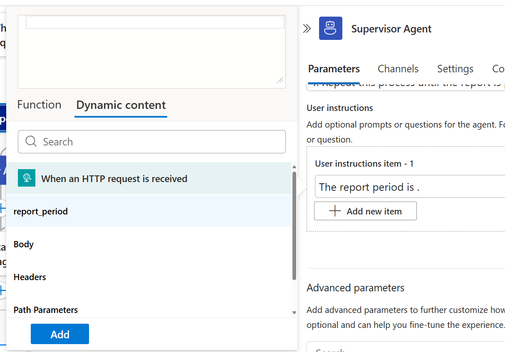

In this module, you will learn how to implement the evaluator-optimizer pattern in Azure Logic Apps. This pattern implements iterative improvement workflows where one agent generates responses while another provides evaluation and feedback in a loop.

When you finish this module, you'll achieve the goals and complete the tasks in the following list:

- Understand when and why to use the evaluator-optimizer pattern
- Build nested agent workflows in Logic Apps using autonomous and conversational agents
- Design effective feedback loops for iterative improvement
- Define and implement clear evaluation criteria

## What is the Evaluator-Optimizer Pattern?

The evaluator-optimizer pattern is a workflow where an optimizer agent generates or improves outputs, and an evaluator agent provides feedback or scores, enabling iterative refinement. Each cycle aims to improve quality based on evaluation results, continuing until a quality threshold or stopping condition is met.

### Key Benefits

- **Iterative Quality Improvement**: Each loop refines the output based on evaluator feedback.
- **Objective Assessment**: Evaluator applies clear criteria for structured, repeatable evaluation.
- **Continuous Learning**: The optimizer adapts to feedback, improving over time.
- **Quality Control**: Built-in mechanism for ensuring outputs meet standards.
- **Convergence Detection**: Stops when further improvement is minimal or unnecessary.

### When to Use This Pattern

Use the evaluator-optimizer pattern when:
- Outputs benefit from iterative refinement and feedback.
- You have clear, actionable evaluation criteria.
- Quality is more important than speed.
- You need to ensure outputs meet specific standards.
- Tasks require multiple improvement cycles to reach desired quality.

## Example Scenario

We'll build a workflow that uses the evaluator-optimizer pattern to iteratively improve a **sales performance report** until it meets defined quality standards.

**Input**: The provided report period

**Pattern Steps**:
1. **Optimize**: The optimizer agent creates a draft.
2. **Evaluate**: The evaluator agent provides feedback on the draft.
3. **Loop**: If quality is insufficient, repeat with feedback.

**Output**: Final sales report

## Prerequisites

- An Azure account and subscription. If you don't have a subscription, [sign up for a free Azure account](https://azure.microsoft.com/free/?WT.mc_id=A261C142F).
- A Standard logic app resource with agent capabilities enabled.
- Completion of previous modules in the conversational agents and autonomous agents series.

If you don't have this setup, see [Module 1 - Create your first conversational agent](../02_build_conversational_agents/01-create-first-conversational-agent.md) and [Module 1 - Create your first autonomous agent](../03_build_autonomous_agents/01-create-first-autonomous-agent.md)

## Build a Basic Evaluator-Optimizer Workflow

In this section, you'll create a workflow where the optimizer and evaluator agents interact in a loop, refining the document until it passes evaluation.

### Step 1 - Create workflows

1. Set up an optimizer and evaluator agent.
In the Azure portal, open your Standard logic app resource.

Add a new conversational agent workflow in the designer for an optimizer agent and name it `writer-agent`.

Add a new autonomous agent workflow in the designer for an evaluator agent and name it `supervisor-agent`.

### Step 1 - Add the optimizer agent (Writer Agent)


1. Configure the agent with the following settings:

- **Name**: Writer Agent
- **System Instructions**:  
   ```
    You are a Writer Agent tasked with writing a sales performance report for a specified date range using monthly sales records, which you have access to.

    Tools:
     - "Obtain profit per product": Gather data on the top ten most profitable products for the specified period.
     - "Obtain profit by country": Collect profit breakdowns by country for the same period.

    Responsibilities:
     - Draft a structured report using the raw data from the above tools.
     - Include text summaries of the top ten most profitable products and profit breakdown by country.
     - Present key metrics in bullet points for clarity.

    Important: Write the draft as if it’s ready to submit — do not include suggestions, placeholders, or incomplete sections.
   ```
    1. Click “Add an action” inside the agent loop.
    1. Select the Azure Data Explorer > Run KQL query.
    1. Rename the tool: `Obtain profit per product`
    1. Tool description: `Obtain top ten most profitable products`
    1. Create an agent parameter:
        - Name: `year`
        - Type: Integer
    1. Create another agent parameter:
        - Name: `month`
        - Type: Integer
    1. Use the default method of authentication for the `Run KQL query` action.
    1. Set the following:
        - Cluster URL: `https://help.kusto.windows.net/`
        - Database Name: `ContosoSales`
        - Query:
        ```
        NewSales
        | where  datetime_part("year", DateKey) == @{agentParameters('year')} and datetime_part("month", DateKey) == @{agentParameters('month')} 
        | summarize Profit = sum(TotalCost) by ProductName
        | order by Profit
        | take 10
        ```
    1. Again, click "Add an action" inside the agent loop.
    1. Select the Azure Data Explorer > Run KQL query.
    1. Rename the tool: `Obtain profit by country`
    1. Tool description: `Obtain profit breakdown by country`
    1. Create an agent parameter:
        - Name: `year`
        - Type: Integer
    1. Create another agent parameter:
        - Name: `month`
        - Type: Integer
    1. Set the following for the action:
        - Cluster URL: `https://help.kusto.windows.net/`
        - Database Name: `ContosoSales`
        - Query:
        ```
        NewSales
        | where datetime_part("year", DateKey) == @{agentParameters('year')} and datetime_part("month", DateKey) == @{agentParameters('month')}
        | summarize Profit = sum(TotalCost) by RegionCountryName
        | order by Profit
        ```

    Note: For this agent and the next agent, when you see something like `agentParameters('parameter_name')`, please insert the agent parameter.

   

   

### Step 2 - Add the evaluator Agent (Supervisor Agent)


1. Click on Add a Trigger.
1. Select the Request > When an HTTP request is received
1. Set Request Body JSON schema to
    ```
    {
      "type": "object",
      "properties": {
        "report_period": {
          "type": "string"
        }
      }
    }
    ```

1. Then, configure the agent with the following settings:
- **Name**: Supervisor Agent
- **System Instructions**:  
   ```
    You are the Supervisor Agent overseeing the creation of a sales performance report.
    
    1. Use the Writer Agent to draft the report for the given report period.
    2. Review the draft to ensure smooth flow, formal tone, and concise language.
    3. Provide feedback to the Writer Agent for revisions as needed.
    4. Repeat this process until the report is polished and ready for submission.
   ```
- **User Instructions**: ```The report period is triggerBody()?['report_period']```

    Note: For the user instructions, insert `report_period` by selecting `Function Editor`, clicking on the `Dynamic Content` tab and selecting `report_period`.

   

   

    1. Click “Add an action” inside the agent loop.
    1. Select the Workflow Operations > Send task to a nested agent.
    1. Rename the tool: `Writer Agent`
    1. Tool description: `Have the writer agent data gather from enterprise systems and draft a sales performance report with business insights and receive the response.`
    1. Create an agent parameter:
        - Name: `report_period`
        - Type: String
        - Description: `The requested month and year of report period (ex. 01-2025)`
    1. Create another agent parameter:
        - Name: `feedback`
        - Type: String
    1. Set the following in the nested agent action:
        - Workflow Name: `writer-agent`
        - Task Message: `concat('report period: ', agentParameters('report_period'), ' feedback: ', agentParameters('feedback'))`

### Step 3 - Test the Evaluator-Optimizer Workflow

- Use "Run With Payload" with the body `{"report_period": "03-2025"}` to send a sample draft and observe the iterative improvement process.

When we click the Run history and view the Agent log, we can see the Writer Agent taking the Supervisor Agent's feedback into account.


## Best Practices for Evaluator-Optimizer Workflows

- **Keep feedback actionable**: Evaluator should provide clear, specific suggestions.
- **Define quality gates**: Set measurable criteria for success.
- **Design for convergence**: Detect when further improvement is minimal.