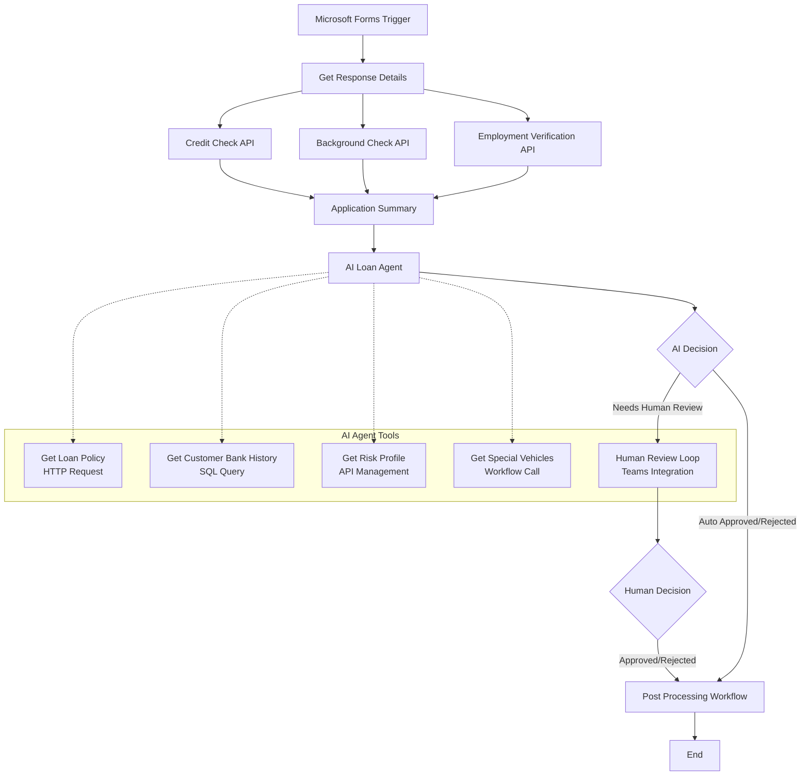
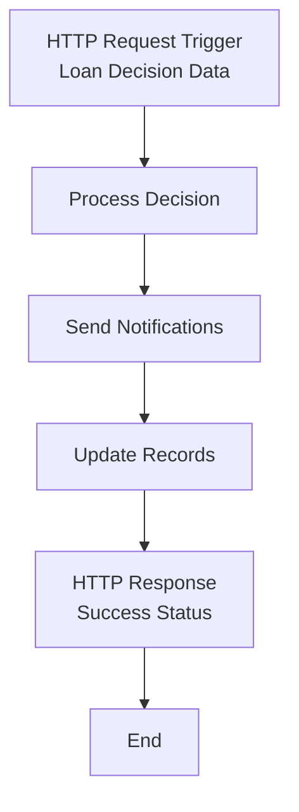
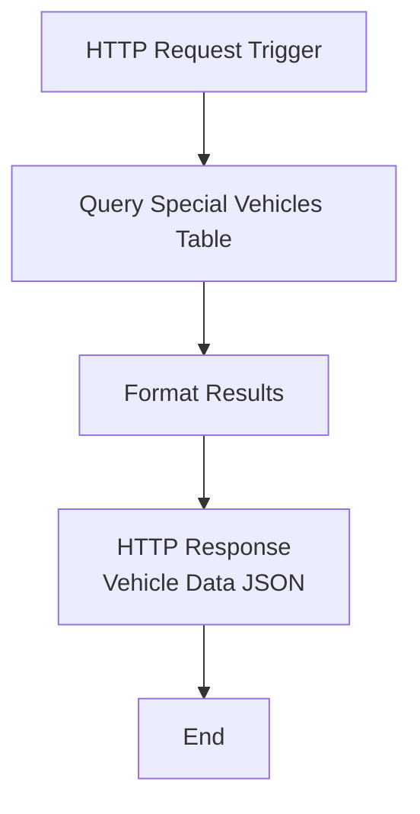

# AI Loan Agent

This project is an AI-powered loan approval system that automates the evaluation of vehicle loan applications using Azure Logic Apps Standard and Azure OpenAI. The system intelligently processes loan applications from Microsoft Forms, performs comprehensive risk assessments, and routes decisions through AI agents with human escalation when needed.

## Prerequisites

The following Azure services are required for this project:

- **Azure Logic Apps Standard** - Workflow orchestration platform
- **Azure OpenAI Service** - AI agent for loan decision making with GPT-4 deployment
- **Azure SQL Database** - Customer history and special vehicle data storage
- **Azure API Management** - Risk assessment, credit check, employment verification, and demographic APIs
- **Microsoft Forms** - Loan application submission interface
- **Microsoft Teams** - Human agent notification and approval workflow
- **Microsoft Outlook** - Email notifications and communications
- **Azure Storage Account** - Workflow runtime storage
- **Azure Blob Storage** - Policy document storage

## Deployment Instructions

Deploy this Logic Apps Standard application using Visual Studio Code with the Azure Logic Apps extension:

1. Install the Azure Logic Apps (Standard) extension in VS Code
2. Configure your `local.settings.json` file (see LogicApps/README.md for setup instructions)
3. Right-click on the LogicApps folder and select "Deploy to Logic App in Azure"
4. Follow the deployment wizard to create or select an Azure Logic App resource

For detailed deployment guidance, refer to the [official Azure Logic Apps deployment documentation](https://docs.microsoft.com/en-us/azure/logic-apps/create-single-tenant-workflows-visual-studio-code).

## Workflows

### LoanApprovalAgent

The main workflow that orchestrates the complete loan approval process using AI agents to evaluate applications against company policies, with integrated tools for data retrieval and human escalation.

#### Process Flow

#### Required Connections

|Connection Name|Connector Name|Connector Type|
|---|---|---|
|microsoftforms-1|Microsoft Forms|Azure|
|new_conn_5643d|Azure OpenAI|Agent|
|new_conn_05f33|SQL Server|Service Provider|
|new_conn_ecac8|Risk Assessment API|API Management|
|new_conn_0d73b|Employment Validation API|API Management|
|new_conn_4e6e0|Credit Check API|API Management|
|new_conn_7f62c|Demographic Verification API|API Management|
|teams|Microsoft Teams|Azure|
|outlook|Office 365 Outlook|Azure|

### LoanPostProcessing

A supporting workflow that handles post-approval processing steps and notifications after loan decisions are made.

#### Process Flow

#### Required Connections

|Connection Name|Connector Name|Connector Type|
|---|---|---|
|None|HTTP Request/Response|Built-in|

### SpecialVehicles

A utility workflow that retrieves special vehicle information from the database to support loan policy decisions and pricing calculations.

#### Process Flow

#### Required Connections

|Connection Name|Connector Name|Connector Type|
|---|---|---|
|new_conn_05f33|SQL Server|Service Provider|
