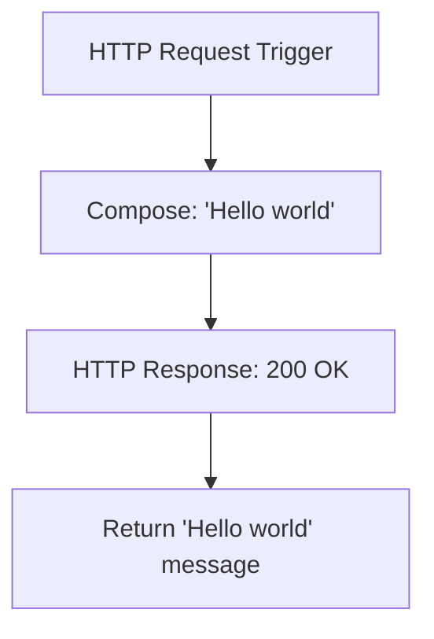

# Logic Apps Project

This is a sample project structure aimed to help contributors to share Logic Apps Sample

## Workflows

### 1. Stateful1

#### Overview
This is a simple stateful workflow that demonstrates basic HTTP request handling in Azure Logic Apps. The workflow:
1. Receives an HTTP request through a trigger
2. Composes a "Hello world" message
3. Returns an HTTP response with the composed message and a 200 status code

This workflow serves as a foundational example for HTTP-based Logic Apps and can be used as a starting point for more complex integrations.

#### Workflow Diagram

#### Connectors Required
- HTTP Request/Response (built-in)