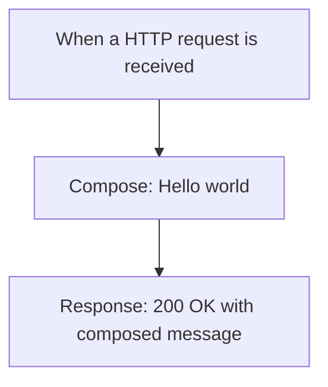

# Sample Logic App Workspace

This project demonstrates a basic Azure Logic Apps Standard workspace featuring a simple HTTP-based workflow. It serves as a foundational example for developers getting started with Azure Logic Apps development and can be used as a template for building more complex business process automation solutions.

## Prerequisites

The following Azure services are required for this project:

- **Azure Logic Apps Standard** - The runtime environment for executing workflows
- **Azure Storage Account** - Required for workflow state management and runtime storage

## Deployment Instructions

This project can be deployed using the Azure Logic Apps extension for Visual Studio Code. Follow the standard Logic Apps deployment process:

1. Open the workspace in VS Code with the Azure Logic Apps extension installed
2. Sign in to your Azure account
3. Right-click on the LogicApps folder and select "Deploy to Logic App"
4. Follow the deployment wizard to create or select your Logic App resource

## Workflows

### Stateful1

This is a simple stateful workflow that demonstrates basic HTTP request handling in Azure Logic Apps. The workflow receives HTTP requests, processes them through a composition action, and returns a formatted response, showcasing the fundamental request-response pattern commonly used in API integrations and web service implementations.

#### Process Flow

#### Required Connections

This workflow uses built-in connectors only and does not require any external connections.